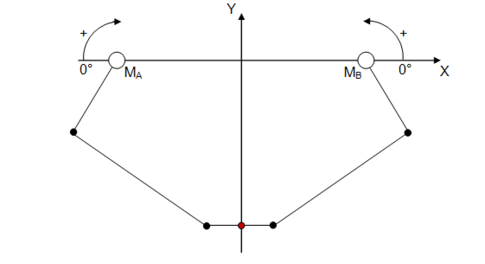
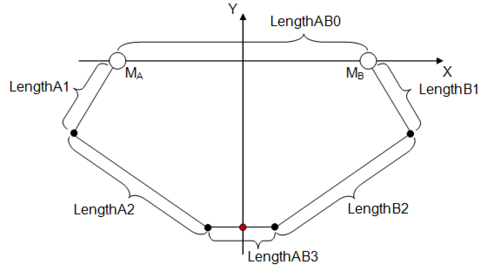
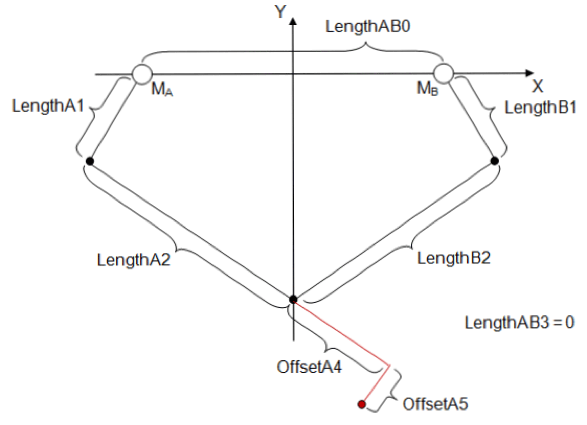

# IF\_RobotConfiguration - Delta2Ax (Method)

## Overview

|  |  |
| --- | --- |
| Type: | Method |
| Available as of: | V1.2.0.0 |

Robots of all types inherently present various hazards to machine operators, maintenance personnel, and commissioners. Some of these hazards may be the result of improper/invalid programming control or system parameterization/configuration. To help avoid as much as possible these hazards/situations, the library SchneiderElectricRobotics has been developed dedicated to Schneider Electric robots.

| WARNING | |
| --- | --- |
|  | UNINTENDED ROBOT OPERATION  Ensure that the library SchneiderElectricRobotics is used for operating a Schneider Electric robot.  Failure to follow these instructions can result in death, serious injury, or equipment damage. |

The Schneider Electric Robot library facilitates:

* The parameterization of the robot.
* The monitoring of the robot axes parameters.

  + GearIn and GearOut
  + FeedConstant
  + Maximum current
  + Direction
  + Maximum speed
* The monitoring of the work envelope of the robot.

This chapter provides information on:

* [Task](#D-SE-0075520__D-SE-0075520.3)
* [Description](#D-SE-0075520__D-SE-0075520.4)
* [Interface](#D-SE-0075520__D-SE-0075520.5)
* [Diagnostic Messages](#D-SE-0075520__D-SE-0075520.6)

## Task

Configuring a biaxial Delta robot.

## Description

With the method Delta2Ax(...), the robot can be configured as a biaxial Delta robot with two degrees of freedom.

NOTE: If a method to configure a transformation was already called up successfully (q\_etDiag = ET\_Diag.Ok AND q\_etDiagExt = ET\_DiagExt.Ok), then it is not possible to overwrite the parameterization by calling up another method to configure a transformation.

## Interface

| Input | Data type | Description |
| --- | --- | --- |
| i\_ifDriveA | [SystemConfigurationItf.IF\_Drive](../../../../../api/crossBook?lang=en-US&virtualBookName=PD.Lib.SystemConfigurationItf&topicID=D_SE_0089154)  For Modicon M262/M660 Motion Controllers, the data type is CMI.IF\_AxisIdentification. | Drive of axis A. |
| i\_ifDriveB | [SystemConfigurationItf.IF\_Drive](../../../../../api/crossBook?lang=en-US&virtualBookName=PD.Lib.SystemConfigurationItf&topicID=D_SE_0089154)  For Modicon M262/M660 Motion Controllers, the data type is CMI.IF\_AxisIdentification. | Drive of axis B. |
| i\_etPlane | [ET\_WorkingPlane](D-SE-0075495.html#D-SE-0075495) | Specification in which working plane the robot is operating. |
| i\_lrLengthAB0 | LREAL | Length of the distance between the axes A and B.  Value range: i\_lrLengthAB0 >= 0 |
| i\_lrLengthA1 | LREAL | Length of the upper arm mounted on Axis A.  Value range: i\_lrLengthA1 > 0 |
| i\_lrLengthA2 | LREAL | Length of the lower arm mounted on Axis A.  Value range: i\_lrLengthA2 > 0 |
| i\_lrLengthB1 | LREAL | Length of the upper arm mounted on Axis B.  Value range: i\_lrLengthB1 > 0 |
| i\_lrLengthB2 | LREAL | Length of the lower arm mounted on Axis B.  Value range: i\_lrLengthB2 > 0 |
| i\_lrLengthAB3 | LREAL | Length of the distance between the two suspension points of the lower arms A and B.  Value range: 0 <=i\_lrLengthAB3 <= i\_lrLengthAB0 |
| i\_lrOffsetA4 | LREAL | Offset of the TCP in extension of the lower arm of Axis A.  The value of i\_lrLengthAB3 has to be 0.  Value range: - infinite <=i\_lrOffsetA4 <= + infinite |
| i\_lrOffsetA5 | LREAL | Offset of the TCP perpendicular to the offset i\_lrOffsetA4.  The value of i\_lrLengthAB3 has to be 0.  Value range: - infinite <=i\_lrOffsetA5 <= + infinite |

| Output | Data type | Description |
| --- | --- | --- |
| q\_etDiag | [GD.ET\_Diag](../../../../../api/crossBook?lang=en-US&virtualBookName=PD.Lib.GlobalDiagnostic&topicID=D_SE_0076228) | General library-independent statement on the diagnostic.  A value not equal to GD.ET\_Diag.Ok corresponds to a diagnostic message. |
| q\_etDiagExt | [ET\_DiagExt](ET_DiagExt-GeneralInformation-CAB158DC.html#ET_DiagExt-GeneralInformation-CAB158DC) | POU-specific output on the diagnostic.  q\_etDiag = ET\_Diag.Ok -> Status message  q\_etDiag <> ET\_Diag.Ok -> Diagnostic message |
| q\_sMsg | STRING[80] | Event-triggered message that gives additional information on the diagnostic state. |

## Diagnostic Messages

| q\_etDiag | q\_etDiagExt | Enumeration value | Description |
| --- | --- | --- | --- |
| OK | Ok | 0 | Ok |
| ExecutionAborted | ConfigurationAlreadyCompleted | 105 | The configuration is already completed. |
| ExecutionAborted | TransformationAlreadyConfigured | 106 | The transformation is already configured. |
| InputParameterInvalid | DriveAAlreadyInUse | 36 | The drive A is already in use. |
| InputParameterInvalid | DriveAInvalid | 48 | The drive A is invalid. |
| InputParameterInvalid | DriveBAlreadyInUse | 37 | The drive B is already in use. |
| InputParameterInvalid | DriveBInvalid | 49 | The drive B is invalid. |
| InputParameterInvalid | LengthA1Range | 148 | The LengthA1 is out of range. |
| InputParameterInvalid | LengthA2Range | 149 | The LengthA2 is out of range. |
| InputParameterInvalid | LengthAB0Range | 146 | The LengthAB0 is out of range. |
| InputParameterInvalid | LengthAB3Range | 147 | The LengthAB3 is out of range. |
| InputParameterInvalid | LengthB1Range | 150 | The LengthB1 is out of range. |
| InputParameterInvalid | LengthB2Range | 151 | The LengthB2 is out of range. |
| InputParameterInvalid | PlaneInvalid | 107 | The plane is invalid. |

## ConfigurationAlreadyCompleted

|  |  |
| --- | --- |
| Enumeration name: | ConfigurationAlreadyCompleted |
| Enumeration value: | 105 |
| Description: | The configuration is already completed. |

| Issue | Cause | Solution |
| --- | --- | --- |
| The configuration of the robot transformation was not successful. | The configuration of the robot has already been completed. The method ConfigDone(...) has already been called up successfully. | Ensure that no transformation configuration method, for example Delta3Ax(...) or AddAuxAx(...), is called after the configuration has been completed. |

## DriveAAlreadyInUse

|  |  |
| --- | --- |
| Enumeration name: | DriveAAlreadyInUse |
| Enumeration value: | 36 |
| Description: | The drive A is already in use. |

| Issue | Cause | Solution |
| --- | --- | --- |
| The configuration of the robot transformation was not successful. | The drive transferred at the input i\_ifDriveA is already configured in the robot and cannot be used again. | Ensure that no drive is assigned to the robot more than once. |

## DriveAInvalid

|  |  |
| --- | --- |
| Enumeration name: | DriveAInvalid |
| Enumeration value: | 48 |
| Description: | The drive A is invalid. |

| Issue | Cause | Solution |
| --- | --- | --- |
| The configuration of the robot transformation was not successful. | The drive transferred at the input i\_ifDriveA is invalid. | At the input i\_ifDriveA, a valid drive must be transferred. |

## DriveBAlreadyInUse

|  |  |
| --- | --- |
| Enumeration name: | DriveBAlreadyInUse |
| Enumeration value: | 37 |
| Description: | The drive B is already in use. |

| Issue | Cause | Solution |
| --- | --- | --- |
| The configuration of the robot transformation was not successful. | The drive transferred at the input i\_ifDriveB is already configured in the robot and cannot be used again. | Ensure that no drive is assigned to the robot more than once. |

## DriveBInvalid

|  |  |
| --- | --- |
| Enumeration name: | DriveBInvalid |
| Enumeration value: | 49 |
| Description: | The drive B is invalid. |

| Issue | Cause | Solution |
| --- | --- | --- |
| The configuration of the robot transformation was not successful. | The drive transferred at the input i\_ifDriveB is invalid. | At the input i\_ifDriveB, a valid drive must be transferred. |

## LengthA1Range

|  |  |
| --- | --- |
| Enumeration name: | LengthA1Range |
| Enumeration value: | 148 |
| Description: | The LengthA1 is out of range. |

| Issue | Cause | Solution |
| --- | --- | --- |
| The configuration of the robot transformation was not successful. | The value transferred at the input i\_IrLengthA1 is not within the valid range. | At the input i\_lrLengthA1, a value greater than 0 must be transferred. |

## LengthA2Range

|  |  |
| --- | --- |
| Enumeration name: | LengthA2Range |
| Enumeration value: | 149 |
| Description: | The LengthA2 is out of range. |

| Issue | Cause | Solution |
| --- | --- | --- |
| The configuration of the robot transformation was not successful. | The value transferred at the input i\_IrLengthA2 is not within the valid range. | At the input i\_lrLengthA2, a value greater than 0 must be transferred. |

## LengthAB0Range

|  |  |
| --- | --- |
| Enumeration name: | LengthAB0Range |
| Enumeration value: | 146 |
| Description: | The LengthAB0 is out of range. |

| Issue | Cause | Solution |
| --- | --- | --- |
| The configuration of the robot transformation was not successful. | The value transferred at the input i\_IrLengthAB0 is not within the valid range. | At the input i\_lrLengthAB0, a value greater than or equal to 0 must be transferred. |

## LengthAB3Range

|  |  |
| --- | --- |
| Enumeration name: | LengthAB3Range |
| Enumeration value: | 147 |
| Description: | The LengthAB3 is out of range. |

| Issue | Cause | Solution |
| --- | --- | --- |
| The configuration of the robot transformation was not successful. | The value transferred at the input i\_IrLengthAB3 is not within the valid range. | At the input i\_lrLengthAB3, a value greater than or equal to 0 must be transferred.  At the input i\_lrLengthAB3, a value less than or equal to i\_lrLengthAB0 must be transferred. |

## LengthB1Range

|  |  |
| --- | --- |
| Enumeration name: | LengthB1Range |
| Enumeration value: | 150 |
| Description: | The LengthB1 is out of range. |

| Issue | Cause | Solution |
| --- | --- | --- |
| The configuration of the robot transformation was not successful. | The value transferred at the input i\_IrLengthB1 is not within the valid range. | At the input i\_lrLengthB1, a value greater than 0 must be transferred. |

## LengthB2Range

|  |  |
| --- | --- |
| Enumeration name: | LengthB2Range |
| Enumeration value: | 151 |
| Description: | The LengthB2 is out of range. |

| Issue | Cause | Solution |
| --- | --- | --- |
| The configuration of the robot transformation was not successful. | The value transferred at the input i\_IrLengthB2 is not within the valid range. | At the input i\_lrLengthB2, a value greater than 0 must be transferred. |

## Ok

|  |  |
| --- | --- |
| Enumeration name: | Ok |
| Enumeration value: | 0 |
| Description: | Ok |

The configuration of the robot transformation was successful.

## PlaneInvalid

|  |  |
| --- | --- |
| Enumeration name: | PlaneInvalid |
| Enumeration value: | 107 |
| Description: | The plane is invalid. |

| Issue | Cause | Solution |
| --- | --- | --- |
| The configuration of the robot transformation was not successful. | The value transferred at the input i\_etPlane is invalid. | At the input i\_etPlane, a value contained in ET\_WorkingPlane must be transferred. |

## TransformationAlreadyConfigured

|  |  |
| --- | --- |
| Enumeration name: | TransformationAlreadyConfigured |
| Enumeration value: | 106 |
| Description: | The transformation is already configured. |

| Issue | Cause | Solution |
| --- | --- | --- |
| The configuration of the robot transformation was not successful. | The configuration of the robot transformation has already been completed successfully. | Ensure that a configuration for a transformation is only called once. |

EIO0000002232.23