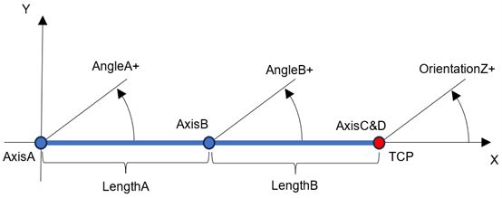
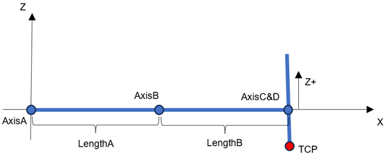

# IF\_RobotConfiguration - SCARA4AxCoupling (Method)

## Overview

|  |  |
| --- | --- |
| Type: | Method |
| Available as of: | V3.9.0.0 |
| Versions: | Current version |

This chapter provides information on:

* [Task](#IF_RobotConfiguration-SCARA4AxCoupl-10A005A2__Task-10A04656)
* [Description](#IF_RobotConfiguration-SCARA4AxCoupl-10A005A2__Description-10A04793)
* [Interface](#IF_RobotConfiguration-SCARA4AxCoupl-10A005A2__Interface-10A7A473)
* [Diagnostic Messages](#IF_RobotConfiguration-SCARA4AxCoupl-10A005A2__DiagnosticMessages-10A7A139)

## Task

Configures a SCARA robot with four axes which has a coupling on the motors that perform the Z and OrientationZ motion.

## Description

With the method SCARA4AxCoupling(…), the robot can be configured as a SCARA robot with four axes which uses a coupling for Z (translation movement along the mechanical Z axis) and OrientationZ (rotation about the mechanical Z axis).

The axes A and B move the robot in the XY-Plane, axis C moves the TCP in the Z direction and compensates the movements of axis D. Axis D turns the TCP about Z and compensates the movements of the axes A and B.

The axes A, B and D must be configured for a scaling in degrees (FeedConstant = 360) while axis C must be scaled in millimeters (FeedConstant = mm/revolution).

Coupling in transformation is defined as:

D = OrientationZ - A - B

C = Z - (D/360 \* i\_lrSlope)

## Interface

| Input | Data type | Description |
| --- | --- | --- |
| i\_ifDriveA | SystemConfigurationItf.IF\_Drive  NOTE: For Modicon M262 Motion Controllers, the data type is CMI.IF\_AxisIdentification. | Drive for axis A. |
| i\_ifDriveB | SystemConfigurationItf.IF\_Drive  NOTE: For Modicon M262 Motion Controllers, the data type is CMI.IF\_AxisIdentification. | Drive for axis B. |
| i\_ifDriveC | SystemConfigurationItf.IF\_Drive  NOTE: For Modicon M262 Motion Controllers, the data type is CMI.IF\_AxisIdentification. | Drive for axis C. |
| i\_ifDriveD | SystemConfigurationItf.IF\_Drive  NOTE: For Modicon M262 Motion Controllers, the data type is CMI.IF\_AxisIdentification. | Drive for axis D. |
| i\_lrLengthA | LREAL | Length of the arm mounted on axis A.  Value range: i\_lrLengthA > 0  Unit: [mm] |
| i\_lrLengthB | LREAL | Length of the arm mounted on axis B.  Value range: i\_lrLengthB > 0  Unit: [mm] |
| i\_lrSlope | LREAL | Slope of the lift mechanic.  Value range: i\_lrSlope > 0  Unit: [mm]/[revolution] |

| Output | Data type | Description |
| --- | --- | --- |
| q\_etDiag | [GD.ET\_Diag](../../../../../api/crossBook?lang=en-US&virtualBookName=PD.Lib.GlobalDiagnostic&topicID=D_SE_0076228) | General library-independent statement on the diagnostic.  A value not equal to GD.ET\_Diag.Ok corresponds to a diagnostic message. |
| q\_etDiagExt | [ET\_DiagExt](ET_DiagExt-GeneralInformation-CAB158DC.html#ET_DiagExt-GeneralInformation-CAB158DC) | POU-specific output for the diagnostic.  q\_etDiag = ET\_Diag.Ok -> status message  q\_etDiag <> ET\_Diag.Ok -> diagnostic message |
| q\_sMsg | STRING[80] | Event-triggered message that gives additional information on the diagnostic state. |

## Diagnostic Messages

| q\_etDiag | q\_etDiagExt | Enumeration value | Description |
| --- | --- | --- | --- |
| OK | Ok | 0 | Ok |
| ExecutionAborted | ConfigurationAlreadyCompleted | 105 | The configuration is already completed. |
| ExecutionAborted | TransformationAlreadyConfigured | 106 | The transformation is already configured. |
| InputParameterInvalid | DriveAAlreadyInUse | 36 | The drive A is already in use. |
| InputParameterInvalid | DriveAInvalid | 48 | The drive A is invalid. |
| InputParameterInvalid | DriveBAlreadyInUse | 37 | The drive B is already in use. |
| InputParameterInvalid | DriveBInvalid | 49 | The drive B is invalid. |
| InputParameterInvalid | DriveCAlreadyInUse | 38 | The drive C is already in use. |
| InputParameterInvalid | DriveCInvalid | 50 | The drive C is invalid. |
| InputParameterInvalid | DriveDAlreadyInUse | 96 | The drive D is already in use. |
| InputParameterInvalid | DriveDInvalid | 93 | The drive D is invalid. |
| InputParameterInvalid | LengthARange | 160 | The LengthA is out of range. |
| InputParameterInvalid | LengthBRange | 161 | The LengthB is out of range. |
| InputParameterInvalid | SlopeRange | 266 | The slope value is out of range. |

## ConfigurationAlreadyCompleted

|  |  |
| --- | --- |
| Enumeration name: | ConfigurationAlreadyCompleted |
| Enumeration value: | 105 |
| Description: | The configuration is already completed. |

| Issue | Cause | Solution |
| --- | --- | --- |
| The configuration of the transformation was not successful. | The configuration is already completed. | Call the method SCARA4AxCoupling before calling of the method ConfigDone. |

## DriveAAlreadyInUse

|  |  |
| --- | --- |
| Enumeration name: | DriveAAlreadyInUse |
| Enumeration value: | 36 |
| Description: | The drive A is already in use. |

| Issue | Cause | Solution |
| --- | --- | --- |
| The configuration of the transformation was not successful. | The drive transferred at the input i\_ifDriveA is already configured in the robot and cannot be used again. | Do not assign a drive to the robot more than once. |

## DriveAInvalid

|  |  |
| --- | --- |
| Enumeration name: | DriveAInvalid |
| Enumeration value: | 48 |
| Description: | The drive A is invalid. |

| Issue | Cause | Solution |
| --- | --- | --- |
| The configuration of the transformation was not successful. | The drive transferred at the input i\_ifDriveA is invalid. | Transfer a valid drive to the input i\_ifDriveA. |

## DriveBAlreadyInUse

|  |  |
| --- | --- |
| Enumeration name: | DriveBAlreadyInUse |
| Enumeration value: | 37 |
| Description: | The drive B is already in use. |

| Issue | Cause | Solution |
| --- | --- | --- |
| The configuration of the transformation was not successful. | The drive transferred at the input i\_ifDriveB is already configured in the robot and cannot be used again. | Do not assign a drive to the robot more than once. |

## DriveBInvalid

|  |  |
| --- | --- |
| Enumeration name: | DriveBInvalid |
| Enumeration value: | 49 |
| Description: | The drive B is invalid. |

| Issue | Cause | Solution |
| --- | --- | --- |
| The configuration of the transformation was not successful. | The drive transferred at the input i\_ifDriveB is invalid. | Transfer a valid drive to the input i\_ifDriveB. |

## DriveCAlreadyInUse

|  |  |
| --- | --- |
| Enumeration name: | DriveCAlreadyInUse |
| Enumeration value: | 38 |
| Description: | The drive C is already in use. |

| Issue | Cause | Solution |
| --- | --- | --- |
| The configuration of the transformation was not successful. | The drive transferred at the input i\_ifDriveC is already configured in the robot and cannot be used again. | Do not assign a drive to the robot more than once. |

## DriveCInvalid

|  |  |
| --- | --- |
| Enumeration name: | DriveCInvalid |
| Enumeration value: | 50 |
| Description: | The drive C is invalid. |

| Issue | Cause | Solution |
| --- | --- | --- |
| The configuration of the transformation was not successful. | The drive transferred at the input i\_ifDriveC is invalid. | Transfer a valid drive to the input i\_ifDriveC. |

## DriveDAlreadyInUse

|  |  |
| --- | --- |
| Enumeration name: | DriveDAlreadyInUse |
| Enumeration value: | 96 |
| Description: | The drive D is already in use. |

| Issue | Cause | Solution |
| --- | --- | --- |
| The configuration of the transformation was not successful. | The drive transferred at the input i\_ifDriveD is already configured in the robot and cannot be used again. | Do not assign a drive to the robot more than once. |

## DriveDInvalid

|  |  |
| --- | --- |
| Enumeration name: | DriveDInvalid |
| Enumeration value: | 93 |
| Description: | The drive D is invalid. |

| Issue | Cause | Solution |
| --- | --- | --- |
| The configuration of the transformation was not successful. | The drive transferred at the input i\_ifDriveD is invalid. | Transfer a valid drive to the input i\_ifDriveD. |

## LengthARange

|  |  |
| --- | --- |
| Enumeration name: | LengthARange |
| Enumeration value: | 160 |
| Description: | The LengthA is out of range. |

| Issue | Cause | Solution |
| --- | --- | --- |
| The configuration of the transformation was not successful. | The value transferred at the input i\_lrLengthA is not within a valid range. | Transfer a valid value at the input i\_lrLenghtA.  Valid values are i\_lrLenghtA > 0.  Unit: [mm]. |

## LengthBRange

|  |  |
| --- | --- |
| Enumeration name: | LengthBRange |
| Enumeration value: | 161 |
| Description: | The LengthB is out of range. |

| Issue | Cause | Solution |
| --- | --- | --- |
| The configuration of the transformation was not successful. | The value transferred at the input i\_lrLengthB is not within a valid range. | Transfer a valid value at the input i\_lrLenghtB.  Valid values are i\_lrLenghtB > 0.  Unit: [mm]. |

## Ok

|  |  |
| --- | --- |
| Enumeration name: | Ok |
| Enumeration value: | 0 |
| Description: | Ok |

The configuration of the robot was successful.

## SlopeRange

|  |  |
| --- | --- |
| Enumeration name: | SlopeRange |
| Enumeration value: | 266 |
| Description: | The slope value is out of range. |

| Issue | Cause | Solution |
| --- | --- | --- |
| The configuration of the transformation was not successful. | The value transferred at the input i\_lrSlope is not within the valid range. | Transfer a valid value at the input i\_lrSlope.  Valid values are i\_lrSlope > 0.  Unit: [mm]/[revolution] |

## TransformationAlreadyConfigured

|  |  |
| --- | --- |
| Enumeration name: | TransformationAlreadyConfigured |
| Enumeration value: | 106 |
| Description: | The transformation is already configured. |

| Issue | Cause | Solution |
| --- | --- | --- |
| The configuration of the transformation was not successful. | The configuration of the robot transformation is already Completed successfully. | Call the configuration for a transformation only once. |

EIO0000002232.23