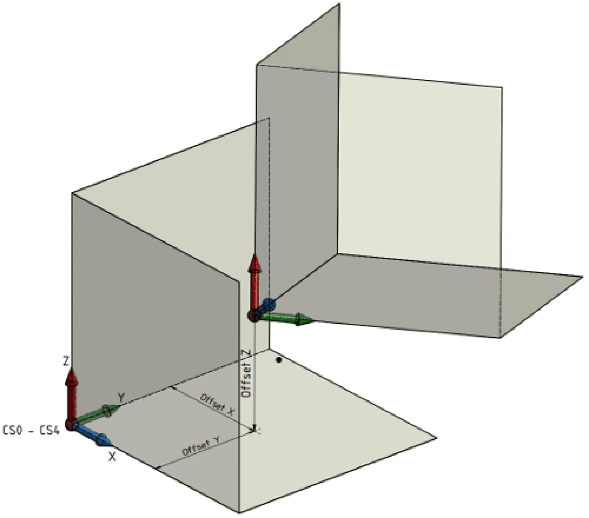

# IF\_RobotConfigurationAdvanced - ModifyCoordinateSystem2 (Method)

## Overview

|  |  |
| --- | --- |
| Type: | Method |
| Available as of: | V1.6.0.0 |

This chapter provides information on:

* [Task](#D-SE-0075533__D-SE-0075533.3)
* [Description](#D-SE-0075533__D-SE-0075533.4)
* [Interface](#D-SE-0075533__D-SE-0075533.5)
* [Diagnostic Messages](#D-SE-0075533__D-SE-0075533.6)

## Task

Modifying a coordinate system of the robot.

## Description

With the method ModifyCoordinateSystem2(…), a coordinate system of the robot can be modified.

In this example, the orientation convention is ET\_OrientationConvention.XYZ.

Execution sequence of the shift and rotation of the coordinate system CS0:

| 1 | Shifting the coordinate system CS0 with the offsets X, Y, Z. This creates the coordinate system CS1. |

| 2 | Rotation of the coordinate system CS1 around its X axis. This creates the coordinate system CS2. |

| 3 | Rotation of the coordinate system CS2 around its Y axis.This creates the coordinate system CS3. |

| 4 | Rotation of the coordinate system CS3 around its Z axis.This creates the coordinate system CS4. |

The coordinate system CS4 corresponds to the shifted and rotated coordinate system.

By setting the inputs i\_xInvertDirectionX, i\_xInvertDirectionY or i\_xInvertDirectionZ to TRUE, the positive cartesian directions of the coordinate system CS4 can be inverted.

Also refer to [Using ModifyCoordinateSystem / ModifyCoordinateSystem2](TPC_Using_ModifyCoordinateSystem_2.html#TPC_Using_ModifyCoordinateSystem_2).

## Interface

| Input | Data type | Description |
| --- | --- | --- |
| i\_etName | [ET\_CoordinateSystem](D-SE-0075477.html#D-SE-0075477) | Name of the coordinate system that has to be modified.  Valid values are:   * ET\_CoordinateSystem.CSR * ET\_CoordinateSystem.Tracking1 * ET\_CoordinateSystem.Tracking2 * ET\_CoordinateSystem.Tracking3 * ET\_CoordinateSystem.Tracking4 * ET\_CoordinateSystem.Tracking5 * ET\_CoordinateSystem.Tracking6 * ET\_CoordinateSystem.Tracking7 * ET\_CoordinateSystem.Tracking8 * ET\_CoordinateSystem.Tracking9 * ET\_CoordinateSystem.Tracking10   For further information, refer to ET\_CoordinateSystem. |
| i\_stOffset | [PDL.ST\_Vector3D](../../../../../api/crossBook?lang=en-US&virtualBookName=PD.Lib.PacDriveLib&topicID=D_SE_0087802) | Describes the shifting of the coordinate system in relation to the world coordinate system.  Unit: [mm] |
| i\_etOrientationConvention | [ET\_OrientationConvention](D-SE-0075485.html#D-SE-0075485) | Convention for the rotation angles of the orientation i\_stOrientation. |
| i\_stOrientation | [PDL.ST\_Vector3D](../../../../../api/crossBook?lang=en-US&virtualBookName=PD.Lib.PacDriveLib&topicID=D_SE_0087802) | Describes the rotation of the coordinate system in relation to the world coordinate system.  Unit: [°] |
| i\_xInvertDirectionX | BOOL | Invert the positive X direction of the coordinate system. |
| i\_xInvertDirectionY | BOOL | Invert the positive Y direction of the coordinate system. |
| i\_xInvertDirectionZ | BOOL | Invert the positive Z direction of the coordinate system. |

| Output | Data type | Description |
| --- | --- | --- |
| q\_etDiag | [GD.ET\_Diag](../../../../../api/crossBook?lang=en-US&virtualBookName=PD.Lib.GlobalDiagnostic&topicID=D_SE_0076228) | General library-independent statement on the diagnostic.  A value not equal to GD.ET\_Diag.Ok corresponds to a diagnostic message. |
| q\_etDiagExt | [ET\_DiagExt](ET_DiagExt-GeneralInformation-CAB158DC.html#ET_DiagExt-GeneralInformation-CAB158DC) | POU-specific output on the diagnostic.  q\_etDiag = ET\_Diag.Ok -> Status message  q\_etDiag <> ET\_Diag.Ok -> Diagnostic message |
| q\_sMsg | STRING[80] | Event-triggered message that gives additional information on the diagnostic state. |
| q\_stDirectionEx | [PDL.ST\_Vector3D](../../../../../api/crossBook?lang=en-US&virtualBookName=PD.Lib.PacDriveLib&topicID=D_SE_0087802) | Direction vector of the positive cartesian X axis of the linear tracking system in robot coordinate system ET\_CoordinateSystem.CSR. |
| q\_stDirectionEy | [PDL.ST\_Vector3D](../../../../../api/crossBook?lang=en-US&virtualBookName=PD.Lib.PacDriveLib&topicID=D_SE_0087802) | Direction vector of the positive cartesian Y axis of the linear tracking system in robot coordinate system ET\_CoordinateSystem.CSR. |
| q\_stDirectionEz | [PDL.ST\_Vector3D](../../../../../api/crossBook?lang=en-US&virtualBookName=PD.Lib.PacDriveLib&topicID=D_SE_0087802) | Direction vector of the positive cartesian Z axis of the linear tracking system in robot coordinate system ET\_CoordinateSystem.CSR. |

## Diagnostic Messages

| q\_etDiag | q\_etDiagExt | Enumeration value | Description |
| --- | --- | --- | --- |
| OK | Ok | 0 | Ok |
| ExecutionAborted | CommandsActive | 79 | There are active commands. |
| ExecutionAborted | InMotion | 52 | The robot is in motion. |
| ExecutionAborted | TrackingActive | 175 | Tracking is active. |
| ExecutionAborted | TransformationMissing | 113 | The transformation is unavailable. |
| ExecutionAborted | ExternalPositionSourceConfigured | 205 | The external position source is configured. |
| InputParameterInvalid | CoordinateSystemInvalid | 117 | The coordinate system is invalid. |
| InputParameterInvalid | CoordinateSystemNotConfigured | 172 | The coordinate system is not configured. |
| InputParameterInvalid | InvertDirectionXInvalid | 154 | InvertDirectionX is invalid. |
| InputParameterInvalid | InvertDirectionYInvalid | 155 | InvertDirectionY is invalid. |
| InputParameterInvalid | InvertDirectionZInvalid | 156 | InvertDirectionZ is invalid. |
| InputParameterInvalid | OffsetInvalid | 152 | The Offset is invalid. |
| InputParameterInvalid | OrientationConventionInvalid | 168 | The orientation convention is invalid. |
| InputParameterInvalid | OrientationInvalid | 153 | The orientation is invalid. |
| UnexpectedProgramBehavior | UnexpectedFeedback | 13 | A feedback value was invalid. |

## CommandsActive

|  |  |
| --- | --- |
| Enumeration name: | CommandsActive |
| Enumeration value: | 79 |
| Description: | There are active commands. |

| Issue | Cause | Solution |
| --- | --- | --- |
| The modification of a coordinate system of the robot was unsuccessful. | There are still active move commands. | Ensure that no more move commands are active. |

## CoordinateSystemInvalid

|  |  |
| --- | --- |
| Enumeration name: | CoordinateSystemInvalid |
| Enumeration value: | 117 |
| Description: | The coordinate system is invalid. |

| Issue | Cause | Solution |
| --- | --- | --- |
| The modification of a coordinate system of the robot was unsuccessful. | The value transferred at the input i\_etName is invalid. | At the input i\_etName, a value of ET\_CoordinateSystem must be transferred. |

## CoordinateSystemNotConfigured

|  |  |
| --- | --- |
| Enumeration name: | CoordinateSystemNotConfigured |
| Enumeration value: | 172 |
| Description: | The coordinate system is not configured. |

| Issue | Cause | Solution |
| --- | --- | --- |
| The modification of a coordinate system of the robot was unsuccessful. | The requested coordinate system at the input i\_etName is not configured. | If required, configure a coordinate system first.  Use the configuration method IF\_RobotConfiguration.AddLinearTrackingSystem to configure a linear tracking system. |

## ExternalPositionSourceConfigured

|  |  |
| --- | --- |
| Enumeration name: | ExternalPositionSourceConfigured |
| Enumeration value: | 205 |
| Description: | The external position source is configured. |

| Issue | Cause | Solution |
| --- | --- | --- |
| The modification of a coordinate system of the robot was unsuccessful. | An external position source for the robot components cartesian, orientation and auxiliary axes is configured. | The modification of a tracking coordinate system of the robot is not possible when an external position source for the robot components is configured.  Do not modify a tracking coordinate system of the robot. |

## InMotion

|  |  |
| --- | --- |
| Enumeration name: | InMotion |
| Enumeration value: | 52 |
| Description: | The robot is in motion. |

| Issue | Cause | Solution |
| --- | --- | --- |
| The modification of a coordinate system of the robot was unsuccessful. | A motion is active in the coordinate system that has to be modified. | Do not call ModifyCoordinateSystem2(...) while the robot is in motion. |

## InvertDirectionXInvalid

|  |  |
| --- | --- |
| Enumeration name: | InvertDirectionXInvalid |
| Enumeration value: | 154 |
| Description: | InvertDirectionX is invalid. |

| Issue | Cause | Solution |
| --- | --- | --- |
| The modification of a coordinate system of the robot was unsuccessful. | A two-dimensional transformation, in the YZ plane, is configured. | Ensure that the input i\_xInvertDirectionX is set to FALSE. |

## InvertDirectionYInvalid

|  |  |
| --- | --- |
| Enumeration name: | InvertDirectionYInvalid |
| Enumeration value: | 155 |
| Description: | InvertDirectionY is invalid. |

| Issue | Cause | Solution |
| --- | --- | --- |
| The modification of a coordinate system of the robot was unsuccessful. | A two-dimensional transformation, in the XZ plane, is configured. | Ensure that the input i\_xInvertDirectionY is set to FALSE. |

## InvertDirectionZInvalid

|  |  |
| --- | --- |
| Enumeration name: | InvertDirectionZInvalid |
| Enumeration value: | 156 |
| Description: | InvertDirectionZ is invalid. |

| Issue | Cause | Solution |
| --- | --- | --- |
| The modification of a coordinate system of the robot was unsuccessful. | A two-dimensional transformation, in the XY plane, is configured. | Ensure that the input i\_xInvertDirectionZ is set to FALSE. |

## OffsetInvalid

|  |  |
| --- | --- |
| Enumeration name: | OffsetInvalid |
| Enumeration value: | 152 |
| Description: | The Offset is invalid. |

| Issue | Cause | Solution |
| --- | --- | --- |
| The modification of a coordinate system of the robot was unsuccessful. | A two-dimensional transformation, in the XY plane, is configured. | Ensure that the input i\_stOffset.lrZ is set to 0. |
| A two-dimensional transformation, in the XZ plane, is configured. | Ensure that the input i\_stOffset.lrY is set to 0. |
| A two-dimensional transformation, in the YZ plane, is configured. | Ensure that the input i\_stOffset.lrX is set to 0. |

## Ok

|  |  |
| --- | --- |
| Enumeration name: | Ok |
| Enumeration value: | 0 |
| Description: | Ok |

The modification of a coordinate system of the robot was successful.

## OrientationConventionInvalid

|  |  |
| --- | --- |
| Enumeration name: | OrientationConventionInvalid |
| Enumeration value: | 168 |
| Description: | The orientation convention is invalid. |

| Issue | Cause | Solution |
| --- | --- | --- |
| The modification of a coordinate system of the robot was unsuccessful. | The value transferred at the input i\_etOrientationConvention is invalid. | At the input i\_etOrientationConvention, a value of ET\_OrientationConvention must be transferred. |

## OrientationInvalid

|  |  |
| --- | --- |
| Enumeration name: | OrientationInvalid |
| Enumeration value: | 153 |
| Description: | The orientation is invalid. |

| Issue | Cause | Solution |
| --- | --- | --- |
| The modification of a coordinate system of the robot was unsuccessful. | A two-dimensional transformation, in the XY plane, is configured. | Ensure that the inputs i\_stOrientation.lrX and i\_stOrientation.lrY are set to 0. |
| A two-dimensional transformation, in the XZ plane, is configured. | Ensure that the inputs i\_stOrientation.lrX and i\_stOrientation.lrZ are set to 0. |
| A two-dimensional transformation, in the YZ plane, is configured. | Ensure that the inputs i\_stOrientation.lrY and i\_stOrientation.lrZ are set to 0. |

## TrackingActive

|  |  |
| --- | --- |
| Enumeration name: | TrackingActive |
| Enumeration value: | 175 |
| Description: | Tracking is active. |

| Issue | Cause | Solution |
| --- | --- | --- |
| The modification of a coordinate system of the robot was unsuccessful. | The robot is still in tracking and not in coordinate system ET\_CoordinateSystem.CSR. | Do not call ModifyCoordinateSystem2(...) while the robot is in tracking. |

## TransformationMissing

|  |  |
| --- | --- |
| Enumeration name: | TransformationMissing |
| Enumeration value: | 113 |
| Description: | The transformation is unavailable. |

| Issue | Cause | Solution |
| --- | --- | --- |
| The modification of a coordinate system of the robot was unsuccessful. | There is no transformation of the robot configured. | Ensure that the transformation of the robot is configured before modifying the coordinate system. |

## UnexpectedFeedback

|  |  |
| --- | --- |
| Enumeration name: | UnexpectedFeedback |
| Enumeration value: | 13 |
| Description: | A feedback value was invalid. |

The modification of a coordinate system of the robot was unsuccessful.

The modification of the coordinate system was aborted because of an invalid feedback value.

EIO0000002232.23