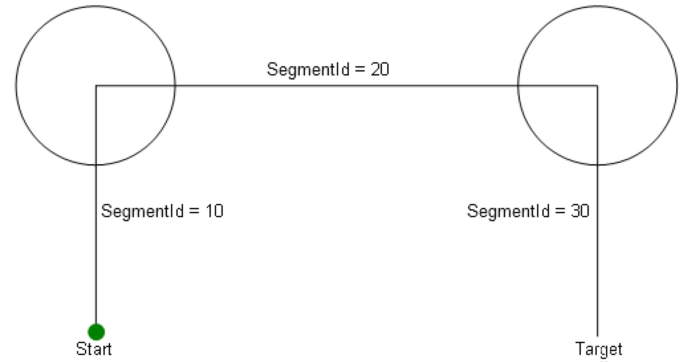
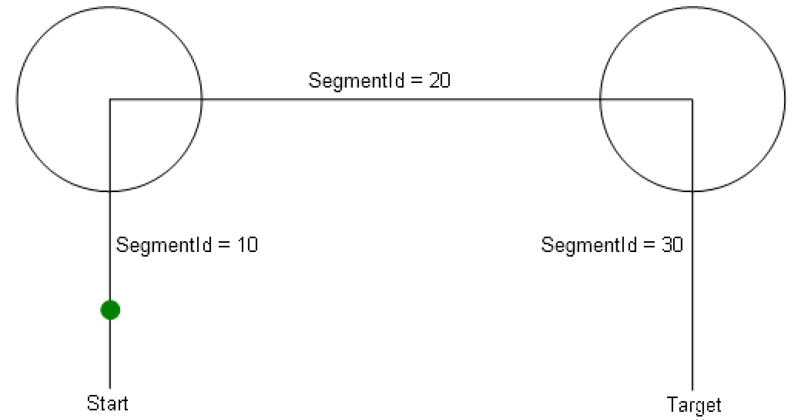
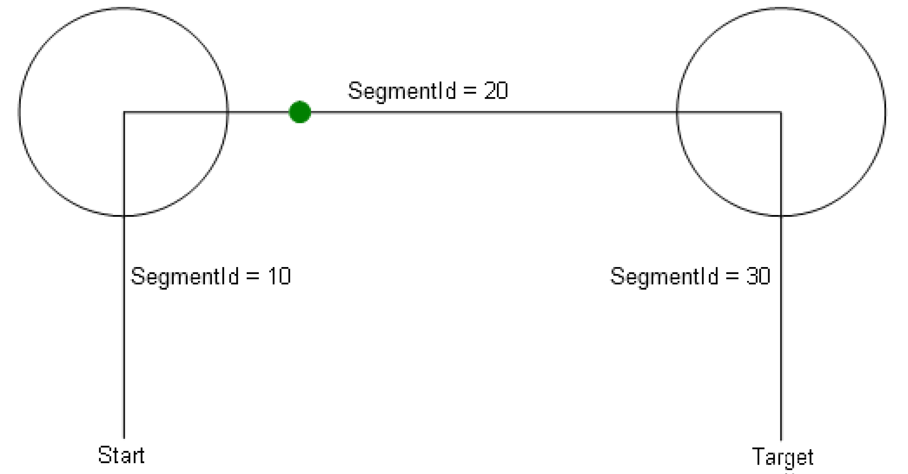

# IF\_RobotMotion - ClearSegmentsFromId (Method)

## Overview

|  |  |
| --- | --- |
| Type: | Method |
| Available as of: | V1.0.0.0 |

This chapter provides information on:

* [Task](#D-SE-0075591__D-SE-0075591.3)
* [Description](#D-SE-0075591__D-SE-0075591.4)
* [Interface](#D-SE-0075591__D-SE-0075591.5)
* [Diagnostic Messages](#D-SE-0075591__D-SE-0075591.6)

## Task

Deleting issued motion commands.

## Description

With the method ClearSegmentsFromId(...), an already issued motion job with the i\_udiSegmentId Id, as well as the motion jobs following this motion job can be deleted again.

[Case examples](#D-SE-0075591__D-SE-0075591.15) explain the behavior of the method ClearSegmentsFromId(…).

## Interface

| Input | Data type | Description |
| --- | --- | --- |
| i\_udiSegmentId | UDINT | Id of the motion job that has to be deleted. The motion jobs following thereafter are also deleted.  The motion job that has to be deleted with the i\_udiSegmentId Id is searched for on the the connected paths configured in the robot.  Special case: Id = 0 -> In this case the motion jobs configured in the robot are deleted.  Requirement for this is, that the robot is in standstill - IF\_RobotFeedback.xInMoiton = FALSE. |

| Output | Data type | Description |
| --- | --- | --- |
| q\_etDiag | [GD.ET\_Diag](../../../../../api/crossBook?lang=en-US&virtualBookName=PD.Lib.GlobalDiagnostic&topicID=D_SE_0076228) | General library-independent statement on the diagnostic.  A value not equal to GD.ET\_Diag.Ok corresponds to a diagnostic message. |
| q\_etDiagExt | [ET\_DiagExt](ET_DiagExt-GeneralInformation-CAB158DC.html#ET_DiagExt-GeneralInformation-CAB158DC) | POU-specific output on the diagnostic.  q\_etDiag = ET\_Diag.Ok -> Status message  q\_etDiag <> ET\_Diag.Ok -> Diagnostic message |
| q\_sMsg | STRING[80] | Event-triggered message that gives additional information on the diagnostic state. |

## Case Example 1

Initial situation:

* FB\_Robot.xEnable = TRUE -> FB\_Robot.xActive = TRUE AND FB\_Robot.xReady = TRUE.
* FB\_Robot.xStart = FALSE -> The robot is not starting to process motion commands.
* Motion commands (MoveL, MoveC, ...) have been issued. See graphic.
* IF\_RobotFeedback.xInMotion = FALSE.



1. The issued motion jobs have to be deleted again.

Variant 1:

```
ifRobotMotion.ClearSegmentsFromId(   i_udiSegmentId := 0,
                                     q_etDiag => etDiag,
                                     q_etDiagExt => etDiagExt,
                                     q_sMsg => sMsg);
```

Result of the call-up:

* The issued motion jobs are deleted.
* Diagnostic message: q\_etDiag = GD.ET\_Diag.Ok AND q\_etDiagExt = ET\_DiagExt.Ok.

Variant 2:

```
ifRobotMotion.ClearSegmentsFromId(   i_udiSegmentId := 10,
                                     q_etDiag => etDiag,
                                     q_etDiagExt => etDiagExt,
                                     q_sMsg => sMsg);
```

Result of the call-up:

* The issued motion jobs are deleted.
* Diagnostic message: q\_etDiag = GD.ET\_Diag.Ok AND q\_etDiagExt = ET\_DiagExt.Ok.

2. The motion job with SegmentId = 20 and the following thereafter have to be deleted.

```
ifRobotMotion.ClearSegmentsFromId(   i_udiSegmentId := 20,
                                     q_etDiag => etDiag,
                                     q_etDiagExt => etDiagExt,
                                     q_sMsg => sMsg);
```

Result of the call-up:

* The motion job with SegmentId = 20 and the following thereafter are deleted.
* Diagnostic message: q\_etDiag = GD.ET\_Diag.Ok AND q\_etDiagExt = ET\_DiagExt.Ok.

3. The motion job with SegmentId = 30 and the following thereafter have to be deleted.

```
ifRobotMotion.ClearSegmentsFromId(   i_udiSegmentId := 30,
                                     q_etDiag => etDiag,
                                     q_etDiagExt => etDiagExt,
                                     q_sMsg => sMsg);
```

Result of the call-up:

* The motion job with SegmentId = 30 and the following thereafter are deleted.
* Diagnostic message: q\_etDiag = GD.ET\_Diag.Ok AND q\_etDiagExt = ET\_DiagExt.Ok.

## Case Example 2

Initial situation:

* FB\_Robot.xEnable = TRUE -> FB\_Robot.xActive = TRUE AND FB\_Robot.xReady = TRUE.
* FB\_Robot.xStart = TRUE -> The robot starts processing motion jobs.
* Motion commands (MoveL, MoveC, ...) have been issued. See graphic.
* IF\_RobotFeedback.xInMotion = TRUE -> The robot is processing the motion job with SegmentId = 10.


1. The issued motion jobs have to be deleted.

```
ifRobotMotion.ClearSegmentsFromId(   i_udiSegmentId := 0,
                                     q_etDiag => etDiag,
                                     q_etDiagExt => etDiagExt,
                                     q_sMsg => sMsg);
```

Result of the call-up:

* This is no longer possible at this stage, because the robot is processing the motion job with SegmentId = 10 and is in motion.
* Diagnostic message: q\_etDiag = GD.ET\_Diag.ExecutionAborted AND q\_etDiagExt = ET\_DiagExt.AlreadyInSegment.

2. The motion job with SegmentId = 10 and the following thereafter have to be deleted.

```
ifRobotMotion.ClearSegmentsFromId(   i_udiSegmentId := 10,
                                     q_etDiag => etDiag,
                                     q_etDiagExt => etDiagExt,
                                     q_sMsg => sMsg);
```

Result of the call-up:

* This is no longer possible at this stage because the robot is processing the motion job with SegmentId = 10 and is in motion.
* Diagnostic message: q\_etDiag = GD.ET\_Diag.ExecutionAborted AND q\_etDiagExt = ET\_DiagExt.AlreadyInSegment.

3. The motion job with JobId = 20 and the following thereafter have to be deleted.

**Requirement:**

* It is possible to stop before the motion job starts with SegmentId = 20.

```
ifRobotMotion.ClearSegmentsFromId(   i_udiSegmentId := 20,
                                     q_etDiag => etDiag,
                                     q_etDiagExt => etDiagExt,
                                     q_sMsg => sMsg);
```

Result of the call-up:

* The motion job with SegmentId = 20 and the following thereafter are deleted.
* Diagnostic message: q\_etDiag = GD.ET\_Diag.Ok AND q\_etDiagExt = ET\_DiagExt.Ok.

**Requirement:**

* It is not possible to stop before the motion job starts with SegmentId = 20.

Result of the call-up:

* The motion job with SegmentId = 20 and the following thereafter are NOT deleted.
* Diagnostic message: q\_etDiag = GD.ET\_Diag.ExecutionAborted AND q\_etDiagExt = ET\_DiagExt.StopInFrontOfSegmentNotPossible.

4. The motion job with JobId = 30 and the following thereafter have to be deleted.

**Requirement:**

* It is possible to stop before the motion job starts with SegmentId = 30.

```
ifRobotMotion.ClearSegmentsFromId(   i_udiSegmentId := 30,
                                     q_etDiag => etDiag,
                                     q_etDiagExt => etDiagExt,
                                     q_sMsg => sMsg);
```

Result of the call-up:

* The motion job with SegmentId = 30 and the following thereafter are deleted.
* Diagnostic message: q\_etDiag = GD.ET\_Diag.Ok AND q\_etDiagExt = ET\_DiagExt.Ok.

## Case Example 3

Initial situation:

* FB\_Robot.xEnable = TRUE -> FB\_Robot.xActive = TRUE AND FB\_Robot.xReady = TRUE.
* FB\_Robot.xStart = TRUE ->FALSE.
* Motion commands (MoveL, MoveC, ...) have been issued. See graphic.
* IF\_RobotFeedback.xInMotion = FALSE -> The robot is not in motion, but is already processing the motion job with SegmentId = 10.



1. The issued motion jobs have to be deleted.

```
ifRobotMotion.ClearSegmentsFromId(   i_udiSegmentId := 0,
                                     q_etDiag => etDiag,
                                     q_etDiagExt => etDiagExt,
                                     q_sMsg => sMsg);
```

Result of the call-up:

* The issued motion jobs are deleted.
* Diagnostic message: q\_etDiag = GD.ET\_Diag.Ok AND q\_etDiagExt = ET\_DiagExt.Ok.

2. The motion job with SegmentId = 10 and the following thereafter have to be deleted.

```
ifRobotMotion.ClearSegmentsFromId(   i_udiSegmentId := 0,
                                     q_etDiag => etDiag,
                                     q_etDiagExt => etDiagExt,
                                     q_sMsg => sMsg);
```

Result of the call-up:

* The issued motion jobs are deleted.
* Diagnostic message: q\_etDiag = GD.ET\_Diag.Ok AND q\_etDiagExt = ET\_DiagExt.Ok.

3. The motion job with SegmentId = 20 and the following thereafter have to be deleted.

```
ifRobotMotion.ClearSegmentsFromId(   i_udiSegmentId := 20,
                                     q_etDiag => etDiag,
                                     q_etDiagExt => etDiagExt,
                                     q_sMsg => sMsg);
```

Result of the call-up:

* The motion job with SegmentId = 20 and the following thereafter are deleted.
* Diagnostic message: q\_etDiag = GD.ET\_Diag.Ok AND q\_etDiagExt = ET\_DiagExt.Ok.

4. The motion job with SegmentId = 30 and the following thereafter have to be deleted.

```
ifRobotMotion.ClearSegmentsFromId(   i_udiSegmentId := 30,
                                     q_etDiag => etDiag,
                                     q_etDiagExt => etDiagExt,
                                     q_sMsg => sMsg);
```

Result of the call-up:

* The motion job with SegmentId = 30 and the following thereafter are deleted.
* Diagnostic message: q\_etDiag = GD.ET\_Diag.Ok AND q\_etDiagExt = ET\_DiagExt.Ok.

## Case Example 4

Initial situation:

* FB\_Robot.xEnable = TRUE -> FB\_Robot.xActive = TRUE AND FB\_Robot.xReady = TRUE.
* FB\_Robot.xStart = TRUE.
* Motion commands (MoveL, MoveC, ...) have been issued. See graphic.
* IF\_RobotFeedback.xInMotion = TRUE -> The robot is in motion and is processing the motion job with SegmentId = 20.



1. The motion job with SegmentId = 10 and the following thereafter have to be deleted.

```
ifRobotMotion.ClearSegmentsFromId(   i_udiSegmentId := 10,
                                     q_etDiag => etDiag,
                                     q_etDiagExt => etDiagExt,
                                     q_sMsg => sMsg);
```

Result of the call-up:

* The motion job with SegmentId = 10 cannot be deleted, because the robot is already processing the motion job with SegmentId = 20.
* Diagnostic message: q\_etDiag = GD.ET\_Diag.ExecutionAborted AND q\_etDiagExt = ET\_DiagExt.SegmentAlreadyPassed.

## Diagnostic Messages

| q\_etDiag | q\_etDiagExt | Enumeration value | Description |
| --- | --- | --- | --- |
| OK | Ok | 0 | Ok |
| ExecutionAborted | AlreadyInSegment | 80 | The robot is already in the segment. |
| ExecutionAborted | AlreadyInZone | 73 | The robot is already in the zone. |
| ExecutionAborted | NoConnectedPathAvailable | 9 | There is no connected path available. |
| ExecutionAborted | SegmentAlreadyPassed | 101 | The robot already passed the segment. |
| ExecutionAborted | SegmentNotFound | 100 | The segment was not found. |
| ExecutionAborted | StopInFrontOfSegmentNotPossible | 102 | The robot cannot stop in front of the segment. |
| ExecutionAborted | ExternalPositionSourceConfigured | 205 | The external position source is configured. |
| UnexpectedProgramBehavior | InterfaceInvalid | 3 | An interface is invalid. |

## AlreadyInSegment

|  |  |
| --- | --- |
| Enumeration name: | AlreadyInSegment |
| Enumeration value: | 80 |
| Description: | The robot is already in the segment. |

| Issue | Cause | Solution |
| --- | --- | --- |
| No motion job was deleted. | The motion job with the Id transferred at the input i\_udiSegmentId is already traveling. | Ensure that ClearSegmentsFromId(...) is called early enough to make sure that the robot has not entered the segment that is intended to be deleted. |

## AlreadyInZone

|  |  |
| --- | --- |
| Enumeration name: | AlreadyInZone |
| Enumeration value: | 73 |
| Description: | The robot is already in the zone. |

| Issue | Cause | Solution |
| --- | --- | --- |
| No motion job was deleted. | The robot is already in the zone prior to the motion job with the Id transferred at the input i\_udiSegmentId. | Ensure that ClearSegmentsFromId(...) is called early enough to make sure that the robot is not in the zone prior to the segment that is intended to be deleted. |

## ExternalPositionSourceConfigured

|  |  |
| --- | --- |
| Enumeration name: | ExternalPositionSourceConfigured |
| Enumeration value: | 205 |
| Description: | The external position source is configured. |

| Issue | Cause | Solution |
| --- | --- | --- |
| No motion job was deleted. | An external position source for the robot components cartesian, orientation and auxiliary axes is configured. | Deleting motion jobs is not possible when an external position source for the robot components is configured.  Do not delete motion jobs. |

## InterfaceInvalid

|  |  |
| --- | --- |
| Enumeration name: | InterfaceInvalid |
| Enumeration value: | 3 |
| Description: | An interface is invalid. |

No motion job was deleted.

## NoConnectedPathAvailable

|  |  |
| --- | --- |
| Enumeration name: | NoConnectedPathAvailable |
| Enumeration value: | 9 |
| Description: | There is no connected path available. |

| Issue | Cause | Solution |
| --- | --- | --- |
| It was not possible to delete any motion job. | ClearSegmentsFromId(...) called but no connected path is available. | Create a connected path before calling ClearSegmentsFromId(...). |

## Ok

|  |  |
| --- | --- |
| Enumeration name: | Ok |
| Enumeration value: | 0 |
| Description: | Ok |

The motion jobs from and including the Id transferred at the input i\_udiSegmentId were deleted successfully.

## SegmentAlreadyPassed

|  |  |
| --- | --- |
| Enumeration name: | SegmentAlreadyPassed |
| Enumeration value: | 101 |
| Description: | The robot already passed the segment. |

| Issue | Cause | Solution |
| --- | --- | --- |
| No motion job was deleted. | The motion job with the Id transferred at the input i\_udiSegmentId was passed already. | Ensure that ClearSegmentsFromId(...) is called before the robot has passed the segment. |

## SegmentNotFound

|  |  |
| --- | --- |
| Enumeration name: | SegmentNotFound |
| Enumeration value: | 100 |
| Description: | The segment was not found. |

| Issue | Cause | Solution |
| --- | --- | --- |
| No motion job was deleted. | The motion job with the Id transferred at the input i\_udiSegmentId was not found. | Ensure that a segment with the Id i\_udiSegmentId was sent to the robot successfully. |

## StopInFrontOfSegmentNotPossible

|  |  |
| --- | --- |
| Enumeration name: | StopInFrontOfSegmentNotPossible |
| Enumeration value: | 102 |
| Description: | The robot cannot stop in front of the segment. |

| Issue | Cause | Solution |
| --- | --- | --- |
| No motion job was deleted. | It is no longer possible to stop prior to the motion job with the Id transferred at the input i\_udiSegmentId. | Ensure that ClearSegmentsFromId(...) is called early enough so that the robot is able to stop before entering the segment. |

EIO0000002232.23