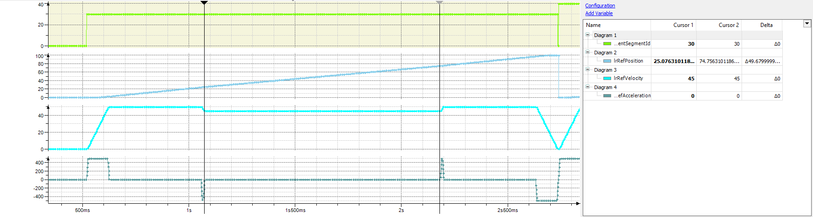

# IF\_RobotMotion - SetReducedVelocity (Method)

## Overview

|  |  |
| --- | --- |
| Type: | Method |
| Available as of: | V3.7.1.0 |

This chapter provides information on:

* [Task](IF_RobotMotion-SetReducedVelocityMe-D8FE8E44.html#IF_RobotMotion-SetReducedVelocityMe-D8FE8E44__Task-D8FEA7B9)
* [Description](IF_RobotMotion-SetReducedVelocityMe-D8FE8E44.html#IF_RobotMotion-SetReducedVelocityMe-D8FE8E44__Description-D8FEA8F8)
* [Interface](IF_RobotMotion-SetReducedVelocityMe-D8FE8E44.html#IF_RobotMotion-SetReducedVelocityMe-D8FE8E44__Interface-D8FEAAEA)
* [Diagnostic Messages](IF_RobotMotion-SetReducedVelocityMe-D8FE8E44.html#IF_RobotMotion-SetReducedVelocityMe-D8FE8E44__DiagnosticMessages-D8FEAC61)

## Task

Set a reduced velocity for a certain part of the connected path.

## Description

The method can be used to set a reduced velocity for a certain part of the connected path.

The part of the connected path where the reduced velocity must be active is specified by the inputs i\_udiStartSegmentId, i\_lrStartOffset, i\_udiEndSegmentId and i\_lrEndOffset.

The reduced velocity set by the input i\_lrValue is reached at the selected start position and is kept until the selected end position. The necessary acceleration and deceleration phases are executed before the start point and after the end point respectively.

Example:

In the example, the reduced velocity of 45 was set for the configured zone between the connected path RefPosition 25...75, marked by the two cursors. The velocity is reduced before the start and increased again to the configured maximum velocity for the segment after the end of the configured zone.

The reduced velocity is only applied if:

* The transmitted velocity is lower than the velocity used for the segments set via the methods SetMotionParameter or SetMaxVelocity.
* The velocity is lower than any other velocity induced by limitation functionalities such as MoveSync or the acceleration control (refer to [IF\_RobotMotion - SetMaxAccelerationResultant (Method)](D-SE-0075589.html)).

## Interface

| Input | Data type | Description |
| --- | --- | --- |
| i\_lrValue | LREAL | Maximum velocity that must be used for the part of the connected path specified by i\_udiStartSegmentId, i\_lrStartOffset, i\_udiEndSegmentId and i\_lrEndOffset.  Unit: [Units/s]  Valid values: i\_lrValue > 0.0 |
| i\_udiStartSegmentId | UDINT | ID of the segment where the reduced velocity is started.  Valid values: i\_udiStartSegmentId > 0 and the segment ID must be present in the last connected path. |
| i\_lrStartOffset | LREAL | Offset within the start segment where the reduced velocity must be reached.  Positive values of i\_lrStartOffset refer to the start of the segment, and negative values refer to the end of the segment.  Special case: i\_lrStartOffset = 0, in this case the reduced velocity must be reached at the start of the segment. |
| i\_udiEndSegmentId | UDINT | ID of the segment where the reduced velocity is ended.  i\_udiEndSegmentId > 0 and the segment ID must be present in the last connected path. |
| i\_lrEndOffset | LREAL | Offset within the end segment until where the reduced velocity must be kept.  Positive values of i\_lrEndOffset refer to the start of the segment, and negative values refer to the end of the segment.  Special case: i\_lrEndOffset = 0, in this case the reduced velocity must be kept until the end of the segment. |

| Output | Data type | Description |
| --- | --- | --- |
| q\_etDiag | [GD.ET\_Diag](../../../../../api/crossBook?lang=en-US&virtualBookName=PD.Lib.GlobalDiagnostic&topicID=D_SE_0076228) | General library-independent statement on the diagnostic.  A value not equal to GD.ET\_Diag.Ok corresponds to a diagnostic message. |
| q\_etDiagExt | [ET\_DiagExt](ET_DiagExt-GeneralInformation-CAB158DC.html#ET_DiagExt-GeneralInformation-CAB158DC) | POU-specific output on the diagnostic.  q\_etDiag = ET\_Diag.Ok -> Status message  q\_etDiag <> ET\_Diag.Ok -> Diagnostic message |
| q\_sMsg | STRING[80] | Event-triggered message that gives additional information on the diagnostic state. |

## Diagnostic Messages

| q\_etDiag | q\_etDiagExt | Enumeration value | Description |
| --- | --- | --- | --- |
| OK | Ok | 0 | Ok |
| ExecutionAborted | CommandRefused | 10 | The command has been denied. |
| ExecutionAborted | ConfigInvalid | 1 | The configuration is invalid. |
| ExecutionAborted | Disabled | 51 | Disabled |
| ExecutionAborted | EndSegmentIdNotFound | 32 | The end segment ID was not found. |
| ExecutionAborted | ExternalPositionSourceConfigured | 205 | The external position source is configured. |
| ExecutionAborted | InitializationFailed | 4 | The initialization was unsuccessful. |
| ExecutionAborted | InterfaceInvalid | 3 | An interface is invalid. |
| ExecutionAborted | NoConnectedPathAvailable | 9 | There is no connected path available. |
| ExecutionAborted | NoMoreSegmentsAvailable | 86 | There are no more segments available. |
| ExecutionAborted | NotReady | 77 | The robot is not ready. |
| ExecutionAborted | PathPositionEndInvalid | 25 | The end position on the path is invalid. |
| ExecutionAborted | PathPositionStartAlreadyPassed | 81 | The robot already passed the start position on the path. |
| ExecutionAborted | RobotFeedbackInvalid | 13 | A feedback value was invalid. |
| ExecutionAborted | StartSegmentIdNotFound | 31 | The start segment Id was not found. |
| InputParameterInvalid | EndOffsetRange | 78 | The end offset is out of range. |
| InputParameterInvalid | EndSegmentIdRange | 28 | The end segment Id is out of range. |
| InputParameterInvalid | MaxVelocityRange | 124 | The maximum velocity is out of range. |
| InputParameterInvalid | StartOffsetRange | 116 | The start offset is out of range. |
| InputParameterInvalid | StartSegmentIdRange | 27 | The start segment Id is out of range. |

## CommandRefused

|  |  |
| --- | --- |
| Enumeration name: | CommandRefused |
| Enumeration value: | 10 |
| Description: | The command has been denied. |

| Issue | Cause | Solution |
| --- | --- | --- |
| The reduced velocity was not set. | Another command is already being processed. Two move commands, for example MoveL(...), MoveC(...), MoveS(...) or MoveSync(...), SetReducedVelocity(…) are called simultaneously. | Ensure that move commands are called one after another and not simultaneously. |

## ConfigInvalid

|  |  |
| --- | --- |
| Enumeration name: | ConfigInvalid |
| Enumeration value: | 1 |
| Description: | The configuration is invalid. |

| Issue | Cause | Solution |
| --- | --- | --- |
| The reduced velocity was not set. | The robot configuration is invalid. | Ensure that the method ConfigDone(...) is called successfully to complete the configuration of the robot. |

## Disabled

|  |  |
| --- | --- |
| Enumeration name: | Disabled |
| Enumeration value: | 51 |
| Description: | Disabled |

| Issue | Cause | Solution |
| --- | --- | --- |
| The reduced velocity was not set. | FB\_Robot.xEnable = FALSE  The robot is not active. | Set FB\_Robot.xEnable = TRUE, to enable the robot before sending commands. |

## EndOffsetRange

|  |  |
| --- | --- |
| Enumeration name: | EndOffsetRange |
| Enumeration value: | 78 |
| Description: | The end offset is out of range. |

| Issue | Cause | Solution |
| --- | --- | --- |
| The reduced velocity was not set. | The value transferred at the input i\_lrEndOffset is not within the valid range. | At the input i\_lrEndOffset, a value less than or equal to the length of the selected segment (i\_udiEndSegmentId) must be transferred. |

## EndSegmentIdNotFound

|  |  |
| --- | --- |
| Enumeration name: | EndSegmentIdNotFound |
| Enumeration value: | 32 |
| Description: | The end segment ID was not found. |

| Issue | Cause | Solution |
| --- | --- | --- |
| The reduced velocity was not set. | The segment with the ID transferred at the input i\_udiEndSegmentId was not found in the last connected path. | Ensure that the segment with the ID i\_udiEndSegmentId is included in the last connected path. |

## EndSegmentIdRange

|  |  |
| --- | --- |
| Enumeration name: | EndSegmentIdRange |
| Enumeration value: | 28 |
| Description: | The end segment Id is out of range. |

| Issue | Cause | Solution |
| --- | --- | --- |
| The reduced velocity was not set. | The value transferred at the input i\_udiEndSegmentId is not within the valid range. | At the input i\_udiEndSegmentId, a value greater than or equal to 1 must be transferred. |

## ExternalPositionSourceConfigured

|  |  |
| --- | --- |
| Enumeration name: | ExternalPositionSourceConfigured |
| Enumeration value: | 205 |
| Description: | The external position source is configured. |

| Issue | Cause | Solution |
| --- | --- | --- |
| The reduced velocity was not set. | An external position source for the robot components cartesian, orientation and auxiliary axes is configured. | Do not send a motion job.  Sending a motion job is not possible when an external position source for the robot components is configured. |

## InitializationFailed

|  |  |
| --- | --- |
| Enumeration name: | InitializationFailed |
| Enumeration value: | 4 |
| Description: | The initialization was unsuccessful. |

The reduced velocity is not set.

## InterfaceInvalid

|  |  |
| --- | --- |
| Enumeration name: | InterfaceInvalid |
| Enumeration value: | 3 |
| Description: | An interface is invalid. |

The reduced velocity is not set.

## MaxVelocityRange

|  |  |
| --- | --- |
| Enumeration name: | MaxVelocityRange |
| Enumeration value: | 124 |
| Description: | The maximum velocity is out of range. |

| Issue | Cause | Solution |
| --- | --- | --- |
| The reduced velocity was not set. | The value transferred at the input i\_IrValue is not within the valid range. | At the input i\_lrValue, a value greater than 0 must be transferred. |

## NoConnectedPathAvailable

|  |  |
| --- | --- |
| Enumeration name: | NoConnectedPathAvailable |
| Enumeration value: | 9 |
| Description: | There is no connected path available. |

| Issue | Cause | Solution |
| --- | --- | --- |
| The reduced velocity was not set. | The method SetReducedVelocity(...) was called but there is no connected path available. | Create a connected path before calling the method SetReducedVelocity(...). |

## NoMoreSegmentsAvailable

|  |  |
| --- | --- |
| Enumeration name: | NoMoreSegmentsAvailable |
| Enumeration value: | 86 |
| Description: | There are no more segments available. |

| Issue | Cause | Solution |
| --- | --- | --- |
| The reduced velocity was not set. | There are no more segments with reduced velocity available. | Wait until the movements with reduced velocity are executed before sending new commands. |
| Increase the parameter [Gc\_udiMaxNumberOfReducuedVelocitySegments](D-SE-0075611.html) in the global parameter list of the robotic library. |

## NotReady

|  |  |
| --- | --- |
| Enumeration name: | NotReady |
| Enumeration value: | 77 |
| Description: | The robot is not ready. |

| Issue | Cause | Solution |
| --- | --- | --- |
| The reduced velocity was not set. | The function block FB\_Robot is not ready. | Ensure that the configuration of the robot is finished, the robot is enabled, and the drives are ready. |

## Ok

|  |  |
| --- | --- |
| Enumeration name: | Ok |
| Enumeration value: | 0 |
| Description: | Ok |

The reduced velocity is set successfully.

## PathPositionEndInvalid

|  |  |
| --- | --- |
| Enumeration name: | PathPositionEndInvalid |
| Enumeration value: | 25 |
| Description: | The end position on the path is invalid. |

| Issue | Cause | Solution |
| --- | --- | --- |
| The reduced velocity was not set. | The end position of the segment with reduced velocity is before its start position. | Ensure that the path position end is greater than the path position start.  Verify the values of i\_udiStartSegmentId, i\_lrStartOffset, i\_udiEndSegmentId, and i\_lrEndOffset of SetReducedVelocity(...). |

## PathPositionStartAlreadyPassed

|  |  |
| --- | --- |
| Enumeration name: | PathPositionStartAlreadyPassed |
| Enumeration value: | 81 |
| Description: | The robot already passed the start position on the path. |

| Issue | Cause | Solution |
| --- | --- | --- |
| The reduced velocity was not set. | The robot has already passed the specified start position of the segment with reduced velocity on the path. | Ensure that SetReducedVelocity(...) is called early enough to ensure that the robot has not passed the start position on the path yet. |

## RobotFeedbackInvalid

|  |  |
| --- | --- |
| Enumeration name: | RobotFeedbackInvalid |
| Enumeration value: | 13 |
| Description: | A feedback value was invalid. |

The reduced velocity was not set.

## StartOffsetRange

|  |  |
| --- | --- |
| Enumeration name: | StartOffsetRange |
| Enumeration value: | 116 |
| Description: | The start offset is out of range. |

| Issue | Cause | Solution |
| --- | --- | --- |
| The reduced velocity was not set. | The value transferred at the input i\_lrStartOffset is not within the valid range. | At the input i\_lrStartOffset, a value less than or equal to the length of the selected segment (i\_udiStartSegmentId) must be transferred. |

## StartSegmentIdNotFound

|  |  |
| --- | --- |
| Enumeration name: | StartSegmentIdNotFound |
| Enumeration value: | 31 |
| Description: | The start segment Id was not found. |

| Issue | Cause | Solution |
| --- | --- | --- |
| The reduced velocity was not set. | The segment with the ID transferred at the input i\_udiStartSegmentId was not found in the last connected path. | Ensure that the segment with the ID i\_udiStartSegmentId is in the last connected path. |

## StartSegmentIdRange

|  |  |
| --- | --- |
| Enumeration name: | StartSegmentIdRange |
| Enumeration value: | 27 |
| Description: | The start segment Id is out of range. |

| Issue | Cause | Solution |
| --- | --- | --- |
| The reduced velocity was not set. | The value transferred at the input i\_lrStartOffset is not within the valid range. | At the input i\_lrStartOffset, a value less than or equal to the length of the selected segment (i\_udiStartSegmentId) must be transferred. |

EIO0000002232.23