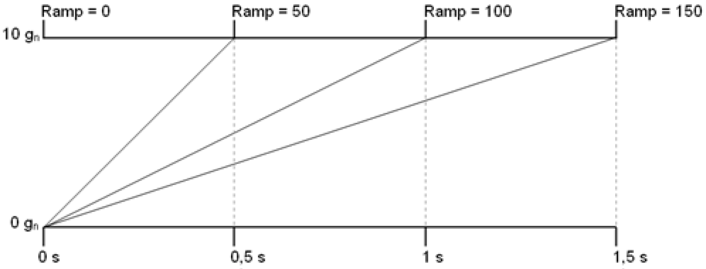
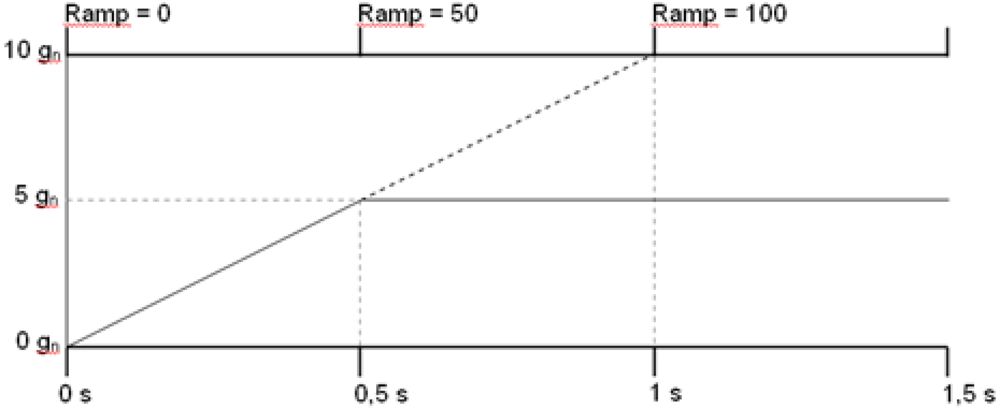
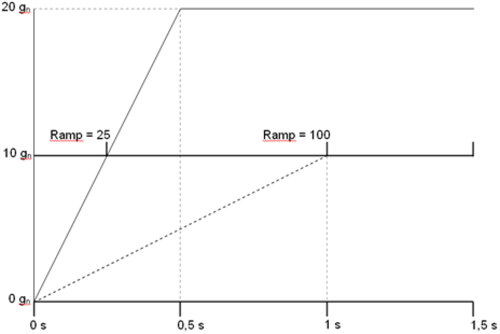

# Motion Parameter Ramp

## General

A value of the ramp = 100 corresponds to an increase in acceleration 0...10 g within one second.

This is why there is a jerk for ramp = 100 (change of the acceleration/deceleration) of 98066.5 mm/s³.

## Example 1:

The specified maximum acceleration of 5 g is reached within 0.5 seconds in case of a ramp is equal to 100.

## Example 2:

The specified maximum acceleration of 20 g is reached within 0.5 seconds in case of a ramp is equal to 25.

EIO0000002232.23