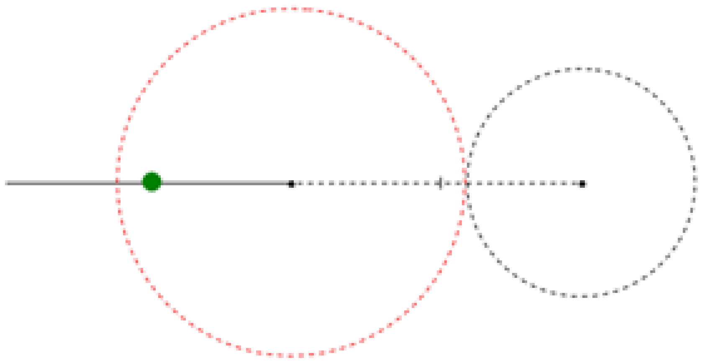
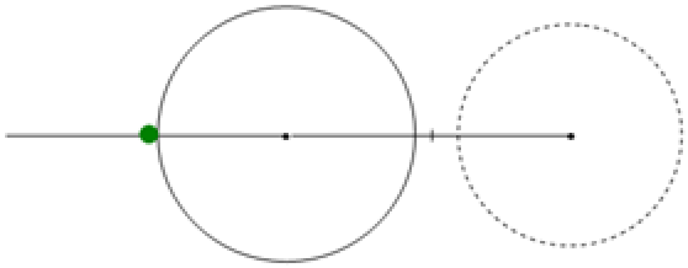
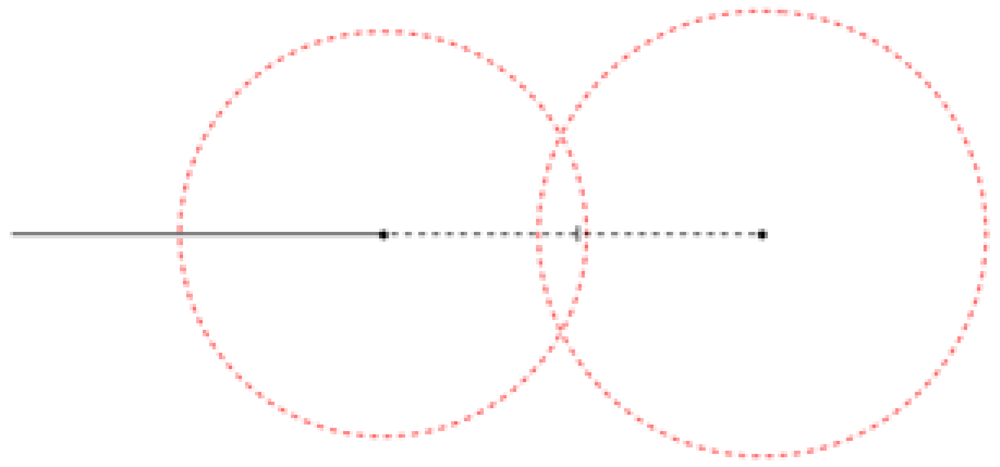
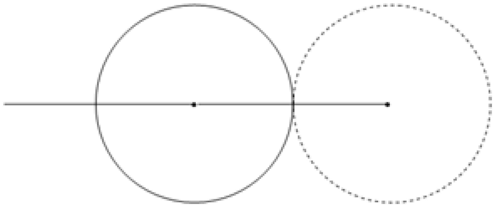
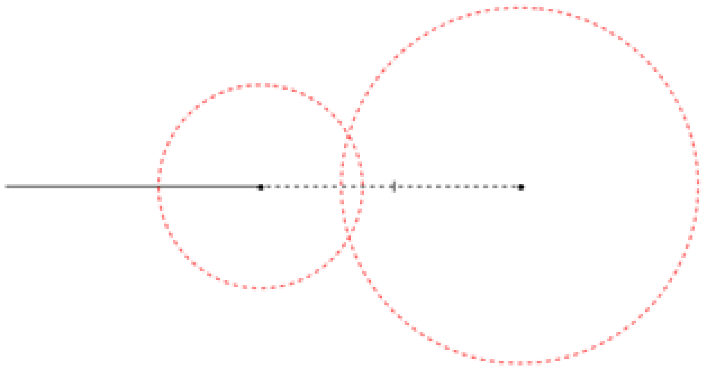
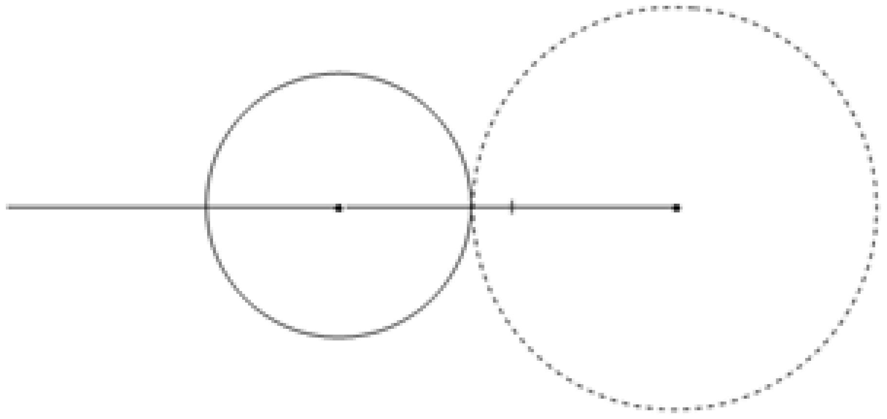
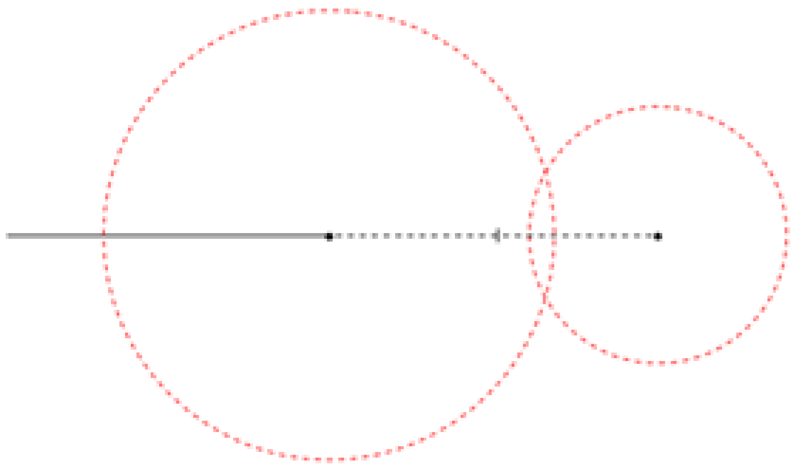
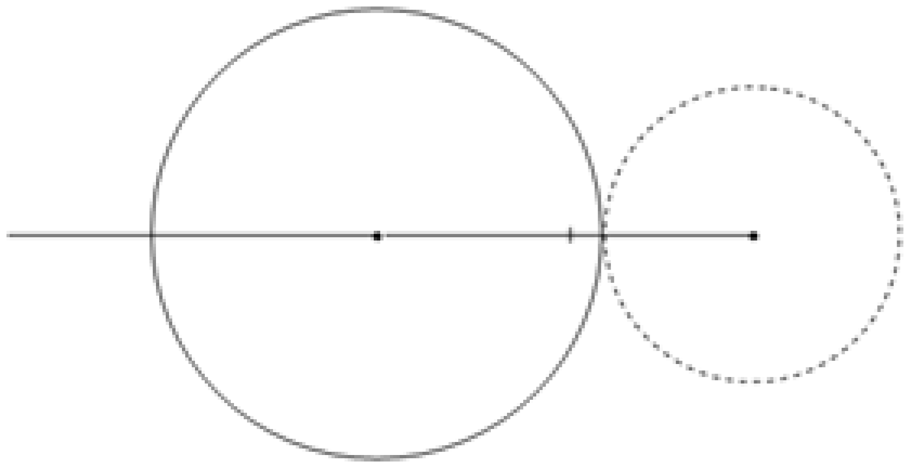

# Independent Shortening of the Blending Zones

## General

The size of the blending zones are always verified twice:

**1. Shortening the zone of the last motion command**

**Initial situation:**

* The robot is within the zone of the last motion command when the new motion command is appended.

Result:

* The zone of the last motion command is shortened.

If this shortening of the zone results in a zone size smaller than IF\_RobotConfigurationAdvanced.lrMinZone, then a new connected path is created.

**2. The zone of the last issued motion command and the zone of the motion command that has to be appended are together greater than the length of the motion command that has to be appended.**

**Initial situation A:**

* Both zones are greater than half the length of the motion command that has to be appended; in this case the proportions are irrelevant.

Result:

* Both zones are shortened to half the length of the motion command that has to be appended.

**Initial situation B:**

* The zone of the motion command that has to be appended is greater than the zone of the last motion command. The smaller zone is also smaller than half the segment length.

Result:

* The zone of the motion command that has to be appended is shortened in order for both zones to touch.

**Initial situation C:**

* The zone of the last motion command is greater than the zone of the motion command that has to be appended. The smaller zone is also smaller than half the segment length.

Result:

* The zone of the last motion command is shortened in order for both zones to touch.

These verifies are performed every time a motion command is issued.

If a zone was shortened by a verification, then the shortening of the following zones does not increase its size.

EIO0000002232.23