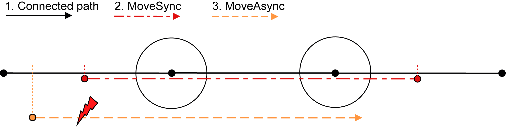
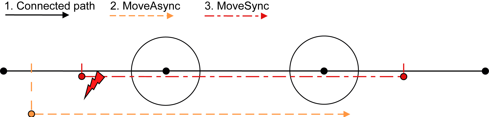
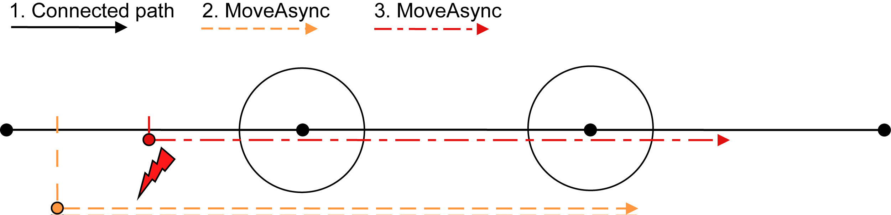

# Behavior of Method MoveAsync

## No MoveAsync Motion Before the End of a MoveSync Motion

If a move command MoveSync (2.) was sent to the robot, either for the connected path or for a next connected path, it is not possible to send a move command MoveAsync (3.) which starts before the synchronous movement is completed.

Reasons for this are:

* The end of an asynchronous movement has no relation to a path position.
* A forecast as to when the asynchronous movement is finished in relation to a path movement is not possible in all cases.

In general, it is not possible to execute a synchronous and an asynchronous auxiliary axis movement at the same time.

## No MoveSync Motion Before the End of a MoveAsync Motion

If a move command MoveAsync (2.) was sent to the robot, it is not possible to send a move command MoveSync (3.) until the asynchronous movement is finished.

A forecast as to when the asynchronous movement is finished in relation to a path movement is not possible in all cases.

In general, it is not possible to execute a synchronous and an asynchronous auxiliary axis movement at the same time.

Also refer to the diagnostic messages of the MoveSync command (MoveAsyncTriggered, MoveAsyncActive).

## No Second MoveAsync Motion Before the End of the First MoveAsync Motion

If a move command MoveAsync (2.) was sent to the robot, it is not possible to send a second move command MoveAsync (3.) until the first asynchronous movement is finished.

A forecast as to when the asynchronous movement is finished in relation to a path movement is not possible in all cases.

## Motion Parameters for an Asynchronous Auxiliary Axis Movement

The asynchronous movement is executed with the motion parameters (MaxVelocity, MaxAcceleration, MaxDeceleration and Ramp) set by the methods:

* IF\_RobotMotion.SetMotionParameter
* IF\_RobotMotion.SetMaxVelocity
* IF\_RobotMotion.SetMaxAcceleration
* IF\_RobotMotion.SetMaxDeceleration
* IF\_RobotMotion.SetRamp

The parameters are set for ET\_RobotComponent.AuxAxAll or ET\_RobotComponent.AuxAx[1..10].

The asynchronous movement is executed with the last set of motion parameters sent before the move command MoveAsync is called.

A change of the motion parameters after the move command MoveAsync is called or while the asynchronous movement is active is possible, but the change does not affect the last sent move command or the ongoing asynchronous movement.

## Behavior While the Robot Is Stopped

| Preconditions | Result |
| --- | --- |
| * FB\_Robot.xEnable is set to TRUE.   Robot is active and ready.   * FB\_Robot.xStart is set from FALSE to TRUE. * MoveAsync command is sent.   The robot moves immediately. | If FB\_Robot.xStart is set to FALSE during an asynchronous auxiliary axis movement is active, the movement is stopped with MaxDeceleration and Ramp configured by methods listed in chapter [Motion parameters for an asynchronous auxiliary axis movement](#D-SE-0075802__D-SE-0075802.6). |
| If FB\_Robot.xStart is set to TRUE again, the asynchronous auxiliary axis movement is continued. |
| If the auxiliary axis was moved away from its last position (for example, by jogging), the robot returns the diagnostic message ET\_DiagExt.NotOnPath. |

## Behavior While the Robot Responds to an Emergency Stop

| Preconditions | Result |
| --- | --- |
| * FB\_Robot.xEnable is set to TRUE.   Robot is active and ready.   * FB\_Robot.xStart is set from FALSE to TRUE. * MoveAsync command is sent.   The robot moves immediately. | In case of FB\_Robot.xEnable is set to FALSE during an asynchronous auxiliary axis movement is active, the movement is stopped with MaxEmergencyDeceleration and EmergencyRamp configured by the method IF\_RobotConfiguration.SetEmergencyParameter2. |
| For an asynchronous auxiliary axis movement, it is mandatory to configure emergency parameters for the auxiliary axis movement (SetEmergencyParameter2). |
| To read out the configured emergency parameters for a robot component, use the method GetEmergencyParameter2. |

NOTE: Also refer to [Behavior of SetEmergencyParameter versus SetEmergencyParameter2](D-SE-0075801.html#D-SE-0075801).

## Behavior of IF\_RobotMotion.lrVelOverride

For an asynchronous auxiliary axis movement, velocity override, which is set by IF\_RobotMotion.lrVelOverride, is NOT considered.

## Behavior During ColdStart

| Preconditions | Result |
| --- | --- |
| * FB\_Robot.xEnable set from TRUE to FALSE.   Robot is inactive and not ready.   * FB\_Robot.xEnable set from FALSE to TRUE.   Robot is active and ready. | If a ColdStart is performed after re-enabling the robot, the previous active asynchronous auxiliary axis movement is NOT continued. |

## Behavior During WarmStart

| Preconditions | Result |
| --- | --- |
| * FB\_Robot.xEnable set from FALSE to TRUE.   Robot is active and ready.   * FB\_Robot.xWsSelect set from FALSE to TRUE.   Warm start motion is pre-selected.   * FB\_Robot.xWsStart set from FALSE to TRUE. | If a WarmStart is performed after re-enabling the robot, a previous active asynchronous auxiliary axis movement is continued. |
| If the auxiliary axis was moved during FB\_Robot.xStart and/or FB\_Robot.xEnable was FALSE, it is moved back to its last position on path first before the asynchronous auxiliary axis movement is continued. |
| If the auxiliary axis has to be moved back to its last position on path, the motion parameters of the latest synchronous or asynchronous movement are used. |

## Behavior During a Stop Caused by SER - WorkEnvelope

In case the Schneider Electric robotics library diagnostics detect that a robot movement would go outside the robot work envelope, the path and tracking movement is stopped.

Refer to [SchneiderElectricRobotics Library Guide (SER)](D-SE-0075468.3.html#D-SE-0075468.3).

An asynchronous auxiliary axis movement is also stopped.

## No Jogging Along the Connected Path

If an asynchronous auxiliary axis movement is sent or active, jogging along the connected path is not possible.

IF\_RobotJogging.Start(i\_etComponent := ET\_RobotComponent.Path) returns:

q\_etDiag -> GD.ET\_Diag.ExecutionAborted

q\_etDiagExt -> ET\_DiagExt.MoveAsyncTriggered / ET\_DiagExt.MoveAsyncActive

EIO0000002232.23