# Behavior of Method FB\_EllipticSpline.CalcSplineExtended

## Simple Pick and Place Motion

To generate a simple spline, it is sufficient to specify the start position, target position, and the absolute height. Based on these specifications, a spline with 21 points is generated.

| i\_stStart | | i\_stTarget | | i\_lrAbsHeight | Configuration |
| --- | --- | --- | --- | --- | --- |
| IrX | -500.0 | IrX | 500.0 | 300.0 | Default values |
| IrY | 0.0 | IrY | 0.0 |
| IrZ | 0.0 | IrZ | 0.0 |

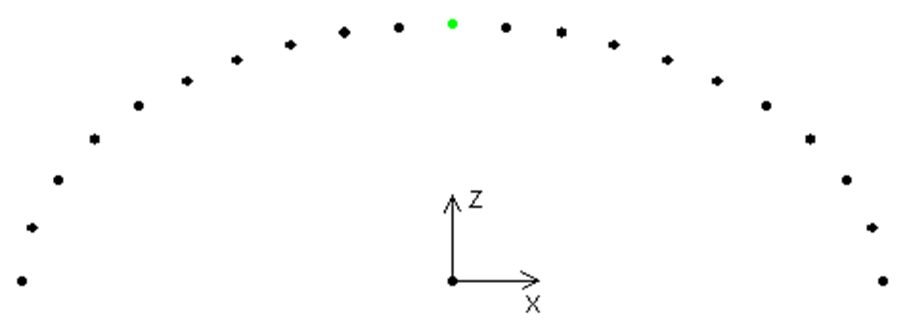

As both coordinates are at the same Z height, the result is a path consisting of two equal half-branches.The apex is marked in green.

## Different Height of Start Position and Target Position

If both coordinates are not at the same height, two different half-branches are generated.

| i\_stStart | | i\_stTarget | | i\_lrAbsHeight | Configuration |
| --- | --- | --- | --- | --- | --- |
| IrX | -500.0 | IrX | 500.0 | 300.0 | Default values |
| IrY | 0.0 | IrY | 0.0 |
| IrZ | 0.0 | IrZ | -200.0 |

The apex is shifted automatically along the projected straight line such that the two half-branches have the same curvature there.

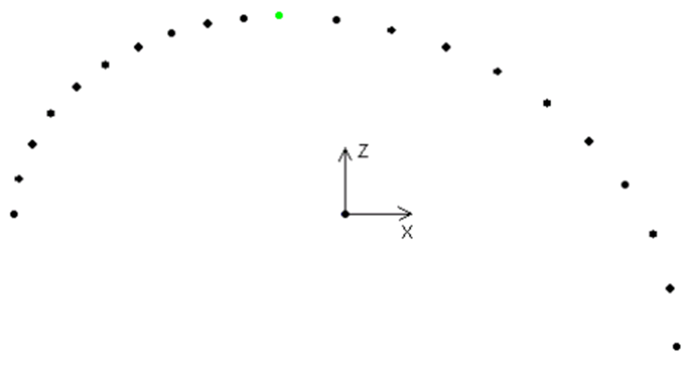

## User Defined Shifting of the Apex

| i\_stStart | | i\_stTarget | | i\_lrAbsHeight | Configuration |
| --- | --- | --- | --- | --- | --- |
| IrX | -500.0 | IrX | 500.0 | 300.0 | xUserApex := TRUE  lrApexScalingFactor := 0.0 |
| IrY | 0.0 | IrY | 0.0 |
| IrZ | 0.0 | IrZ | -200.0 |

The apex is in the middle along the projected straight line between the start and the target position.

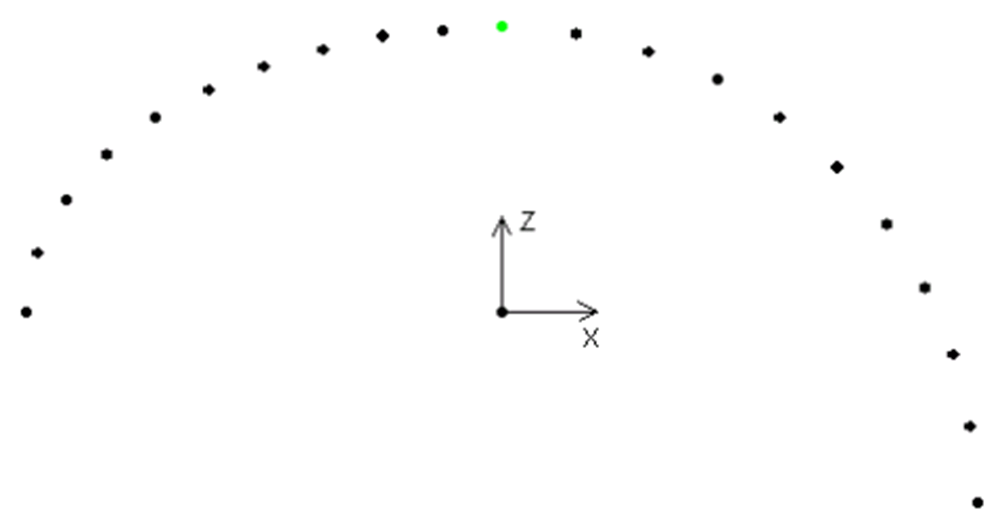

| i\_stStart | | i\_stTarget | | i\_lrAbsHeight | Configuration |
| --- | --- | --- | --- | --- | --- |
| IrX | -500.0 | IrX | 500.0 | 300.0 | xUserApex := TRUE  lrApexScalingFactor := -0.2 |
| IrY | 0.0 | IrY | 0.0 |
| IrZ | 0.0 | IrZ | -200.0 |

The value -0.2 means that the apex is shifted by 20% of the first half-branch on the projected straight line in the direction of the start position. In this way, the apex is at X = -100.

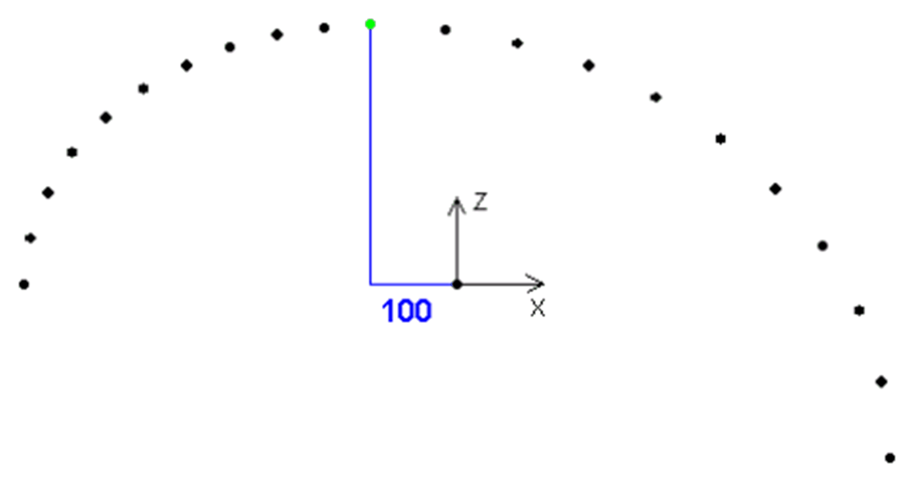

## Smoothing the Apex of the Curve

If the apex cannot be shifted so that a steady curvature is possible, it is possible to smoothen it via lrApexSmoothZone.

| i\_stStart | | i\_stTarget | | i\_lrAbsHeight | Configuration |
| --- | --- | --- | --- | --- | --- |
| IrX | -500.0 | IrX | 500.0 | 300.0 | xUserApex := TRUE  lrApexScalingFactor := -0.2  lrApexSmoothZone := 140 |
| IrY | 0.0 | IrY | 0.0 |
| IrZ | 0.0 | IrZ | -200.0 |

Points that are located within the lrApexSmoothZone are deleted (gray).

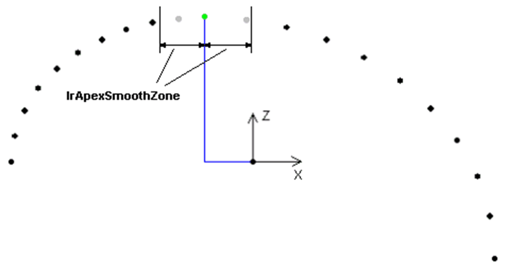

## Consideration of Obstacles

To force the robot across an obstacle, it is possible to specify a threshold each at the start or at the target. In the following example, the robot moves across a threshold which is located at a horizontal distance of 50 mm from the start position and 250 mm above the same.

To circumnavigate obstacles, a sufficient number of spline points is necessary in order to ensure that a spline point is located in the vicinity of the threshold.

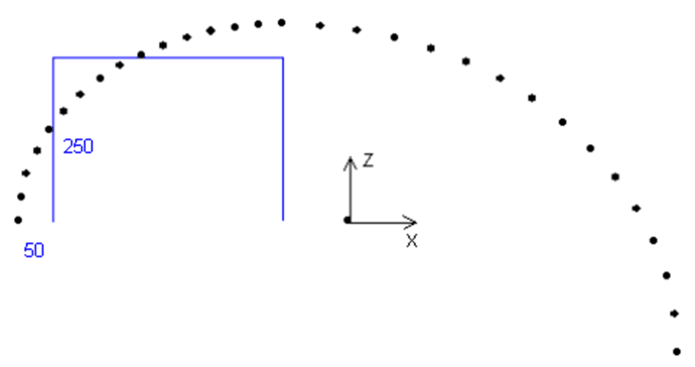

The distance lrStartObstacleDistance always refers to the projected straight line between start position and target position.

| i\_stStart | | i\_stTarget | | i\_lrAbsHeight | Configuration |
| --- | --- | --- | --- | --- | --- |
| IrX | -500.0 | IrX | 500.0 | 300.0 | udiNumberOfSplinePoints := 31  lrStartObstacleDistance := 50.0  lrStartObstacleHeight := 250.0 |
| IrY | 0.0 | IrY | 0.0 |
| IrZ | 0.0 | IrZ | -200.0 |

The function shifts the second spline point upwards to the specified height at the configured distance of 50 mm.

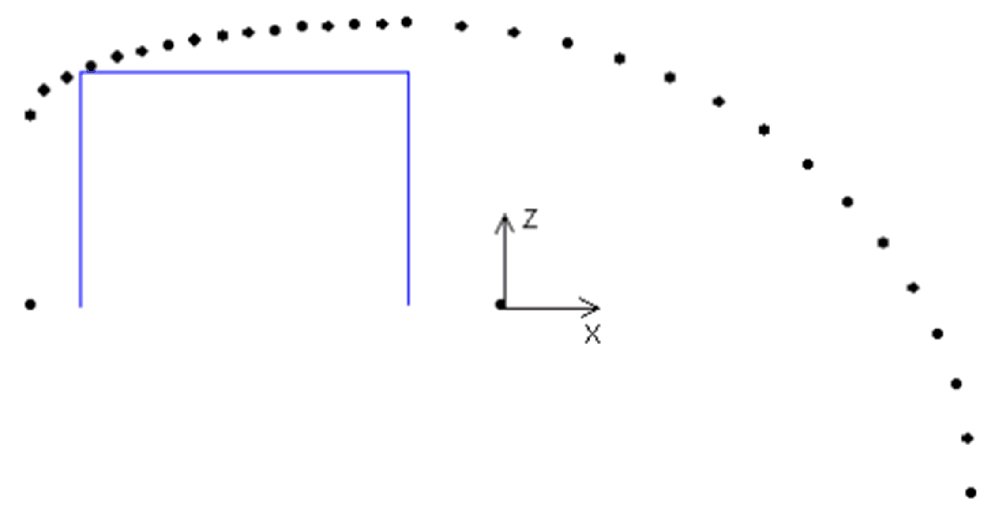

## Forcing a Minimum Vertical Distance

As the function calculates independently whether a vertical movement is necessary and what height this must have to surmount the obstacle, a minimum vertical motion can be parameterized. This motion is only considered if an obstacle is parameterized and it is limited to the height of the obstacle.

| i\_stStart | | i\_stTarget | | i\_lrAbsHeight | Configuration |
| --- | --- | --- | --- | --- | --- |
| IrX | -500.0 | IrX | 500.0 | 300.0 | udiNumberOfSplinePoints := 31  lrStartObstacleDistance := 50.0  lrStartObstacleHeight := 250.0  lrStartMinVerticalDistance := 150.0 |
| IrY | 0.0 | IrY | 0.0 |
| IrZ | 0.0 | IrZ | -200.0 |

The following recording of the actual TCP (Tool Center Point) motion (red) shows that the spline deviates from the straight line towards the outside.

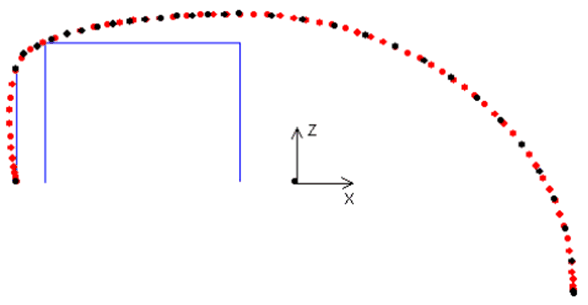

## Forcing a Vertical Distance

To force a vertical motion, spline points can be set onto a straight line above the start position or the target position.

| i\_stStart | | i\_stTarget | | i\_lrAbsHeight | Configuration |
| --- | --- | --- | --- | --- | --- |
| IrX | -500.0 | IrX | 500.0 | 300.0 | udiNumberOfSplinePoints := 31  lrStartObstacleDistance := 50.0  lrStartObstacleHeight := 250.0  lrStartMinVerticalDistance := 150.0  udiStartNumberOfVerticalPoints := 5 |
| IrY | 0.0 | IrY | 0.0 |
| IrZ | 0.0 | IrZ | -200.0 |

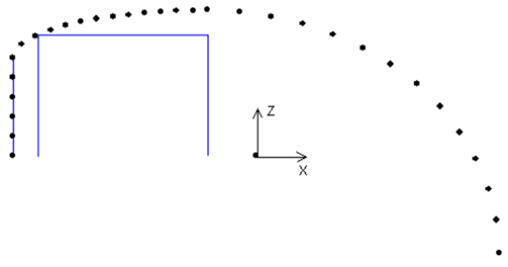

In case of these spline points, a path with minimum lateral deviation is forced:

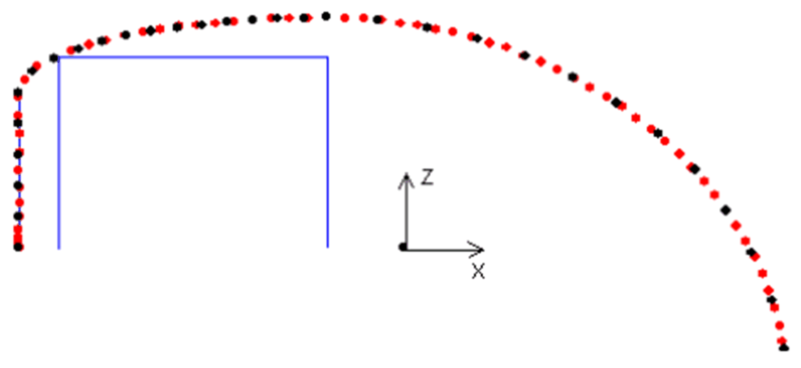

At the point of transition from the straight line to the spline, result in a significant change in curvature. To make this transition smoother, points can be removed from the spline.

| i\_stStart | | i\_stTarget | | i\_lrAbsHeight | Configuration |
| --- | --- | --- | --- | --- | --- |
| IrX | -500.0 | IrX | 500.0 | 300.0 | udiNumberOfSplinePoints := 31  lrStartObstacleDistance := 50.0  lrStartObstacleHeight := 250.0  diStartNumberOfVerticalPoints := 5  diStartSmoothPoints := 1 |
| IrY | 0.0 | IrY | 0.0 |
| IrZ | 0.0 | IrZ | -200.0 |

For diStartSmoothPoints = 1, one point each is removed from the straight line (blue) and the spline curve (green):

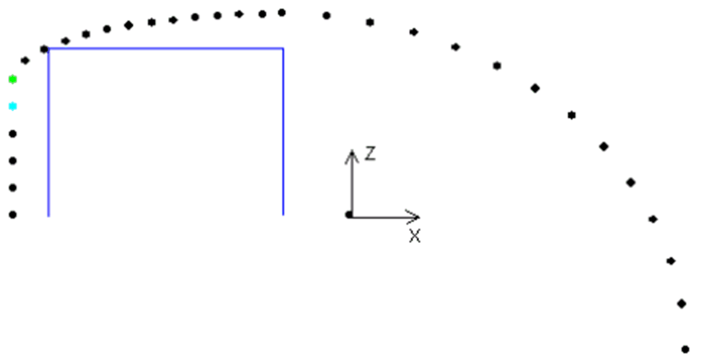

**Result**:

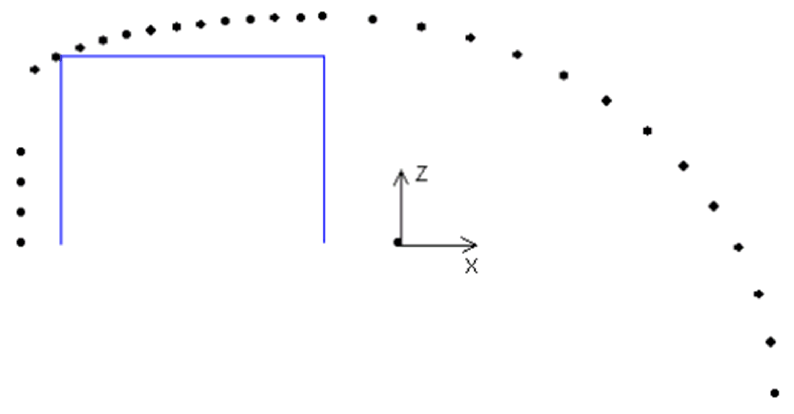

| i\_stStart | | i\_stTarget | | i\_lrAbsHeight | Configuration |
| --- | --- | --- | --- | --- | --- |
| IrX | -500.0 | IrX | 500.0 | 300.0 | udiNumberOfSplinePoints := 31  lrStartObstacleDistance := 50.0  lrStartObstacleHeight := 250.0  diStartNumberOfVerticalPoints := 5  diStartSmoothPoints := 2 |
| IrY | 0.0 | IrY | 0.0 |
| IrZ | 0.0 | IrZ | -200.0 |

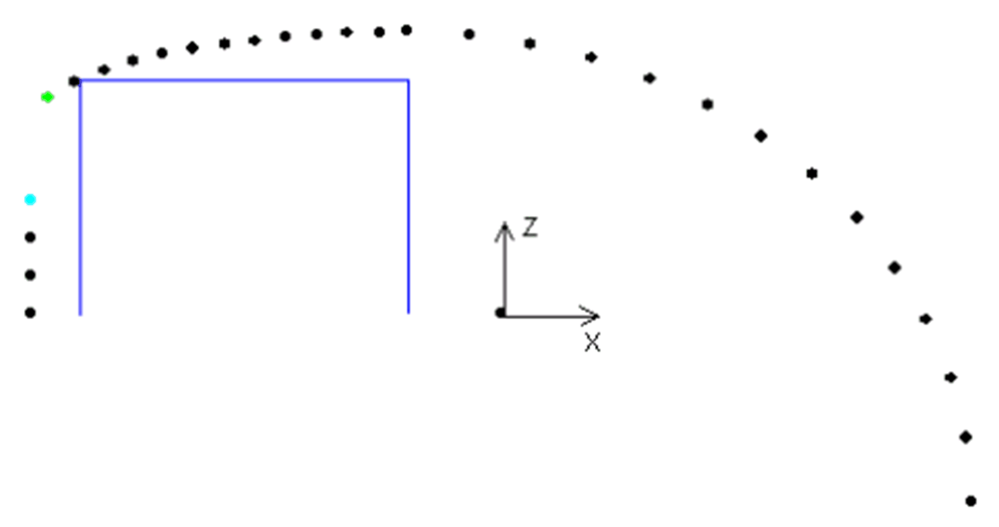

**Result**:

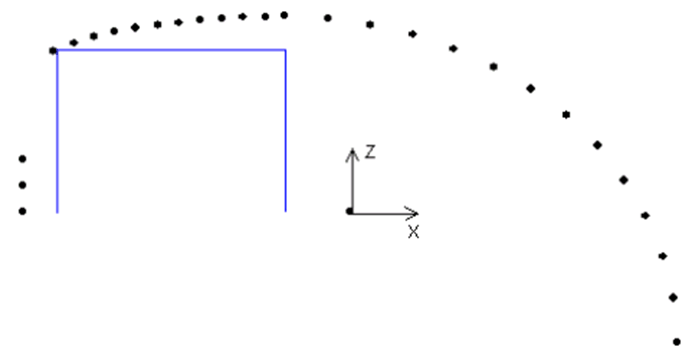

| i\_stStart | | i\_stTarget | | i\_lrAbsHeight | Configuration |
| --- | --- | --- | --- | --- | --- |
| IrX | -500.0 | IrX | 500.0 | 300.0 | udiNumberOfSplinePoints := 31  lrStartObstacleDistance := 50.0  lrStartObstacleHeight := 250.0  diStartNumberOfVerticalPoints := 5  diStartSmoothPoints := 3 |
| IrY | 0.0 | IrY | 0.0 |
| IrZ | 0.0 | IrZ | -200.0 |

However, in this case only the point from the straight line is removed. The spline point (green) remains, as otherwise the spline would run through the obstacle.

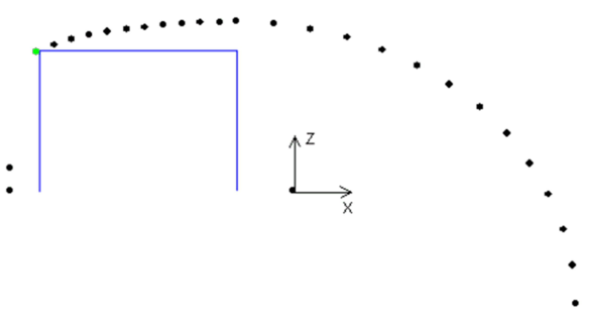

**Result**:

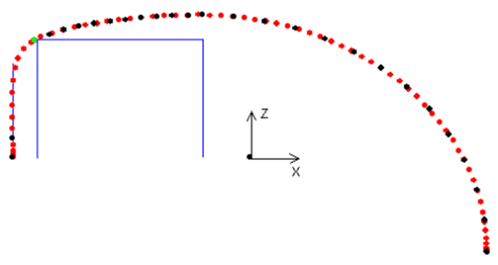

| i\_stStart | | i\_stTarget | | i\_lrAbsHeight | Configuration |
| --- | --- | --- | --- | --- | --- |
| IrX | -500.0 | IrX | 500.0 | 300.0 | udiNumberOfSplinePoints := 31  lrStartObstacleDistance := 50.0  lrStartObstacleHeight := 250.0  diStartNumberOfVerticalPoints := 5  diStartSmoothPoints := 4 |
| IrY | 0.0 | IrY | 0.0 |
| IrZ | 0.0 | IrZ | -200.0 |

Only the point from the straight line is removed.

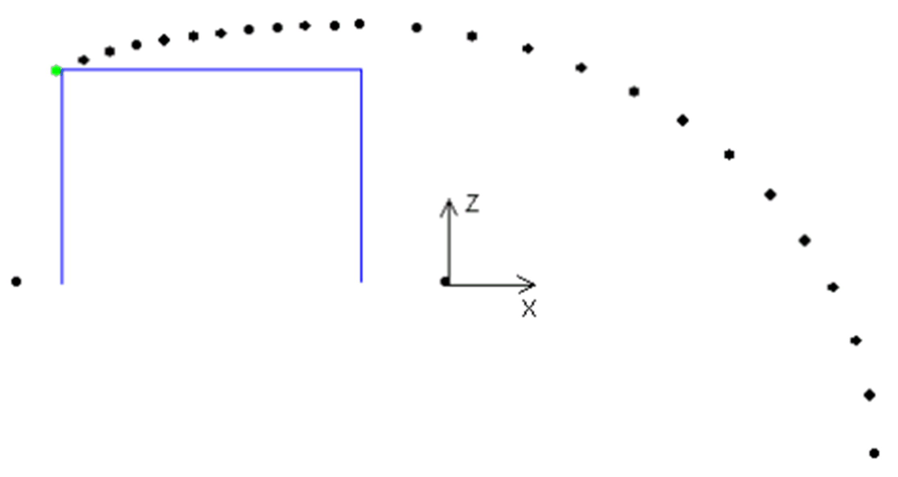

**Result**:

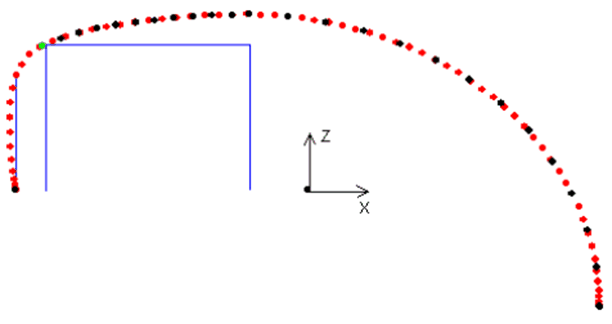

However, the spline path deviates significantly from the straight line again. A further increase in smooth points does not lead to any further change as no further points can be removed.

If a minimum vertical motion is parameterized, then this is considered when removing points from the spline. This means that no points are removed from the straight line which are required for the minimum vertical motion.

diStartSmoothPoints and diTargetSmoothPoints are only considered if a straight line exists each in the start position or the target position to smoothen the transition from a curved path to a path with a curvature nearly equal to zero(straight line).

If spline points are removed without a straight line from the start position or the target position, they must be provided with a negative sign (for example diStartSmoothPoints := -3). This offers the option to move to a start position or target position not vertically from the top but at an incline.

lrStartObstacleDistance or lrTargetObstacleDistance must be set to a value greater than zero to parameterize the maximum distance from the start position or the target position for the slanted path. The corresponding lrStartObstacleHeight or lrTargetObstacleHeight must be set to a value greater than zero also.

| i\_stStart | | i\_stTarget | | i\_lrAbsHeight | Configuration |
| --- | --- | --- | --- | --- | --- |
| IrX | -500.0 | IrX | 500.0 | 300.0 | udiNumberOfSplinePoints := 31  lrStartObstacleDistance := 50.0  lrStartObstacleHeight := 50.0  diStartSmoothPoints := -3 |
| IrY | 0.0 | IrY | 0.0 |
| IrZ | 0.0 | IrZ | -200.0 |

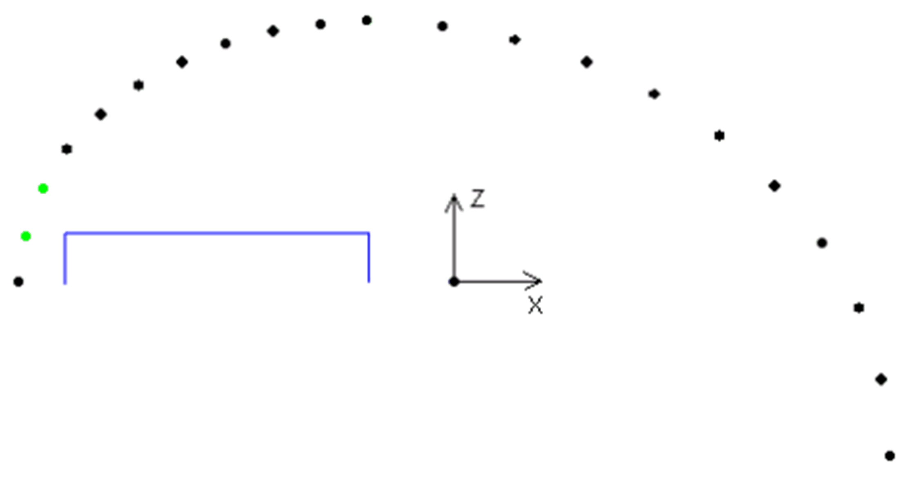

In this example, there will be only two points deleted even if three are configured. The third point will not be deleted because it is already above the configured obstacle.

**Result**:

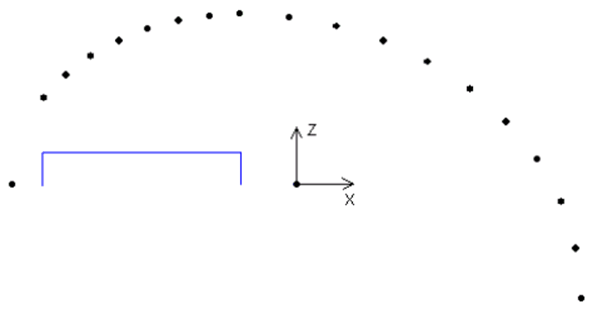

## Consideration of the Width of an Obstacle or the Width of the TCP (Tool Center Point)

If the width of an obstacle or of a tool or product on the TCP must be considered when generating a spline, this can be realized using the parameter lrStartObstacleWidth and lrTargetObstacleWidth. Since the width of the obstacle and the width of the TCP equally influence the path course, the sum of both values is entered in the parameter.

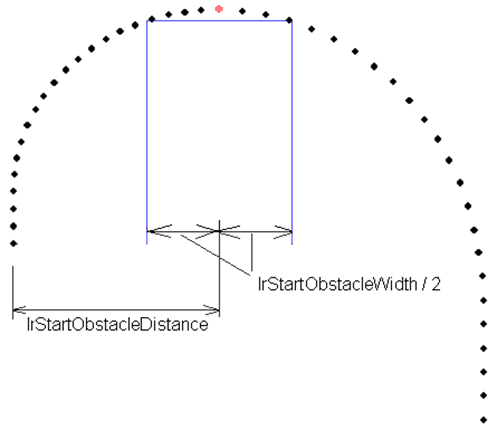

## Obstacles for a Path in Three-Dimensional Space

| i\_stStart | | i\_stTarget | | i\_lrAbsHeight | Configuration |
| --- | --- | --- | --- | --- | --- |
| IrX | -200.0 | IrX | 200.0 | 300.0 | Default values |
| IrY | 100.0 | IrY | 200.0 |
| IrZ | 0.0 | IrZ | 0.0 |

Side view

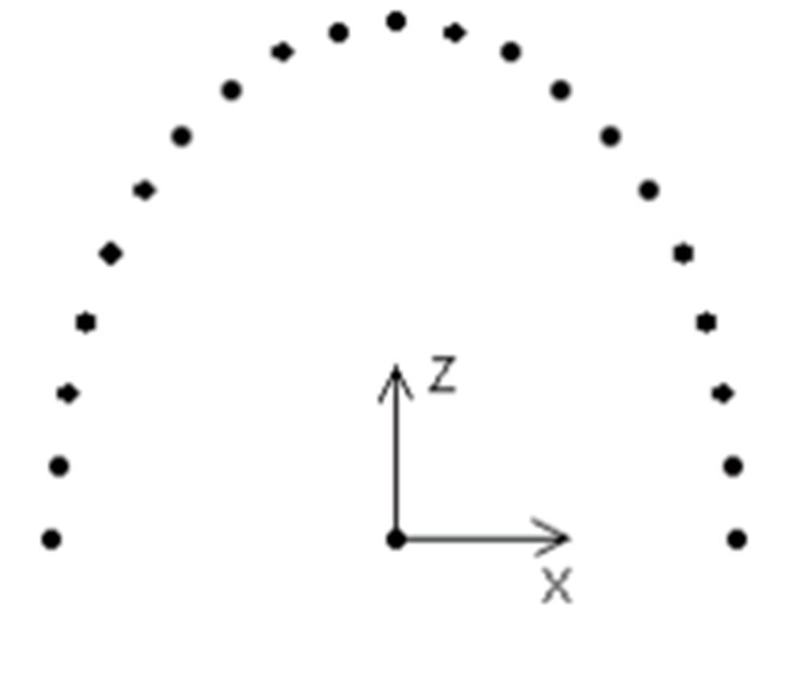

Top view

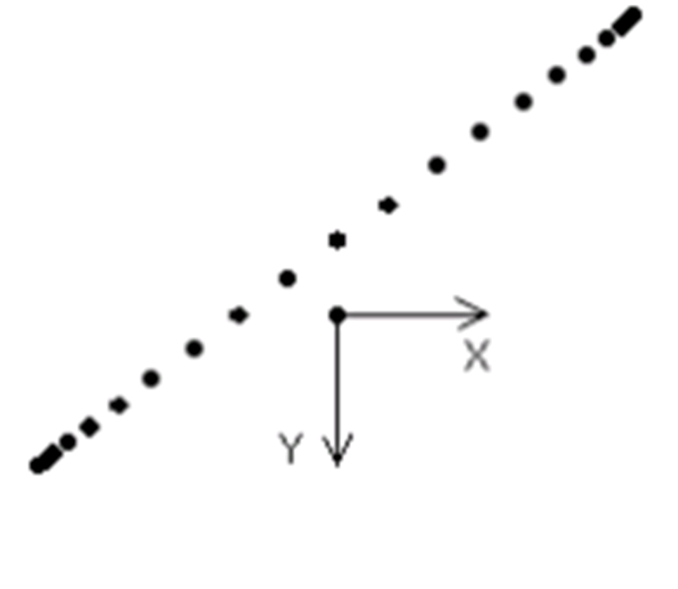

3-dimensional view

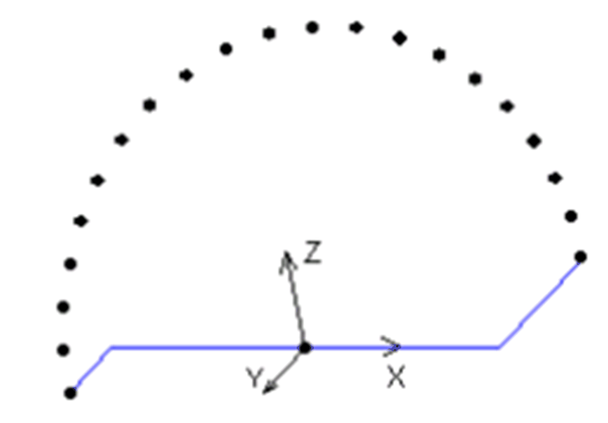

The obstacles refer to a straight line between the start position and the target position.

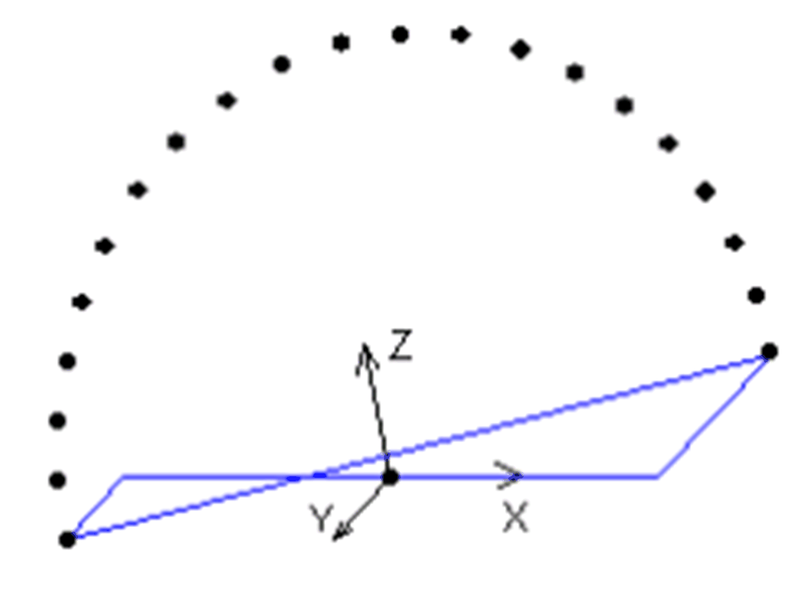

In this case, an obstacle with a distance of 100 mm from the target position is located at X = 120, Y = -140

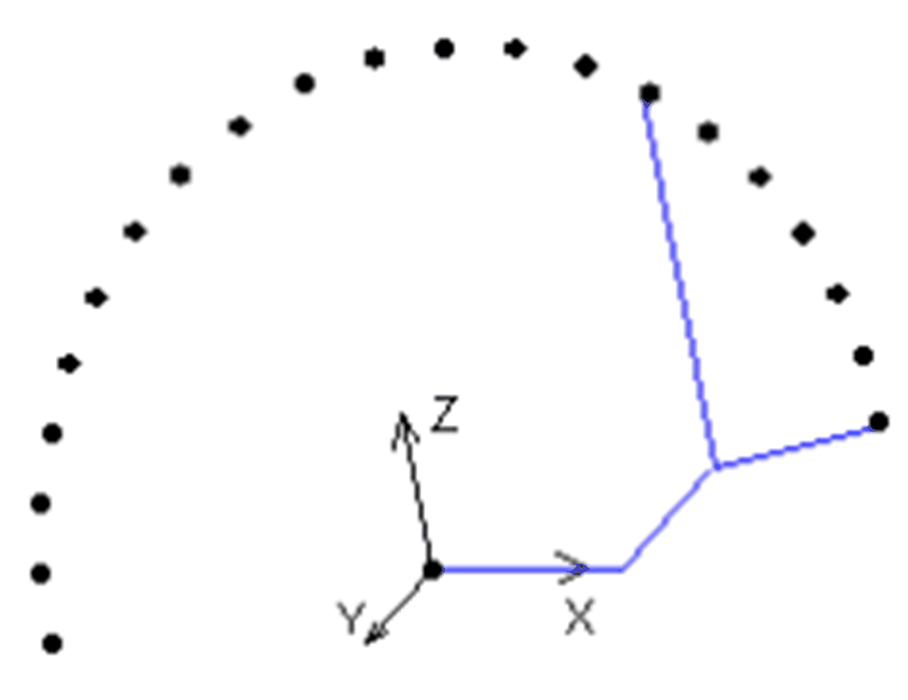

The function described for the two-dimensional case works analogously also in three-dimensional space. Here, the motion plane is always located in parallel to the Z axis of the coordinate system.

EIO0000002232.23