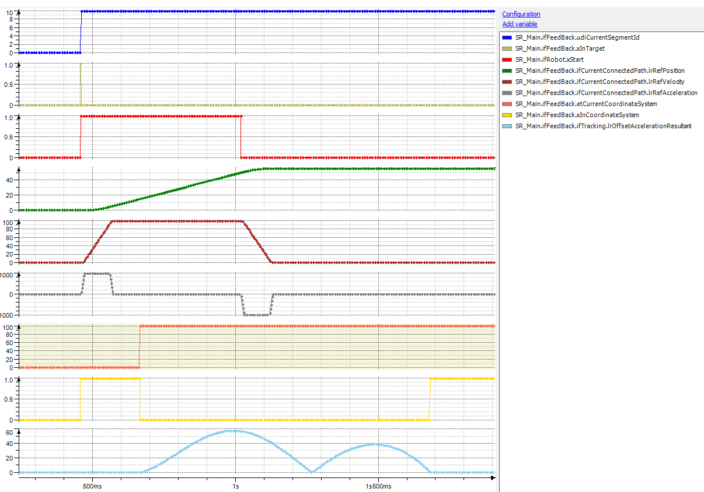

# Behavior of FB\_Robot.xStart = FALSE

## General

When the robot is stopped on the path with FB\_Robot.xStart := FALSE, the behavior is the same as for a stop-on-path. The robot stops on the path, while a synchronization phase, which is already started, continues. As a result, the robot path movement stands still but the robot stays synchronous to the tracking system.

## Trace

EIO0000002232.23