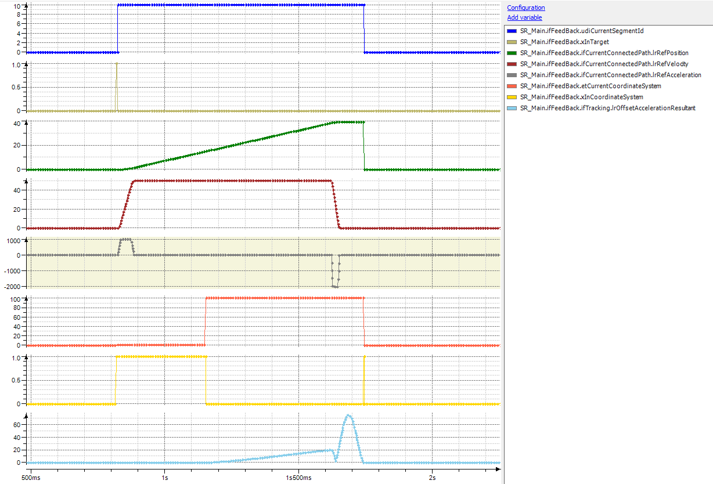

# Behavior of FB\_Robot.xEnable = FALSE / SyncStop

## General

When the FB\_Robot is disabled, or when a SyncStop is triggered on the RoboticModule, the tracking is stopped with the maximum resulting acceleration configured for the component ET\_RobotComponent.Tracking.

Also refer to [RoboticModule Library Guide\Using the Library\OpMode and State Diagrams\OpMode Auto\Stop behavior](../../../../../api/crossBook?lang=en-US&virtualBookName=PD.Lib.RoboticModule&topicID=D_SE_0076979).

## Trace

EIO0000002232.23