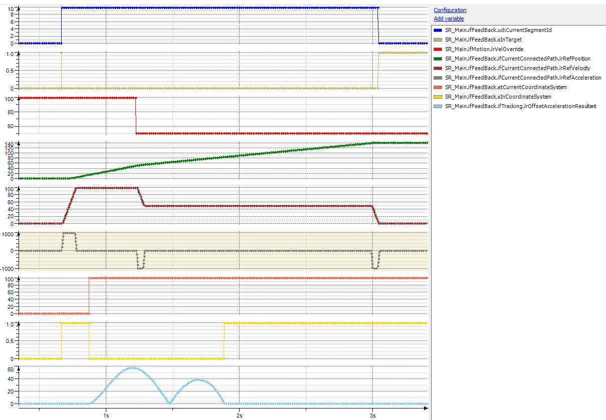
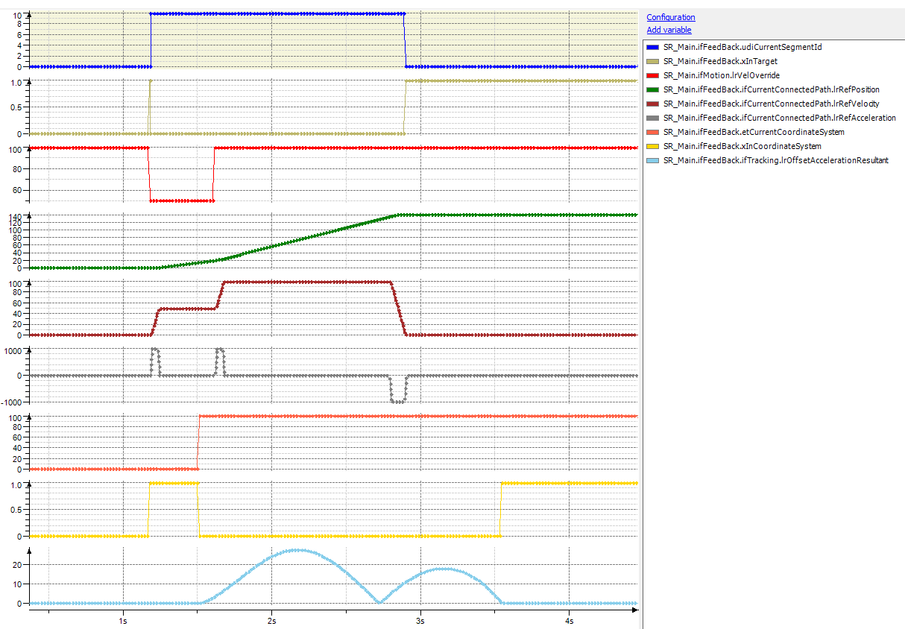
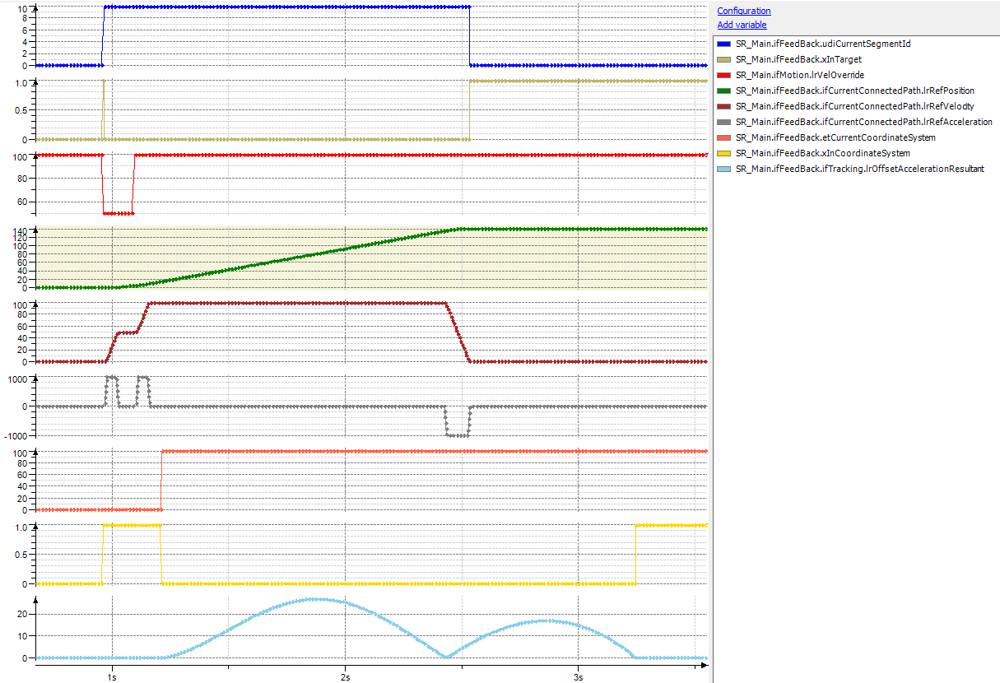

# Behavior of IF\_RobotMotion.lrVelOverride

## General

If the value of IF\_RobotMotion.lrVelOverride is reduced during the motion, the robot reaches its end position later, thus, tracking is finished earlier. There is no recalculation of the values.

## Trace 1

When the value of IF\_RobotMotion.VelOverride is reduced before the start of the tracking synchronization phase, it is considered for the tracking calculations.

## Trace 2

In case IF\_RobotMotion.lrVelOverride is increased, the robot reaches its end position earlier. As the tracking data is not recalculated, the tracking is finished later.

When the value of IF\_RobotMotion.VelOverride is increased before the start of the tracking synchronization phase, it is considered for the tracking calculations.

## Trace 3

Even if IF\_RobotMotion.lrVelOverride is increased before the start of the synchronization phase, the behavior is the same. The values for the tracking are not recalculated.

EIO0000002232.23