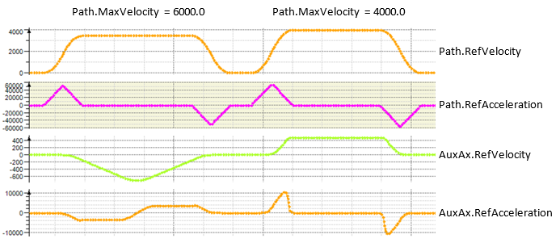
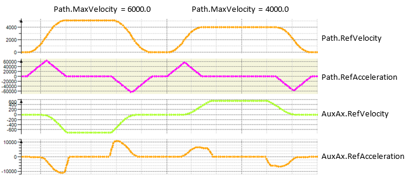
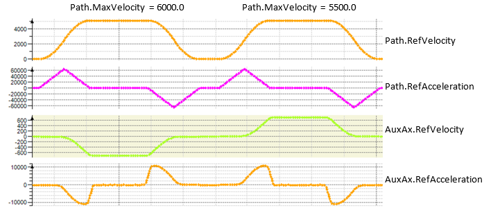

# Behavior of ET\_MotionProfile.MoveSyncMaxVelocity

## Synchronous movements (MoveSync)

| Path | AuxAx |
| --- | --- |
| MaxVelocity 6000.0 / 4000.0  MaxAcceleration 100000.0  MaxDeceleration 100000.0  Ramp 12.0 | MaxVelocity 720.0  MaxAcceleration 10000.0  MaxDeceleration 10000.0 |

## Example Code ET\_MotionProfile.Default for ET\_RobotComponent.AuxAxAll (OrientationAll)

```
VAR
   ifRobotConfiguration	    :ROB.IF_RobotConfiguration;
   etDiag                  :GD.ET_Diag;
   etDiagExt               :ROB.ET_DiagExt;
   sMsg                    :STRING[80];
END_VAR

ifRobotConfiguration.ifAdvanced.SetMotionProfileType(
    i_etComponent   := ROB.ET_RobotComponent.AuxAxAll, // OrientationAll 
    i_etValue       := ROB.ET_MotionProfileType.Default, 
    q_etDiag         => etDiag, 
    q_etDiagExt      => etDiagExt, 
    q_sMsg           => sMsg
 );
```

## Calculation of Path.Velocity

The following example shows the non-optimized calculation of Path.Velocity calculated by MoveSync. The calculated Path.Velocity depends on the configured Path.MaxVelocity.



Path.Velocity 3462.252 calculated by MoveSync is used in case of Path.MaxVelocity 6000.0

Path.Velocity 4000.0 calculated by MoveSync is used in case of Path.MaxVelocity 4000.0

## Example Code ET\_MotionProfile.MoveSyncMaxVelocity for ET\_RobotComponent.AuxAxAll (OrientationAll)

```
VAR
   ifRobotConfiguration	    :ROB.IF_RobotConfiguration;
   etDiag                  :GD.ET_Diag;
   etDiagExt               :ROB.ET_DiagExt;
   sMsg                    :STRING[80];
END_VAR

ifRobotConfiguration.ifAdvanced.SetMotionProfileType(
    i_etComponent   := ROB.ET_RobotComponent.AuxAxAll, // OrientationAll 
    i_etValue       := ROB.ET_MotionProfileType.MoveSyncMaxVelocity, 
    q_etDiag         => etDiag, 
    q_etDiagExt      => etDiagExt, 
    q_sMsg           => sMsg
 );
```

## Calculation of Path.Velocity



Path.Velocity 5121.884 calculated by MoveSync is used only in case of Path.MaxVelocity 6000.0

In case of Path.MaxVelocity 4000.0, Path.Velocity is not used – Path.Velocity is less than the calculated one by MoveSync.

Path.MaxVelocity of second movement is increased from 4000.0 to 5500.0



Path.Velocity 5121.884 calculated by MoveSync is used in both cases now.

EIO0000002232.23