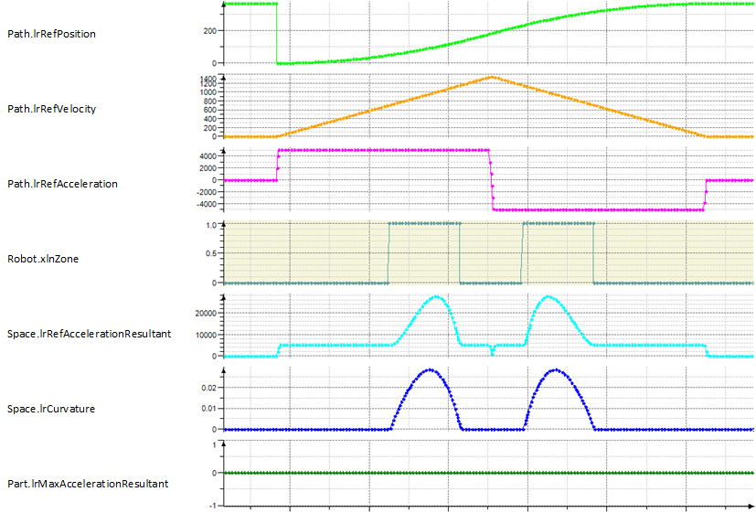
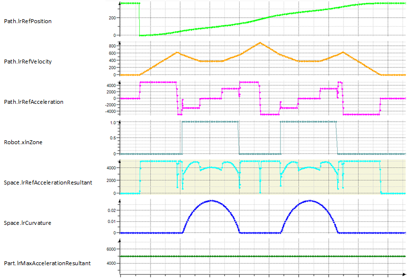

# Behavior of ST\_ResAccLimitParameters.xEnablePreAnalysis

## Example Configuration

The parameter ST\_ResAccLimitParameters.xEnablePreAnalysis is set to TRUE.

|  |  |
| --- | --- |
| Parameter | Value |
| Path.Length | 400.0 |
| Path.MaxVelocity | 2000.0 |
| Path.MaxAcceleration | 5000.0 |
| Path.MaxDeceleration | 5000.0 |
| Path.Ramp | 5 |
| Space.MaxAccelerationResultant | 5000.0 |

## Motion Profile Without Consideration of the Maximum Resulting Acceleration in Space

## Motion Profile and Trajectory to Verify

The calculated motion profile without consideration of the maximum resulting acceleration in space is analyzed in combination with the trajectory to verify, if and where the configured maximum resulting acceleration in space is violated. Points to be analyzed are for example the extreme values of the curvature along the trajectory. In case no violation is detected, the calculated motion profile is used for the robot movement.

## Motion Profile Which Respects the Configured Maximum Resulting Acceleration in Space

If the configured maximum resulting acceleration in space is violated, the motion profile is recalculated taking the algorithm into account to limit the maximum resulting acceleration in space.

Motion profile that complies with the configured maximum resulting acceleration in space.

NOTE: Setting the parameter ST\_ResAccLimitParameters.xEnablePreAnalysis to TRUE introduces additional CPU load for calculations. The additional CPU load depends on the trajectory.

EIO0000002232.23