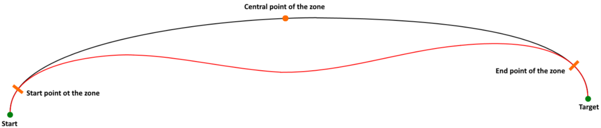
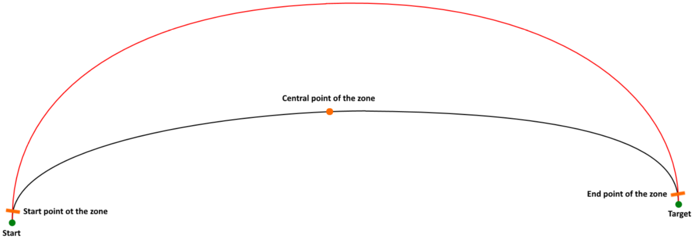
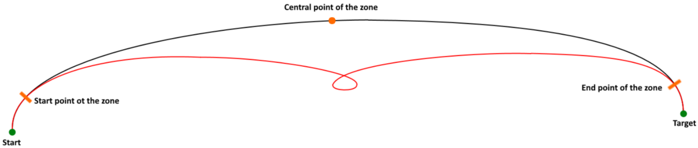

# Behavior of the Trajectory Inside the Blending Zones

## Overview

The trajectory inside the blending zones is calculated by an algorithm that generates a three-dimensional polynomial of 5th degree. The shape of the polynomial depends on the boundary conditions (position, slope and curvature) of the start and the end points of the zone. There may be cases where the blending between the segments is not the shortest possible curve. For example, when non-linear movements (Circular/Spline) having a huge variation in slope and/or curvature at the start and end points of the zone are blended.

* Black curvature: Trajectory of one elliptic spline without blending.
* Red curvature: Trajectory of two elliptic half splines with blending, connected at the central point of the zone.

## Example 1

## Example 2

## Example 3

EIO0000002232.23