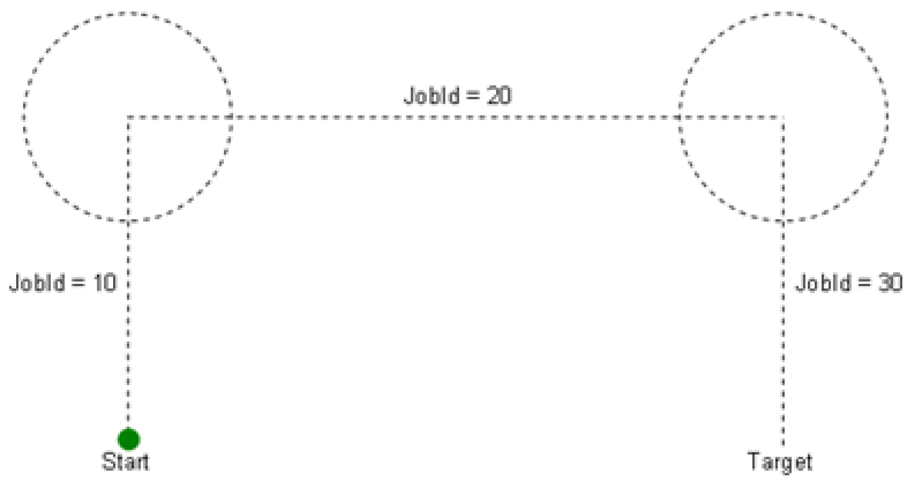
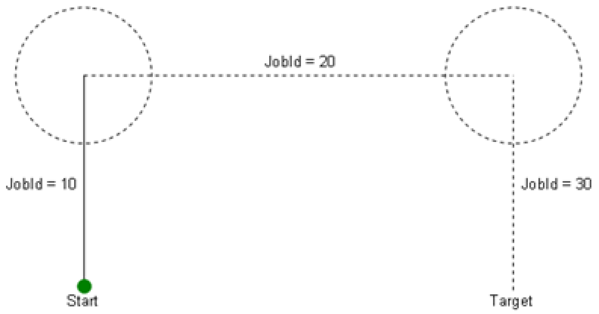
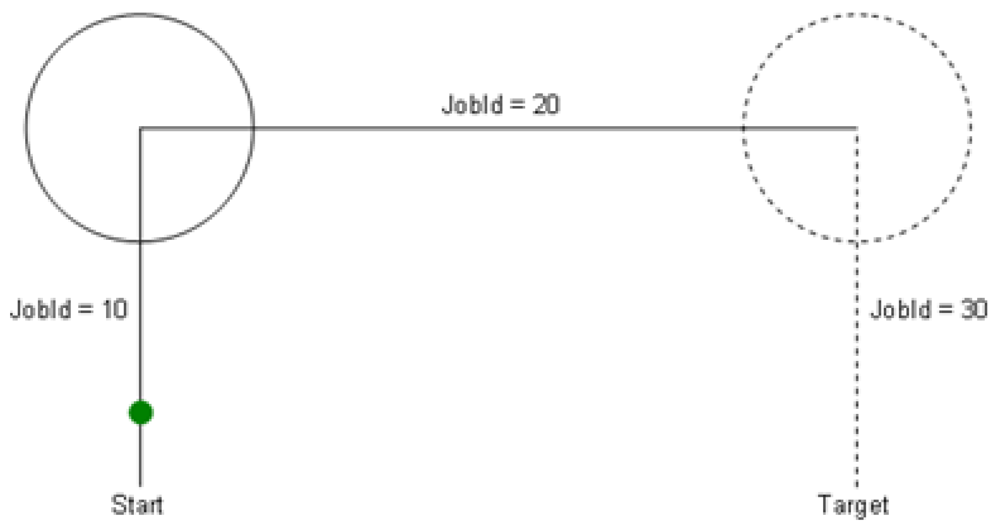
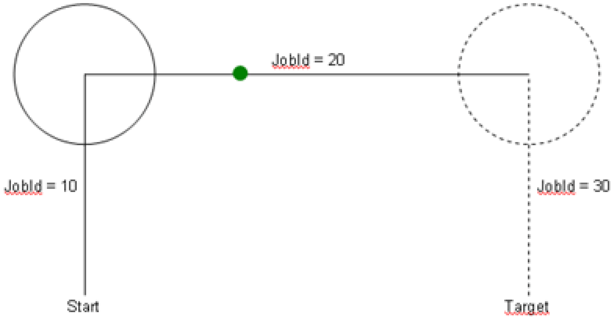
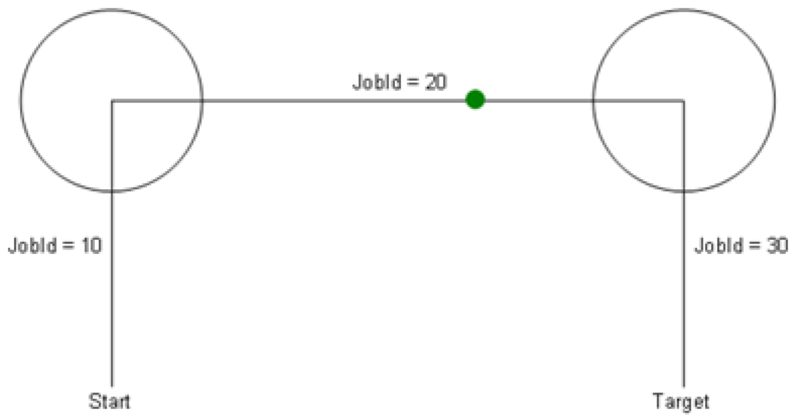
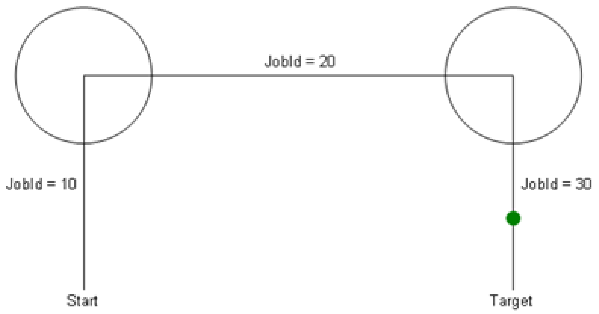
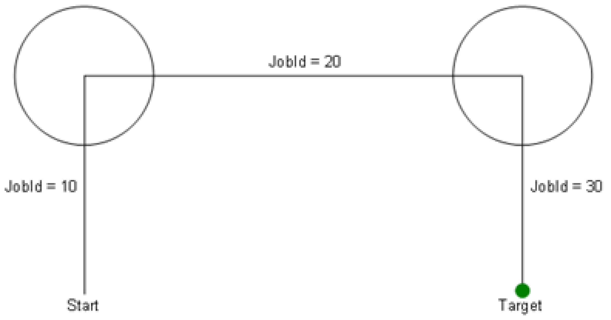

# Behavior of CurrentSegmentId, PreviousSegmentId, and NextSegmentId

## General

**Initial situation:**

FB\_Robot.xEnable was set to the value TRUE.

The return values FB\_Robot.xActive and FB\_Robot.xReady are reporting the value TRUE.

-> The robot is ready for operation.

FB\_Robot.xStart remains FALSE initially.

The following motion of the robot has to be implemented:

-> PreviousSegmentId = 0, CurrentSegmentId = 0, NextSegmentId = 0

**Motion program in a simplified form:**

MoveL(i\_udiSegmentId := 10, …);

-> PreviousSegmentId = 0, CurrentSegmentId = 0, NextSegmentId = 10

FB\_Robot.xStart := TRUE; *// The robot starts processing segment 10*

-> PreviousSegmentId = 0, CurrentSegmentId = 10, NextSegmentId = 0

MoveL(i\_udiSegmentId := 20, …); *// The robot is still processing segment 10*

-> PreviousSegmentId = 0, CurrentSegmentId = 10, NextSegmentId = 20

*// The robot is already processing segment 20, no further segment has been loaded yet*

-> PreviousSegmentId = 10, CurrentSegmentId = 20, NextSegmentId = 0

MoveL(i\_udiSegmentId := 30, …); *// The robot is processing segment 20*

-> PreviousSegmentId = 10, CurrentSegmentId = 20, NextSegmentId = 30

*// The robot is processing segment 30 now*

-> PreviousSegmentId = 20, CurrentSegmentId = 30, NextSegmentId = 0

*// The robot has reached the target of segment 30 now*

*// No further motion command has been issued*

*// Therefore the connected path has been completed*

-> PreviousSegmentId = 30, CurrentSegmentId = 0, NextSegmentId = 0

EIO0000002232.23