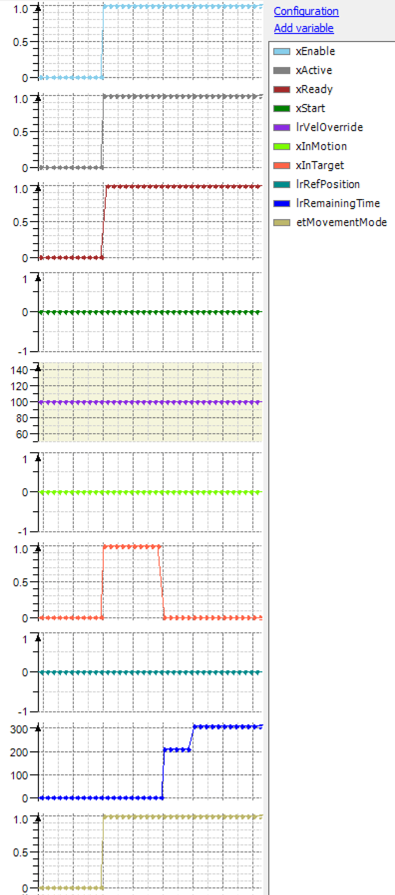
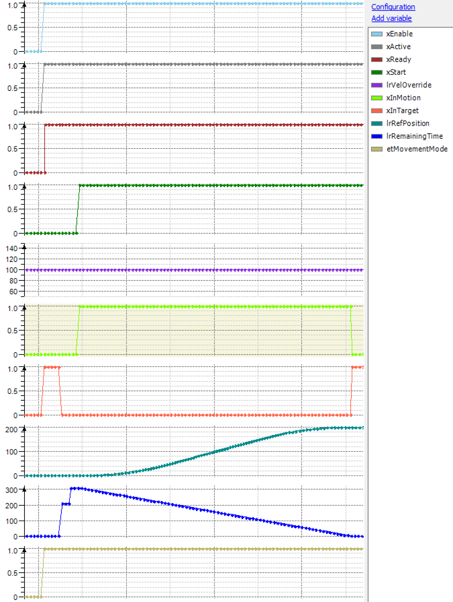
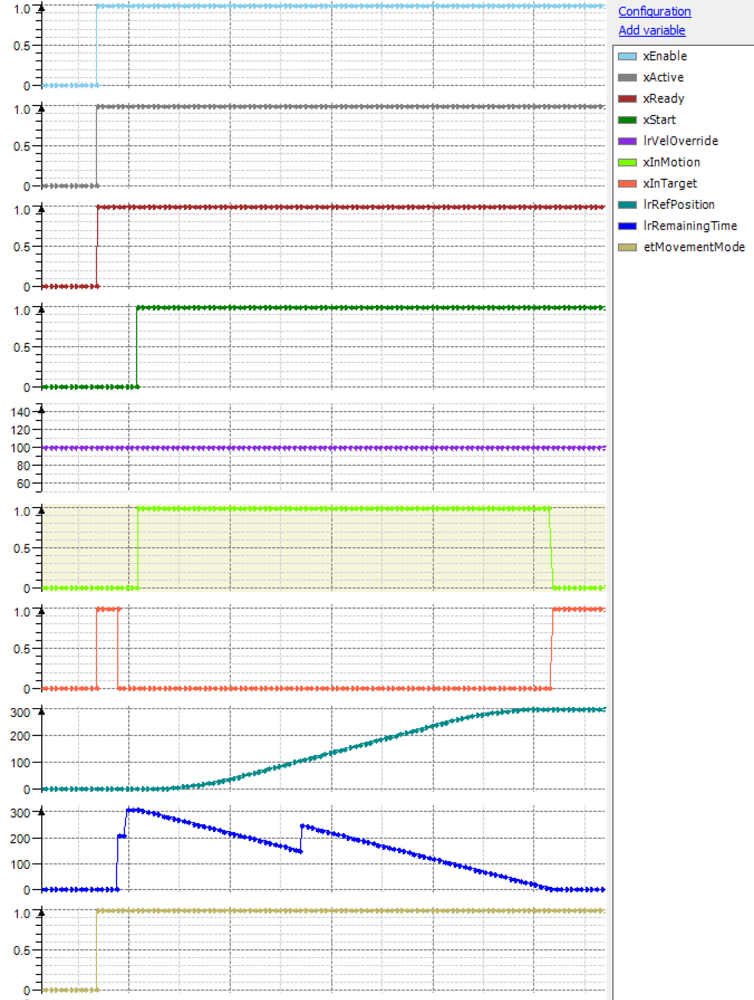
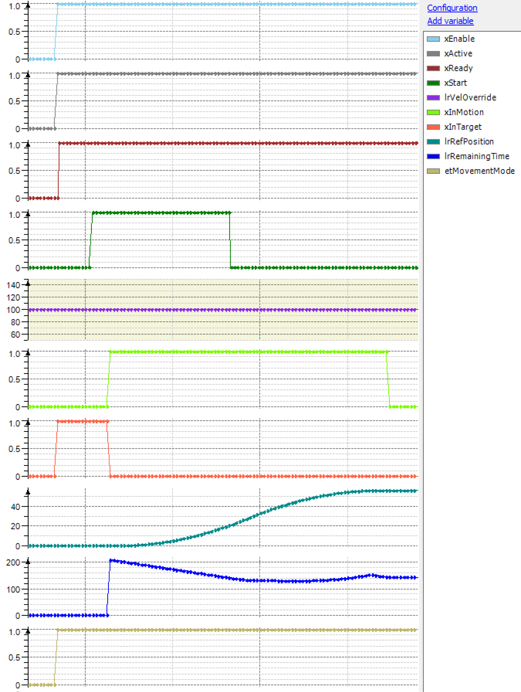
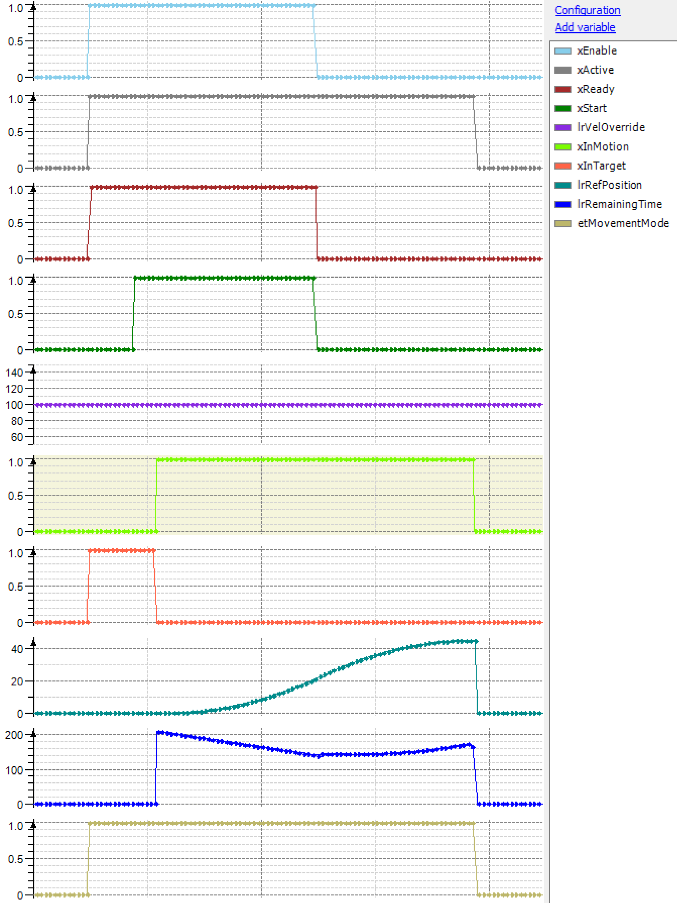
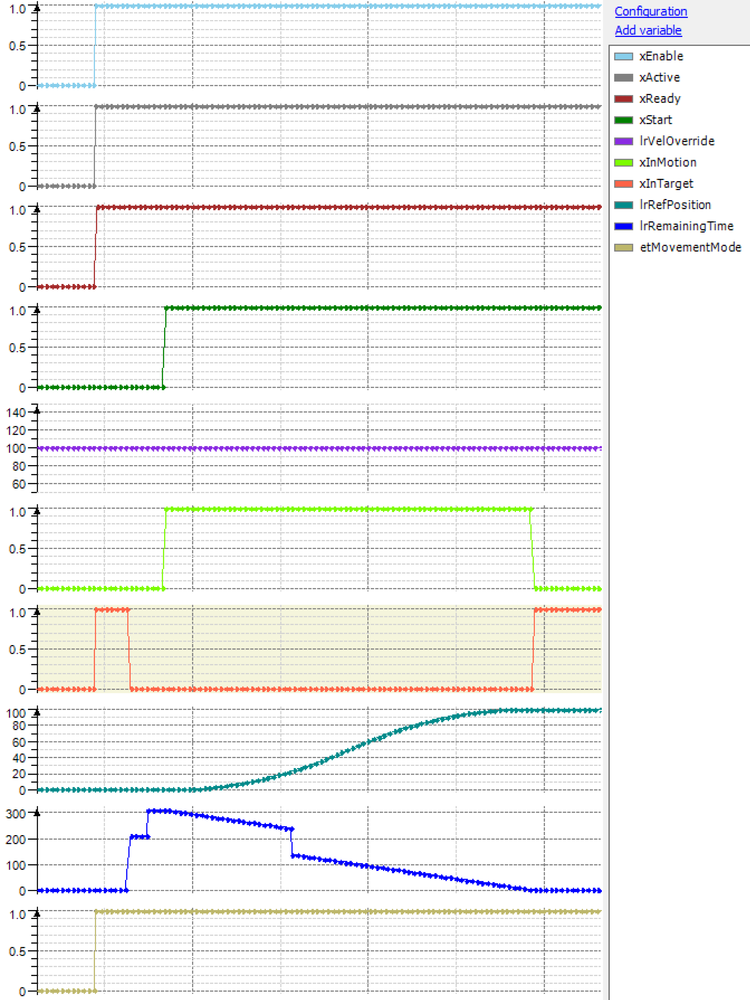
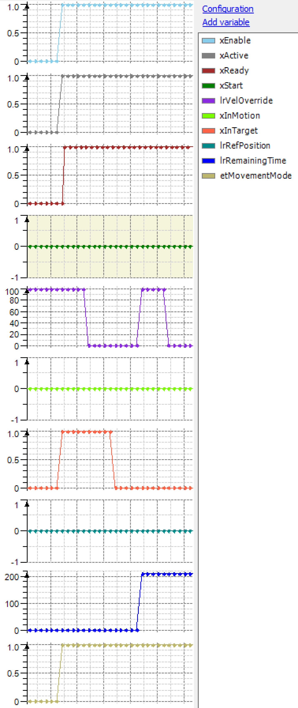
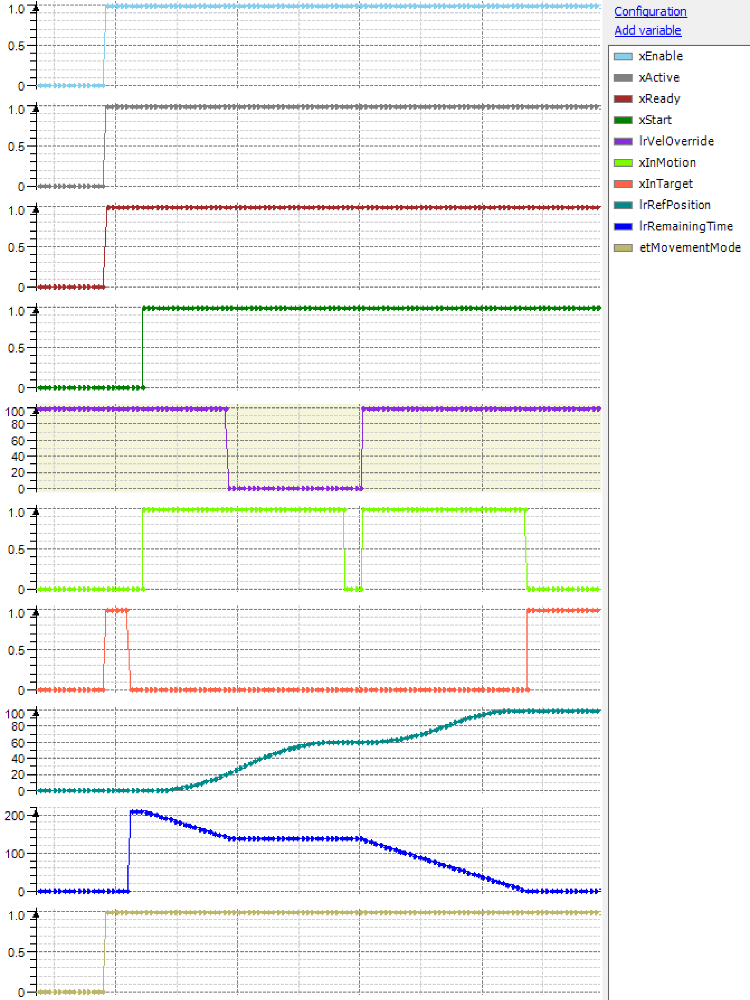
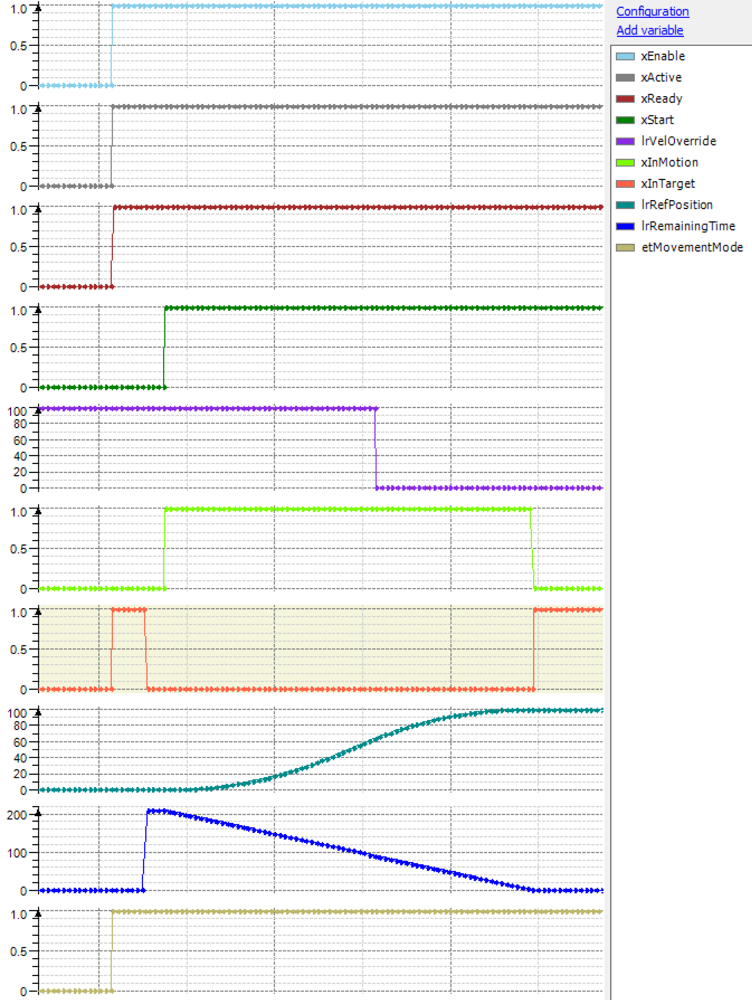
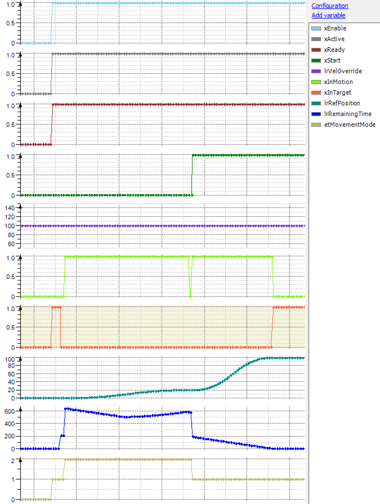

# Behavior of Feedback Property IF\_RobotFeedbackConnectedPath.lrRemainingTime

## General

In this section, the behavior of the feedback property IF\_RobotFeedbackConnectedPath.lrRemainingTime is described in different situations and states of the robot.

## Behavior While the Robot Is Deactivated

| Precondition | Result |
| --- | --- |
| * FB\_Robot.xEnable = FALSE   Robot is not active. | No move commands can be sent. |
| The feedback property lrRemainingTime returns the value 0. |

## Behavior While the Robot Is Not Started

| Preconditions | Results |
| --- | --- |
| * FB\_Robot.xEnable is set to TRUE.   Robot is active and ready.   * FB\_Robot.xStart = FALSE | In case a move command (with blending zone) is sent to the robot, the robot does not move because FB\_Robot.xStart is FALSE. |
| The feedback property lrRemainingTime returns the estimated time until the end of the connected path. |
| For move commands, which extend the connected path, the value of lrRemainingTime is increased. |

lrRemainingTime FB\_Robot.xStart = FALSE

## Behavior While the Robot Is Started

| Preconditions | Result |
| --- | --- |
| * FB\_Robot.xEnable is set to TRUE   Robot is active and ready.   * FB\_Robot.xStart = FALSE * Move commands were sent. * FB\_Robot.xStart is set from FALSE to TRUE.   The robot moves immediately. | During the robot movement, the feedback property lrRemainingTime returns the time until the robot arrives at the end of the connected path. |

lrRemainingTime FB\_Robot.xStart FALSE -> TRUE

## Behavior While the Robot Is in Motion and a Move Command Is Sent

| Preconditions | Result |
| --- | --- |
| * FB\_Robot.xEnable is set to TRUE.   Robot is active and ready.   * Move commands were sent. * FB\_Robot.xStart is set from FALSE to TRUE   The robot is moving. | If a move command is sent while the robot is moving, the feedback property lrRemainingTime is increased according to the new movement. |

lrRemainingTime move command during robot movement

## Behavior While the Robot Is Stopped on Path

| Preconditions | Result |
| --- | --- |
| * FB\_Robot.xEnable is set to TRUE.   Robot is active and ready.   * FB\_Robot.xStart is set from FALSE to TRUE. * Move command is sent.   The robot moves immediately. | If FB\_Robot.xStart is set to FALSE while move commands are executed, the robot comes to a stop-on-path. |
| The feedback property lrRemainingTime returns the remaining time until the end of the connected path if FB\_Robot.xStart is reset to TRUE. |

lrRemainingTime FB\_Robot.xStart TRUE -> FALSE

## Behavior While the Robot Responds to an Emergency Stop

| Preconditions | Result |
| --- | --- |
| * FB\_Robot.xEnable is set to TRUE.   Robot is active and ready.   * FB\_Robot.xStart is set from FALSE to TRUE. * Move command is sent.   The robot moves immediately. | If FB\_Robot.xEnable is set to FALSE during move commands are being executed, the robot does a fast deceleration as configured in response to an emergency stop. |
| The feedback property lrRemainingTime returns the remaining time until the end of the connected path if FB\_Robot.xEnable is set to TRUE again and a WarmStart is done to continue the robot movement on the connected path. |
| The value of the feedback property lrRemainingTime is valid as long as the robot is active. If the robot is not active, the value is set to 0. |
| If the robot is re-enabled after a rising edge on FB\_Robot.xEnable (TRUE -> FALSE -> TRUE), the feedback property lrRemainingTime returns the remaining time until the end of the connected path if a WarmStart is performed and FB\_Robot.xStart is set to TRUE again. |

lrRemainingTime FB\_Robot.xEnable TRUE -> FALSE

## Behavior When a Move Command Is Cleared

| Preconditions | Result |
| --- | --- |
| * FB\_Robot.xEnable set to TRUE.   Robot is active and ready.   * FB\_Robot.xStart is set from FALSE to TRUE. * Move commands are sent.   The robot moves immediately. | If a move command is cleared by calling the method IF\_RobotMotion.ClearSegmentsFromId while move commands are being executed, the feedback property lrRemainingTime returns the remaining time until the end of the connected path. |

lrRemainingTime IF\_RobotMotion.RemoveSegmentsFromId

## Behavior During ColdStart

| Preconditions | Result |
| --- | --- |
| * FB\_Robot.xEnable set from TRUE to FALSE.   Robot is inactive and not ready.   * FB\_Robot.xEnable set from FALSE to TRUE.   Robot is active and ready.   * FB\_Robot.xStart is set from FALSE to TRUE. | If a ColdStart is performed after re-enabling the robot, the value of the feedback property lrRemainingTime is set to 0 until another move command is sent. |
| If in the interim between FB\_Robot.xEnable is set to TRUE and FB\_Robot.xStart is set to TRUE, the feedback property lrRemainingTime returns the time until the end of an existing connected path. |
| If no connected path exists, 0 is returned. |

## Behavior During WarmStart

| Preconditions | Result |
| --- | --- |
| * FB\_Robot.xEnable set from FALSE to TRUE.   Robot is active and ready.   * FB\_Robot.xWsSelect set from FALSE to TRUE.   Warm start motion is pre-selected.   * FB\_Robot.xWsStart set from FALSE to TRUE.   The robot moves to the last detected path position. | If a WarmStart is performed after re-enabling the robot, the value of the feedback property lrRemainingTime stays at its value until the warm start movement is finished and FB\_Robot.xStart is set from FALSE to TRUE or other move commands are sent. |

## Behavior While IF\_RobotMotion.lrVelOverride Is 0 or Is Set to 0

| Precondition | Result |
| --- | --- |
| * IF\_RobotMotion.lrVelOverride is set to 0 before a move command is sent (see IF\_RobotMotion.lrVelOverride). | The value of the feedback property lrRemainingTime stays 0 even if a move command is sent. |

| Precondition | Result |
| --- | --- |
| * FB\_Robot.xStart = FALSE * IF\_RobotMotion.lrVelOverride = 0 before a move command is sent (see IF\_RobotMotion.lrVelOverride). | The value of the feedback property lrRemainingTime stays 0 even if a move command is sent. |
| If the value of IF\_RobotMotion.lrVelOverride gets unequal 0 afterwards, the robot does not move because of FB\_Robot.xStart = FALSE, but the lrRemainingTime returns the time until the end of the connected path in case of FB\_Robot.xStart is set to TRUE. |
| If the value of IF\_RobotMotion.lrVelOverride is set back to 0, the lrRemainingTime keeps the value when IF\_RobotMotion.lrVelOverride was set back to 0. |

| Precondition | Result |
| --- | --- |
| * IF\_RobotMotion. lrVelOverride gets 0 during a movement on path (not jogging on path) is active. | The lrRemainingTime returns the time until the end of the connected path in case the end of the connected path is going to be reached. |
| Otherwise the value of lrRemainingTime freezes until the value of IF\_RobotMotion.lrVelOverride gets > 0. |

## Behavior While Jogging Along the Connected Path

| Precondition | Result |
| --- | --- |
| * FB\_Robot.xStart = FALSE | For jogging along the connected path, FB\_Robot.xStart has to be FALSE. |

| Precondition | Result |
| --- | --- |
| * FB\_Robot.xStart = FALSE * Jogging mode is activated. | If a jogging along the connected path was triggered, the lrRemainingTime is calculated on jogging motion parameters set by a call of corresponding methods of IF\_RobotJogging. |
| If FB\_Robot.xStart is set to TRUE to continue the path movement, the lrRemainingTime is calculated again on motion parameters, set by a call of corresponding methods of IF\_RobotMotion. |
| If a jogging along the connected path is active, the feedback property lrRemainingTime returns the estimated time until the end of the connected path assuming that the jogging movement would otherwise reach the end of the connected path. |
| To display whether the calculation is motion-based or jogging-based, use the feedback property etActiveMovementMode of IF\_RobotFeedbackConnectedPath. |

EIO0000002232.23