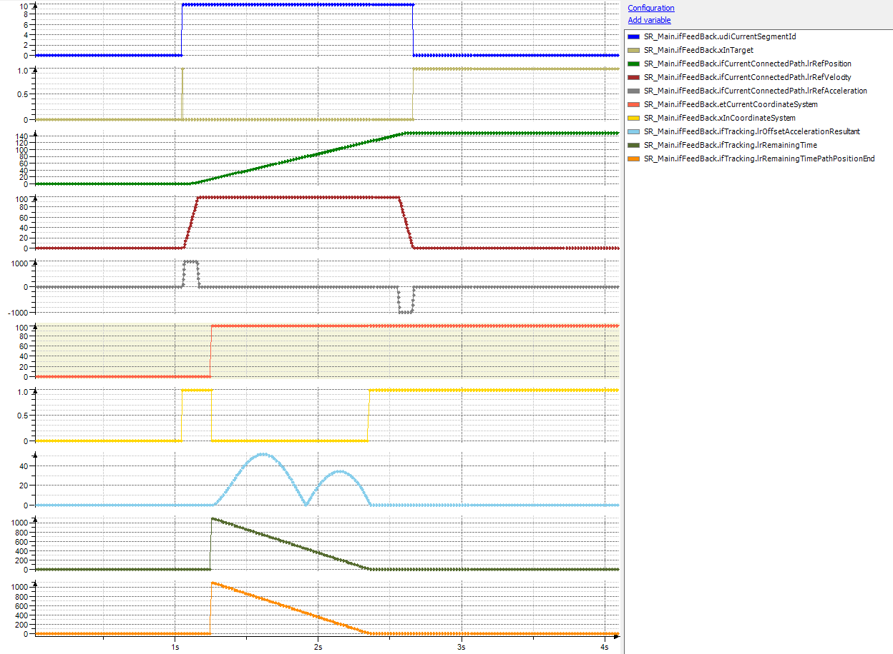
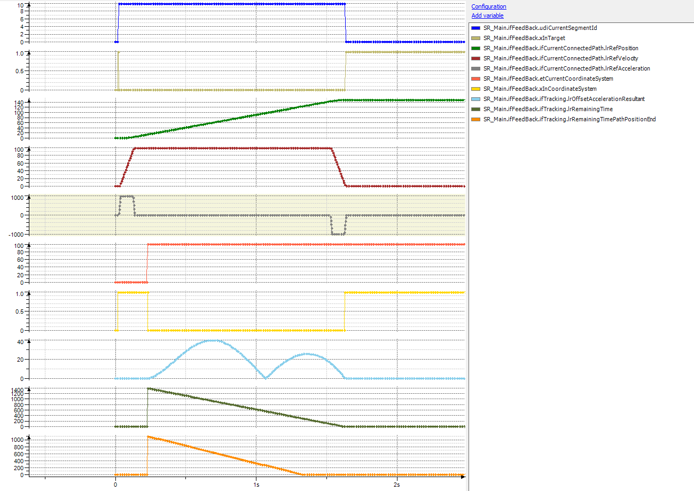
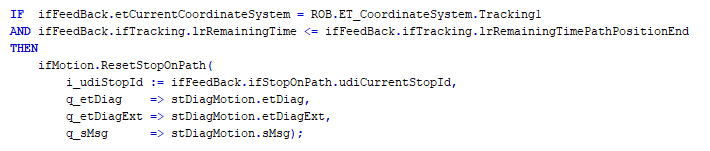
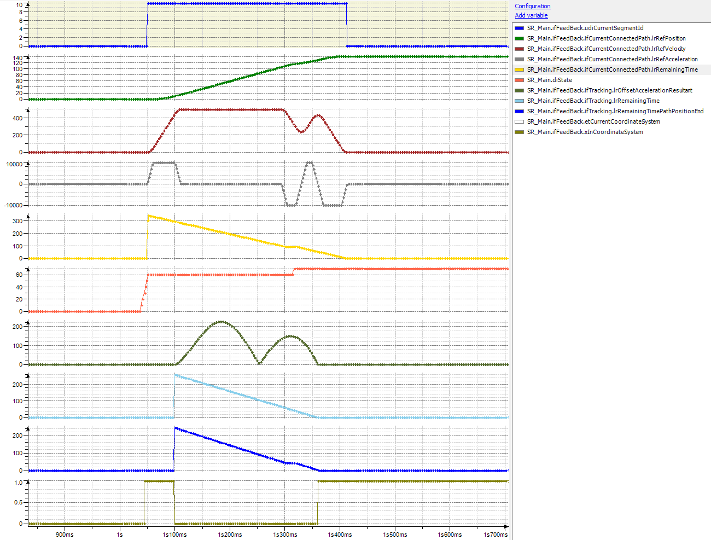

# Behavior of IF\_RobotFeedbackTracking.lrRemainingTimePathPositionEnd

## General

IF\_RobotFeedbackTracking provides two parameters you can use to evaluate the tracking:

* lrRemainingTime displays the time for the synchronization phase to be finished.
* lrRemainingTimePathPositionEnd displays the time until the connected path will reach the specified end position.

## Trace 1

In case the tracking acceleration can be reduced, both parameters display the same value.

NOTE: Both values are calculated LREAL values and so a simple comparison `ifTracking.lrRemainingTime = ifTracking.lrRemainingTimePathPositionEnd` does not work.

Possible verifications are:

* `ABS(ifTracking.lrRemainingTime - ifTracking.lrRemainingTimePathPositionEnd) < 1.0` or
* `ifTracking.lrRemainingTimePathPositionEnd ≤ ifTracking.lrRemainingTime`

## Trace 2

When the necessary resulting acceleration for the synchronization phase is higher than the configured maximum resulting acceleration for tracking, lrRemaingTime is greater than lrRemainingTimePathPositionEnd.

## Trace 3

You can use the two time parameters to reset a stop on path earlier. With the former tracking, you had to wait for xInCoordinateSystem before you reset the stop, now your code could be like this:

Reset stop-on-path based on remaining times

Here, the necessary acceleration is greater than the given maximum acceleration. As a result, the necessary time for the synchronization is approximately 260 ms, while lrRemainingTimePathPositionEnd is only 245 ms.

As a result, the stop-on-path is not reset and becomes effective (the velocity of the robot shows a slight dip). Because of this, the remaining time until path position end increases. As soon as the time is greater than the remaining time of the synchronization, the stop-on-path is reset without forcing the robot into a complete stop.

EIO0000002232.23