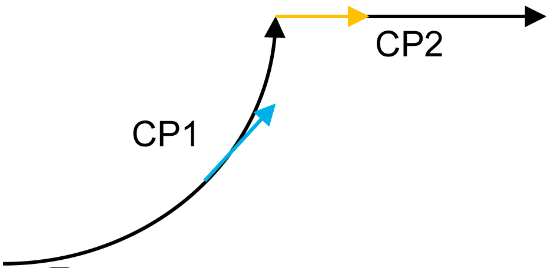

# Behavior of Feedback Property rstTangent

## General

The feedback property rstTangent provides information about the tangent of the current cartesian position along a connected path.

For example, for a cutter application, you need information about the tangent along the path to move the axis controlling the knife.

The tangent is defined by a normalized 3D vector. Within connected paths (CPs), it is not possible to have jumps on the tangent.

However, while switching from one connected path (CP) to another CP there can be a jump in the tangent vector.

## Behavior of rstTangent During Path Movement

| Step | Status / Action | Feedback of rstTangent | Connected path |
| --- | --- | --- | --- |
| 1 | Robot is ready and active.  No move command is set. | rstTangent.X = 0.0  rstTangent.Y = 0.0  rstTangent.Z = 0.0 | - |
| 2 | Robot is ready and active.  ClearSegmentsFromId(Id=0) is called. | rstTangent.X = 0.0  rstTangent.Y = 0.0  rstTangent.Z = 0.0 | - |
| 3 | Robot executes a cold start. | rstTangent.X = 0.0  rstTangent.Y = 0.0  rstTangent.Z = 0.0 | - |
| 4 | Robot is ready and active.  A MoveC command is set with i\_lrMaxZone = 0.0 | rstTangent.X = 1.0  rstTangent.Y = 0.0  rstTangent.Z = 0.0  (rstTangent = blue arrow) |  |
| 5 | While the robot is moving on path, a MoveL command is set with i\_lrMaxZone = 0.0 | rstTangent.X = 0.701  rstTangent.Y = 0.701  rstTangent.Z = 0.0 |  |
| 6 | Robot is in target of connected path 1 (CP1). | rstTangent.X = 0.0  rstTangent.Y = 1.0  rstTangent.Z = 0.0 |  |
| 7 | Robot switches from CP1 to CP2 (CP1 is cleared).  The value of rstTangent provokes a jump. | rstTangent.X = 1.0  rstTangent.Y = 0.0  rstTangent.Z = 0.0 |  |
| 8 | Robot is in target of connected path 2 (CP2). | rstTangent.X = 1.0  rstTangent.Y = 0.0  rstTangent.Z = 0.0 |  |

## Behavior of rstTangent in Case the Robot Is Jogged off Path

| Step | Status / Action | Feedback of rstTangent | Connected path |
| --- | --- | --- | --- |
| 1 | If the robot movement is stopped on path and jogged off the path (xOnPath = FALSE), the tangent remains at last value. | rstTangent.X = 0.701  rstTangent.Y = 0.701  rstTangent.Z = 0.0 |  |

EIO0000002232.23