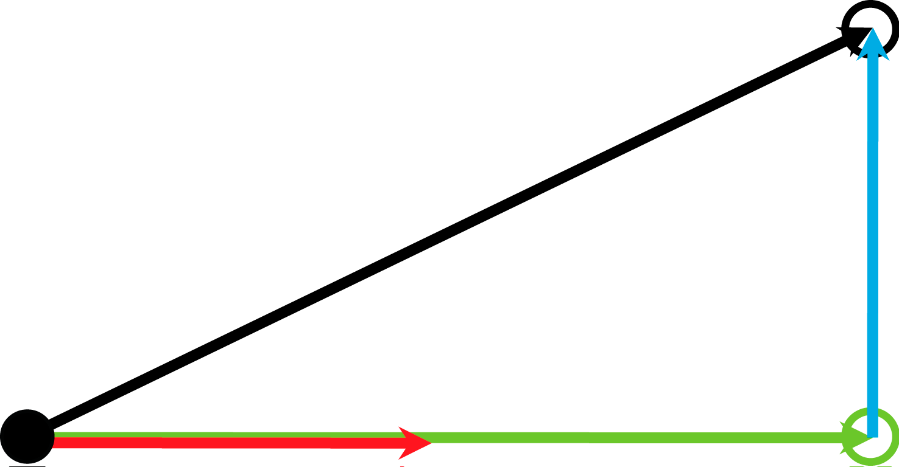

# Behavior of Feedback Property rstEstimatedStopPosition

## General

Use the feedback property rstEstimatedStopPosition to read the estimated Cartesian stop position on the connected path when a stop-on-path (FB\_Robot.xStart = FALSE) is triggered.

By default, the calculation of the estimated stop position is based on motion parameters.

With the property xUseEStopParameterForEstimatedStopPosition, the calculation can be switched to emergency parameters.

When ROB.IF\_RobotConfigurationAdvanced.xUseEStopParameterForEstimatedStopPosition or RM.IF\_RobotConfigurationAdvanced.xUseEStopParameterForEstimatedStopPosition is set to TRUE, the estimated stop position is calculated based on emergency parameters.

In all cases below, the emergency parameters are higher than the motion parameters.

## RoboticModule

The explanations are based on the robotic functionality, in case the RoboticModule is used the corresponding actions would be:

FB\_Robot.xStart TRUE -> FALSE

-> Use ST\_ModuleInterface.i\_xRobotStart

FB\_Robot.xEnable TRUE -> FALSE

-> Send an exception with reaction SyncStopEL, SyncStopEH or use the software limits.

## Stop Movements and Positions

|  |  |
| --- | --- |
|  | Cartesian stop movement on the connected path with emergency parameters (FB\_Robot.xEnable TRUE -> FALSE) |
|  | Cartesian stop movement on the connected path with motion parameters (FB\_Robot.xStart TRUE -> FALSE) |
|  | Cartesian stop movement because of tracking with tracking parameters (ifFeedback.ifTracking.rstEstimatedStopPosition) |
|  | Resulting Cartesian stop movement (connected path + tracking) |
|  | Cartesian stop position on the connected path (ifFeedback.ifTrajectoryStorage.ifSpace.rstEstimatedStopPosition) |
|  | Cartesian stop position with tracking (ifFeedback.ifSpace.rstEstimatedStopPosition) |
|  | Cartesian position when the stop is initiated |
|  | Cartesian position where the robot will stop |

EIO0000002232.23