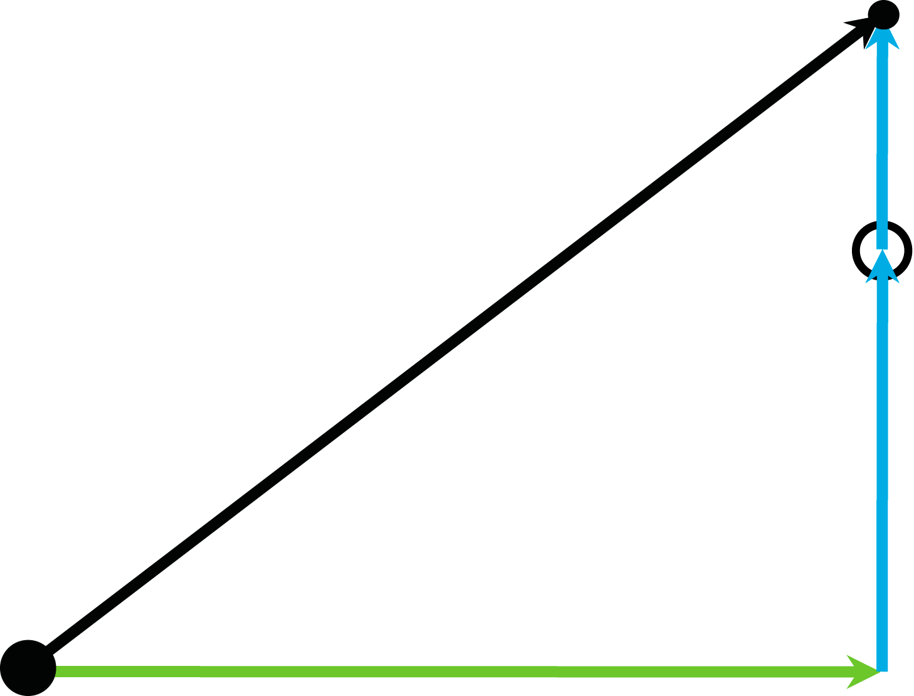
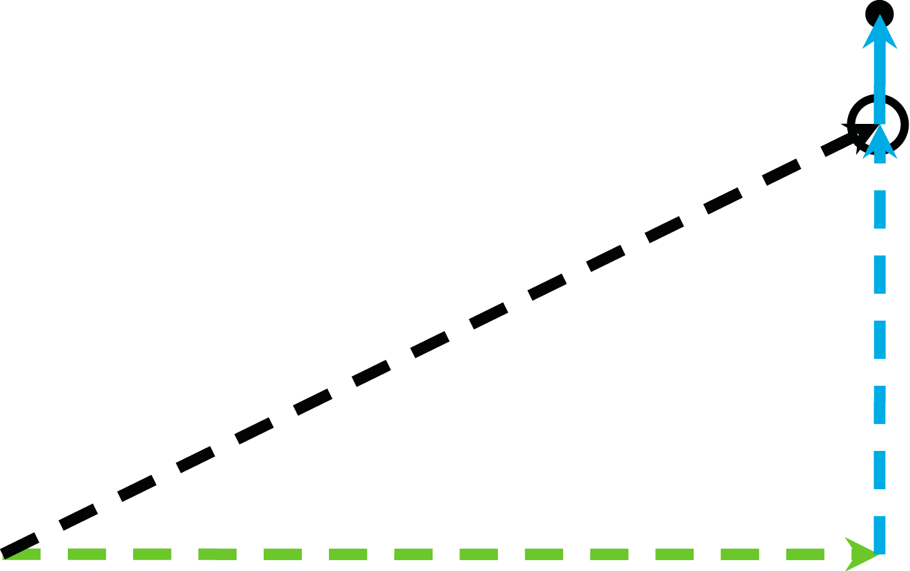
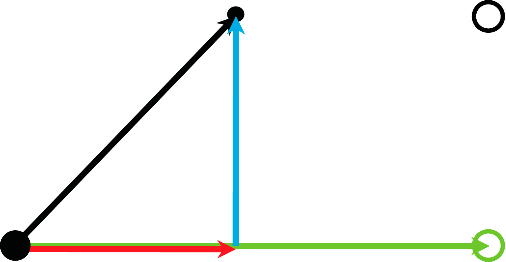

# Behavior with xUseEStopParameterForEstimatedStopPosition = FALSE

## Stop-On-Path Without Tracking

If tracking is not active and a stop-on-path is triggered by FB\_Robot.xStart TRUE -> FALSE, the estimated stop position meets the actual stop-on-path position:

FB\_Robot.xStart TRUE -> FALSE and tracking is not active

The robot stops at the estimated stop position.

## Stop-On-Path With Tracking

If tracking is active and a stop-on-path is triggered by FB\_Robot.xStart TRUE -> FALSE, the estimated stop position does not meet the actual stop-on-path position because the robot is moved by tracking, even if the stop-on-path is finished:

FB\_Robot.xStart TRUE -> FALSE and tracking is active.

The path movement stops, but the tracking does not stop. The robot reaches the stop position, but the tracking moves the TCP further:

|  |  |
| --- | --- |
|  | Cartesian stop movement on the connected path with emergency parameters (FB\_Robot.xEnable TRUE -> FALSE) |
|  | Cartesian stop movement on the connected path with motion parameters (FB\_Robot.xStart TRUE -> FALSE) |
|  | Cartesian stop movement because of tracking with tracking parameters (ifFeedback.ifTracking.rstEstimatedStopPosition) |
|  | Resulting Cartesian stop movement (connected path + tracking) |
|  | Cartesian stop position on the connected path (ifFeedback.ifTrajectoryStorage.ifSpace.rstEstimatedStopPosition) |
|  | Cartesian stop position with tracking (ifFeedback.ifSpace.rstEstimatedStopPosition) |
|  | Cartesian position when the stop is initiated |
|  | Cartesian position where the robot will stop |

## **Emergency Stop-On-Path**

To perform an emergency stop for the robot, it is necessary to disable the robot (FB\_Robot.xEnable TRUE -> FALSE).

If an emergency stop is triggered by FB\_Robot.xEnable TRUE -> FALSE, the calculated estimated stop position on path does not meet the position the robot will stand still because the stop is performed with the emergency parameters (and not with the motion parameters used by a stop-on-path triggered by FB\_Robot.xStart TRUE -> FALSE).

## Emergency Stop-On-Path Without Tracking

FB\_Robot.xEnable TRUE -> FALSE and tracking is not active

The robot does not stop at the estimated stop position because the stop is performed with the emergency parameters.

## **Emergency Stop-On-Path With Tracking**

FB\_Robot.xEnable TRUE -> FALSE and tracking is active

The path movement stops with the emergency parameters and the tracking is aborted with its regular parameters. The TCP stops prior to the Cartesian stop position with tracking.

|  |  |
| --- | --- |
|  | Cartesian stop movement on the connected path with emergency parameters (FB\_Robot.xEnable TRUE -> FALSE) |
|  | Cartesian stop movement on the connected path with motion parameters (FB\_Robot.xStart TRUE -> FALSE) |
|  | Cartesian stop movement because of tracking with tracking parameters (ifFeedback.ifTracking.rstEstimatedStopPosition) |
|  | Resulting Cartesian stop movement (connected path + tracking) |
|  | Cartesian stop position on the connected path (ifFeedback.ifTrajectoryStorage.ifSpace.rstEstimatedStopPosition) |
|  | Cartesian stop position with tracking (ifFeedback.ifSpace.rstEstimatedStopPosition) |
|  | Cartesian position when the stop is initiated |
|  | Cartesian position where the robot will stop |

## Use Cases

For use cases refer to section [*Behavior with xUseEStopParameterForEstimatedStopPosition = TRUE*](D-SE-0102140.html#D-SE-0102140__D-SE-0102140.11).

EIO0000002232.23