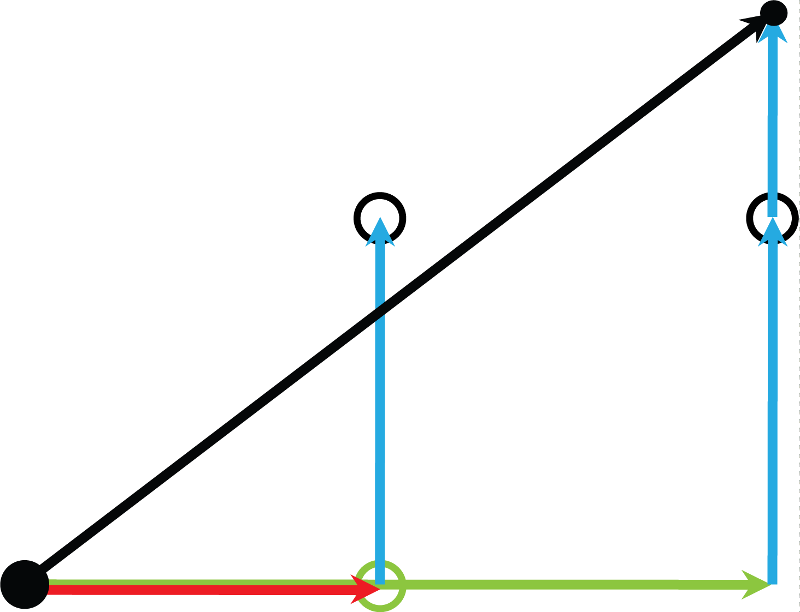
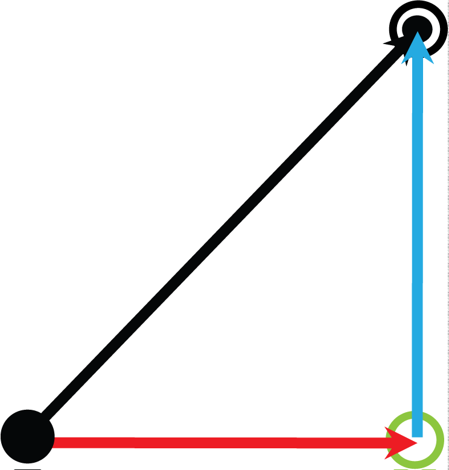

# Behavior with xUseEStopParameterForEstimatedStopPosition = TRUE

## Stop-On-Path Without Tracking

If tracking is not active and a stop-on-path is triggered by FB\_Robot.xStart TRUE -> FALSE, the TCP will move further than the estimated position:

FB\_Robot.xStart TRUE -> FALSE and tracking is not active.

The robot moves further than the estimated stop position, as the estimated stop position was calculated with emergency parameters.

## Stop-On-Path With Tracking

If tracking is active and a stop-on-path is triggered by FB\_Robot.xStart TRUE -> FALSE, the estimated position does not meet the actual stop-on-path position because the robot is moved by tracking, even if the stop-on-path is finished. Furthermore, the estimated stop position is not reached, as it was calculated with emergency parameters:

FB\_Robot.xStart TRUE -> FALSE and tracking is active.

The path movement stops, but the tracking does not stop. Note, that the robot movement along the path will stop, but the tracking will move the TCP further.

|  |  |
| --- | --- |
|  | Cartesian stop movement on the connected path with emergency parameters (FB\_Robot.xEnable TRUE -> FALSE) |
|  | Cartesian stop movement on the connected path with motion parameters (FB\_Robot.xStart TRUE -> FALSE) |
|  | Cartesian stop movement because of tracking with tracking parameters (ifFeedback.ifTracking.rstEstimatedStopPosition) |
|  | Resulting Cartesian stop movement (connected path + tracking) |
|  | Cartesian stop position on the connected path (ifFeedback.ifTrajectoryStorage.ifSpace.rstEstimatedStopPosition) |
|  | Cartesian stop position with tracking (ifFeedback.ifSpace.rstEstimatedStopPosition) |
|  | Cartesian position when the stop is initiated |
|  | Cartesian position where the robot will stop |

## Emergency Stop-On-Path

To perform an emergency stop for the robot, it is necessary to disable the robot (FB\_Robot.xEnable TRUE -> FALSE).

If an emergency stop is triggered by FB\_Robot.xEnable TRUE -> FALSE, the calculated estimated stop position on path will be the position the robot will stand still because the stop is performed with the emergency parameters (and not with the motion parameters used by a stop-on-path triggered by FB\_Robot.xStart TRUE -> FALSE).

## Emergency Stop-On-Path Without Tracking

FB\_Robot.xEnable TRUE -> FALSE and tracking is not active

The robot will stop at the estimated stop position because the stop is performed with emergency parameters.

## Emergency Stop-On-Path With Tracking

FB\_Robot.xEnable TRUE -> FALSE and tracking is active

The path movement stops with the emergency parameters and the tracking is aborted with its regular parameters. The TCP stops at the estimates stop position with tracking.

|  |  |
| --- | --- |
|  | Cartesian stop movement on the connected path with emergency parameters (FB\_Robot.xEnable TRUE -> FALSE) |
|  | Cartesian stop movement on the connected path with motion parameters (FB\_Robot.xStart TRUE -> FALSE) |
|  | Cartesian stop movement because of tracking with tracking parameters (ifFeedback.ifTracking.rstEstimatedStopPosition) |
|  | Resulting Cartesian stop movement (connected path + tracking) |
|  | Cartesian stop position on the connected path (ifFeedback.ifTrajectoryStorage.ifSpace.rstEstimatedStopPosition) |
|  | Cartesian stop position with tracking (ifFeedback.ifSpace.rstEstimatedStopPosition) |
|  | Cartesian position when the stop is initiated |
|  | Cartesian position where the robot will stop |

## Use Cases

The behavior can be switched at runtime. The feedback property rstEstimatedStopPosition will change immediately.

* xUseEStopParameterForEstimatedStopPosition = FALSE

  When tracking is not used and / or a smooth stop of the robot is required, this mode should be used.

  Also during jogging, especially with SchneiderElectricRobotics, the robot can be stopped with the smoother motion parameters.
* xUseEStopParameterForEstimatedStopPosition = TRUE

  When the estimated stop position is used for crash prevention and robot should be stopped with an exception during automatic mode, it is a good practice to calculate the estimated stop position with emergency parameters because the behavior is not too restrictive.

  Furthermore, when tracking is used, the stop position can be predicted more precisely.

  When SchneiderElectricRobotics is used, SchneiderElectricRobotics will also stop the robot with emergency parameters when a violation of the robot work envelope is detected.

EIO0000002232.23