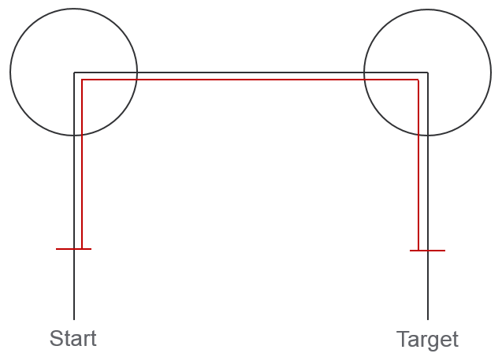
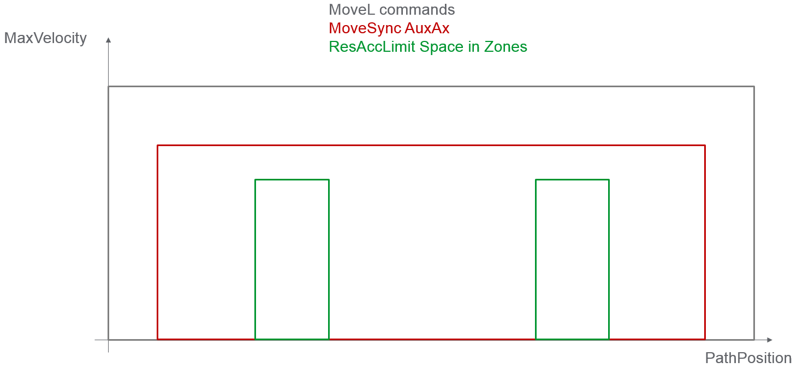
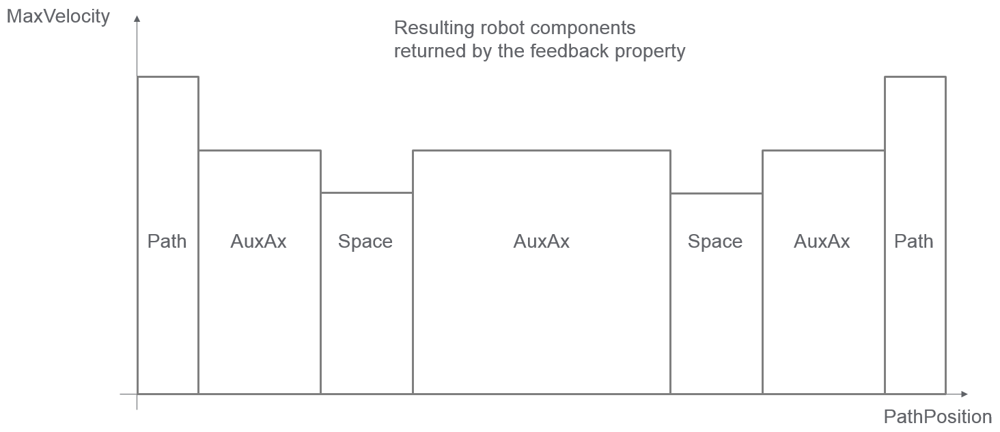
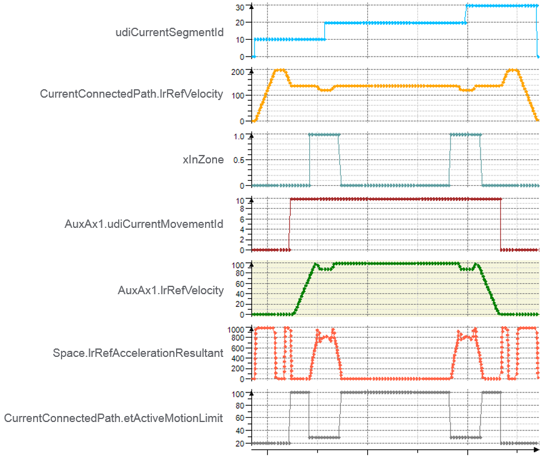

# Behavior of Feedback Property IF\_RobotFeedbackConnectionPath.etActiveMotionLimit

## General

The robot feedback etActiveMotionLimit is of type [ET\_RobotComponent](D-SE-0075489.html#D-SE-0075489).

Used values of ET\_RobotComponent for this example

| Parameter | Value |
| --- | --- |
| ET\_RobotComponent.Path | 20 |
| ET\_RobotComponent.Space | 30 |
| ET\_RobotComponent.AuxAx1 | 101 |

* The value MaxAccelerationResultant for robot component Space is set to 1000.0.
* The value MaxVelocity for robot component Path is set to 200.0.
* The values MaxAcceleration and MaxDeceleration for robot component Path are set to 1000.0.
* The Ramp for robot component Path is set to 100.0.
* A robot movement consisting of three MoveL resulting in one connected path is issued.

  Start = (-100.0 / 0.0 / 0.0) → (-100.0 / 100.0 / 0.0) → (100.0 / 100.0 / 0.0) → (100.0 / 0.0 / 0.0) = Target.
* The value MaxZone is set to 25.0.
* A synchronous auxiliary axis movement (MoveSync) starting in the first and ending in the third MoveL is issued.
* The value MaxVelocity for robot component AuxAx1 is set to 100.0.
* The valuesMaxAcceleration and MaxDeceleration for robot component Path are set to 1000.0.

The calculated MaxVelocity by the MoveSync for robot component Path to keep the motion parameters for the synchronous auxiliary axis movement in its limits is less than the configured MaxVelocity for robot component Path.

The robot path movement is limited by the MaxAccelerationResultant for robot component Space in the zones along the connected path.

## Limit Robot Movement

To find out which robot component limits the robot movement most the trace can be read:

| Trace values | ActiveMotionLimit |
| --- | --- |
| In the beginning (CurrentSgmentId = 10) and end (CurrentSegmentId = 30) of the movement the value 20 is shown in the trace as ActiveMotionLimit | The user motion parameters are used to perform the movement of the robot issued by move commands with SegmentId 10 and 30. |
| AuxAx1.udiCurrentMovementId becomes 10 the value 101 is shown in the trace as ActiveMotionLimit | The movement of the robot is limited by the synchronous movement of the auxiliary axis issued by MoveSync command with MovementId 10. |
| xInZone is TRUE the value 30 is shown in the trace as AcitveMotionLimit | The movement of the robot is limited by the limitation of the resulting acceleration in space. |

EIO0000002232.23