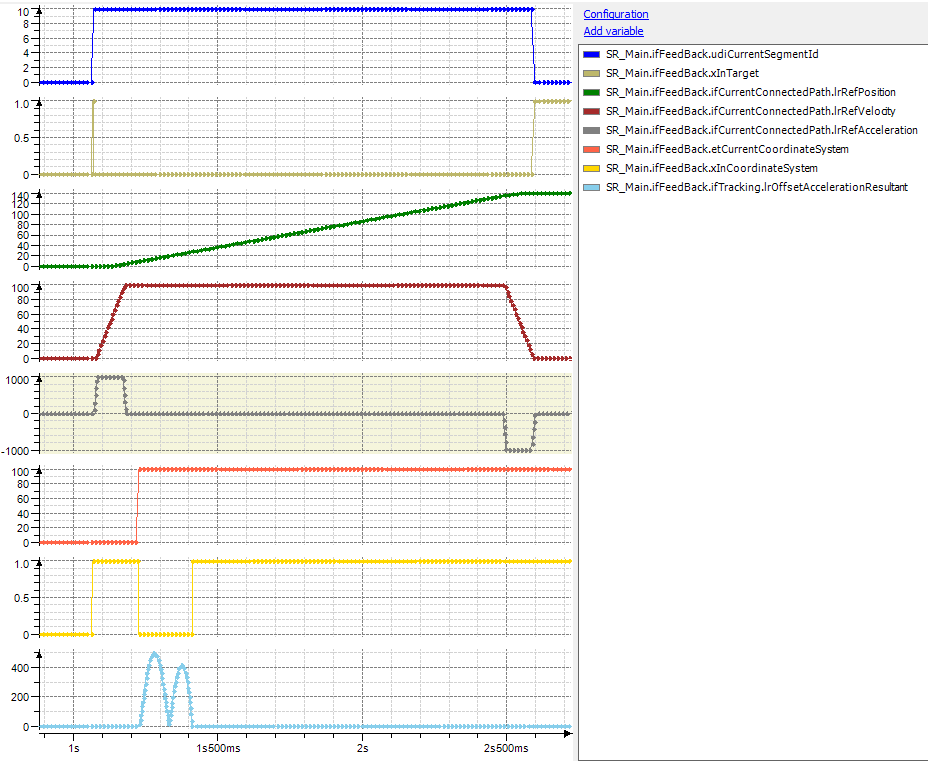

# Behavior of Method ChangeCoordinateSystem

## General

When a tracking is started with IF\_RobotMotion.ChangeCoordinateSystem(…), the synchronization phase uses the full resulting acceleration which was configured with the method IF\_RobotMotion.SetMaxAccelerationResultant(…) for the component ET\_RobotComponent.Tracking.

## Trace

The trace displays that the synchronization phase uses the full resulting acceleration for tracking of 500 mm/sec2 to change the coordinate system. As the movement itself is much longer, it would not be necessary to perform the change so fast

EIO0000002232.23