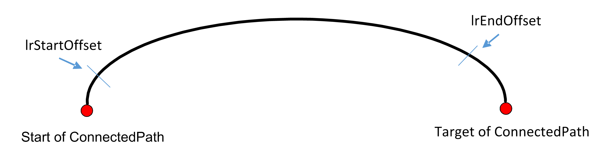
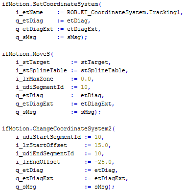
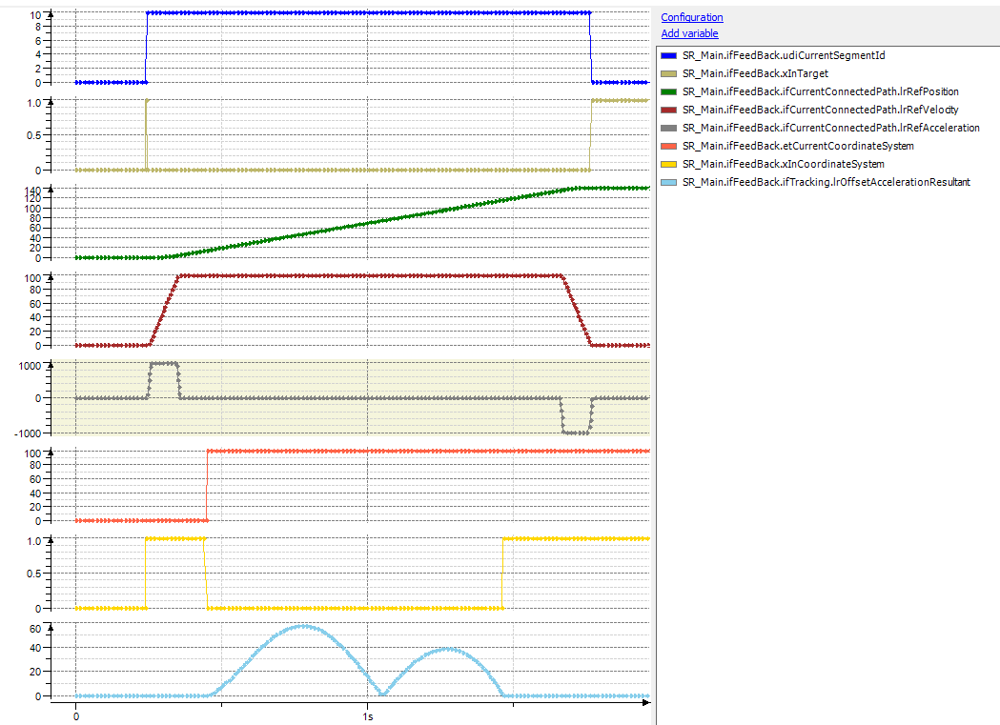
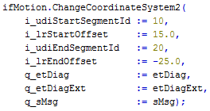

# Behavior of Method ChangeCoordinateSystem2

## General

Using the method ChangeCoordinateSystem2, the change of the coordinate system can be prolonged to a certain end position on the connected path.

## Example Code

In the example, the synchronization phase is executed with segment 10. The synchronization phase begins 15 mm after the segment start and is finished 25 mm before the segment end.

## Trace

The trace displays that the synchronization phase is much longer and less acceleration (approx. 60 mm/sec2) is used.

## Stretch Synchronization Phase

The synchronization phase can be stretched to more than one segment (`i_udiEndSegmentId := 20`).

EIO0000002232.23