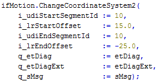
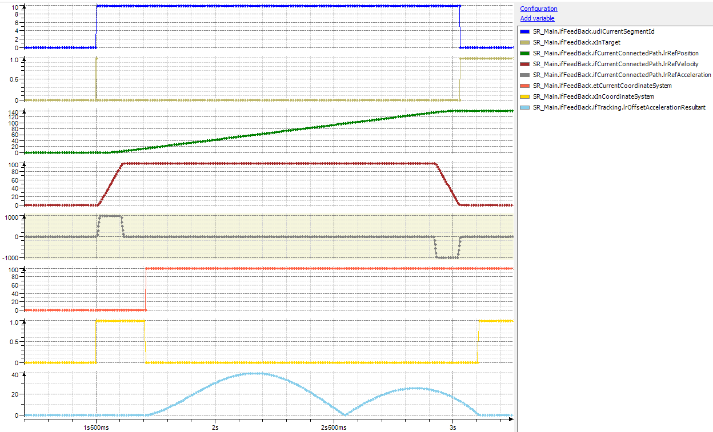

# Behavior of ChangeCoordinateSystem2 in Case Calculated Resulting Acceleration Exceeds Limit

## General

In case the necessary resulting acceleration for the synchronization phase exceeds the limit set by IF\_RobotMotion.SetMaxAccelerationResultant(…), the resulting acceleration for the synchronization phase is limited to this maximum value.

As an effect, the tracking will not be finished at the given end position.

## Example Code

## Trace

In this trace, the resulting acceleration for the synchronization phase was limited to 40 mm/sec2. As a result, the synchronization phase is finished after the end of the connected path is reached, even if the command IF\_RobotMotion.ChangeCoordinateSystem2(…) is configured with an end offset of `-25.0`.

EIO0000002232.23