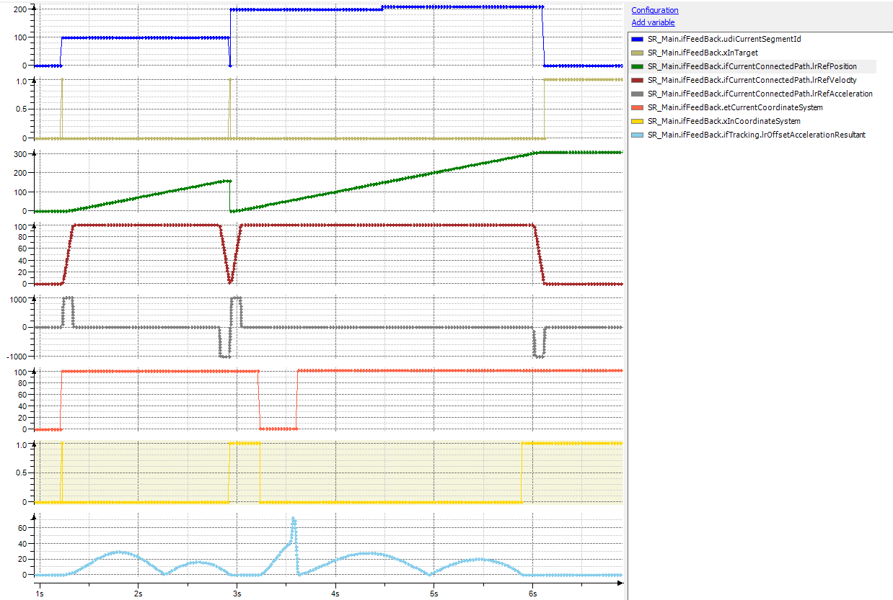

# Change of Coordinate System on the Fly

## General

You can change the tracking on the fly. This can be necessary, for example, if the robot is on the way to a waiting position while a new pick-or-place target appears.

Example code (shortened):

```
SetCoordinateSystem (CSR);
MoveS(Target := WaitPosition, ID : = 10, MaxZone := 10);
ChangeCoordinateSystem2(StartId := 10, StartOffset := 20, EndId := 10, EndOffset := 0);

[Target appears]

SetCoordinateSystem(Tracking1);
ChangeCoordinateSystem2(StartID := 10, StartOffset := 25, EndId := 20, EndOffset := -10);
MoveS(Target := Pick, Id := 20);
```

If the first tracking is active when the second tracking is triggered, the first tracking is aborted. The first tracking is stopped with the configured maximum resulting acceleration for tracking before the second tracking is started. The second synchronization phase uses a reduced resulting acceleration for tracking, if possible.

## Trace



## Conditions to be Considered

There are two conditions to be considered:

* The start position of the second tracking must be greater than the present path position. Otherwise, the diagnostic message PathPositionStartAlreadyPassed is displayed.
* The start position of the second tracking must be greater than the start position of the first tracking. If it is less, the diagnostic message PathPositionStartInvalid is displayed.

  Otherwise, if the start position of the second tracking is in front of the first one, it is triggered first and aborted by the first tracking.

EIO0000002232.23