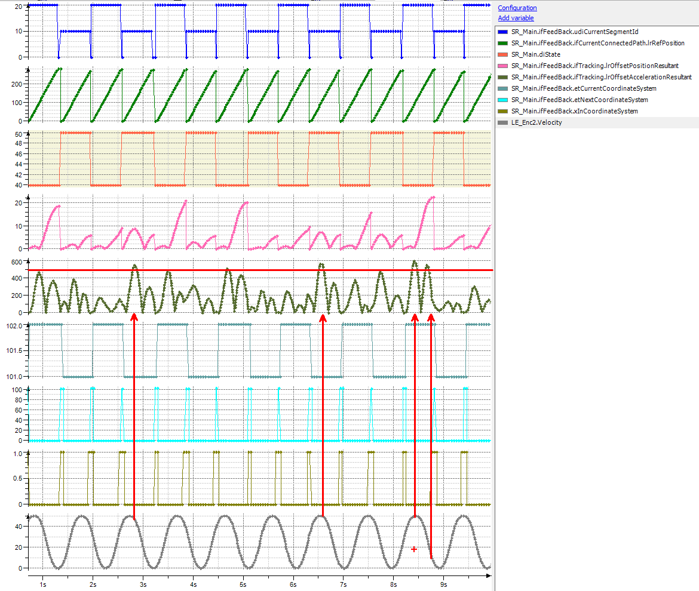

# Tracking on Velocity Sources with Non-Constant Velocity

## General

When the tracking is done on an indexing belt or when the belt changes its velocity, these changes cannot be foreseen by the tracking algorithm. Thus, the maximum acceleration configured might be exceeded.

## Trace

In this trace, the maximum resulting acceleration for the tracking is set to 500 mm/sec2. This limit is exceeded several times because one of the belts is indexing.

EIO0000002232.23