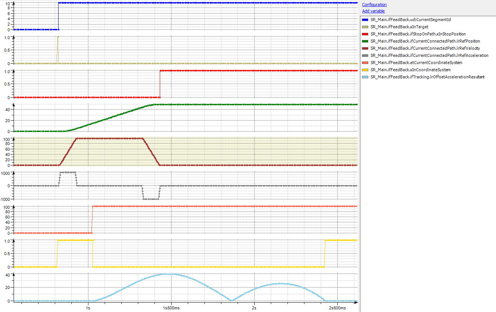
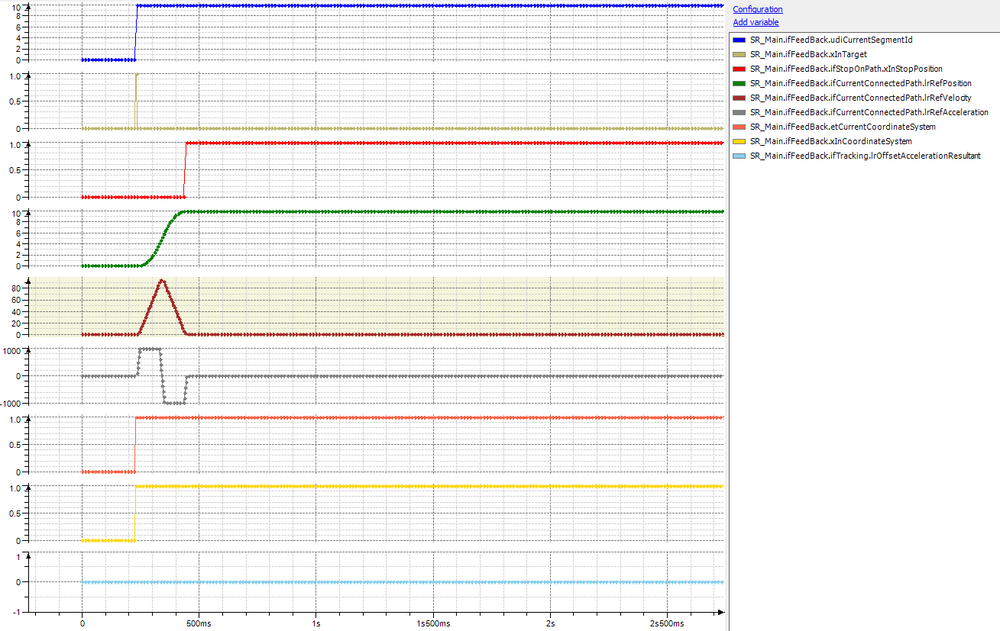

# Interaction of ChangeCoordinateSystem with Stop-on-path

## General

When the change of the coordinate system is started, it is not influenced by the path any more.

In case the robot is stopped with a IF\_RobotMotion.SetStopOnPath(…), the tracking continues with the synchronization phase.

## Trace 1

## Trace 2

When the robot is stopped in front of the tracking start position, the synchronization phase is not started. The synchronization is only triggered when the robot exceeds the configured start position.

EIO0000002232.23