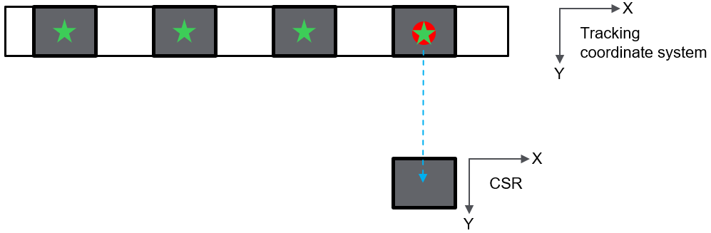
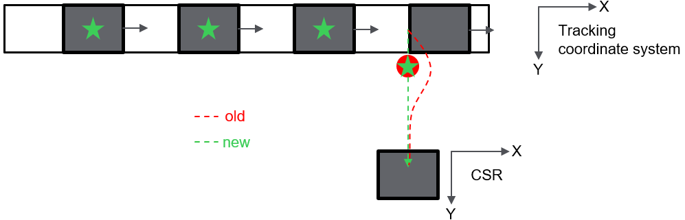
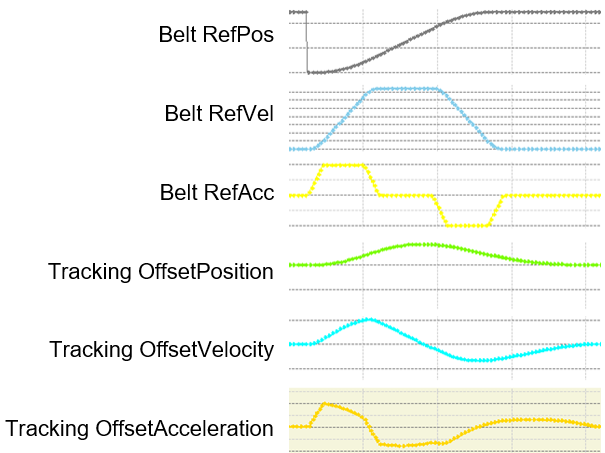
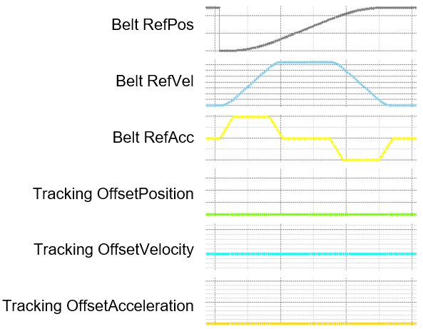

# Minimizing the Influence of a Tracking System on the Trajectory of a Robot

## Overview

To minimize the influence of a tracking system on the trajectory of a robot during desynchronization once a constant velocity is detected, you can use the structure ST\_TrackingParameters

The value of ST\_TrackingParameters.lrAccelerationZeroThreshold defines an acceleration limit for a tracking system. For accelerations below this limit, the state of the tracking system is treated as constant velocity or standstill during desynchronization phase.

Use the methods GetTrackingParameters and SetTrackingParameters to retrieve/apply a set of parameters to a specific tracking system.

## Example

A product is picked from a conveyor associated with a tracking system and should be moved to a fixed position in CSR (Coordinate System Robot). During the pick, the conveyor is at standstill and the robot is synchronous to the tracking system.

Pick and planned path

Once the product is picked, the conveyor moves to its next indexed position. At the same time, the robot begins to desynchronize from the tracking system and switches back to CSR.

Planned and resulting path

## Using ST\_TrackingParameters

If you do not define the value ST\_TrackingParameters.lrAccelerationZeroThreshold, any acceleration of a tracking system, the robot is desynchronizing from, induces its acceleration to the TCP during the desynchronization phase.

This even applies if the tracking system was at constant velocity or standstill, while switching into another system was started.

Belt acceleration during desynchronization without defining ST\_TrackingParameters.lrAccelerationZeroThreshold

If you define the value ST\_TrackingParameters.lrAccelerationZeroThreshold (together with the methods GetTrackingParameters / SetTrackingParameters), accelerations of a tracking system that appear after a constant velocity or a standstill has been detected during the desynchronization phase, will not influence the movement of the robot.

Belt acceleration during desynchronization using ST\_TrackingParameters.lrAccelerationZeroThreshold

EIO0000002232.23