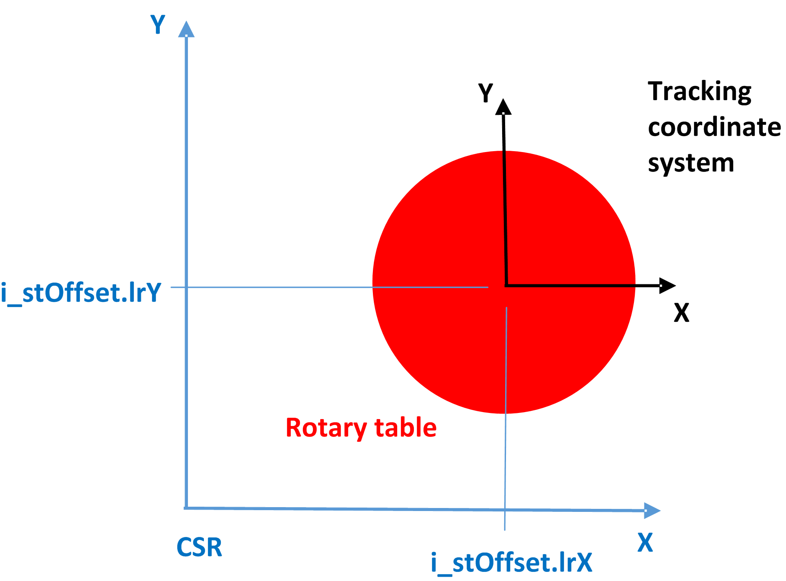
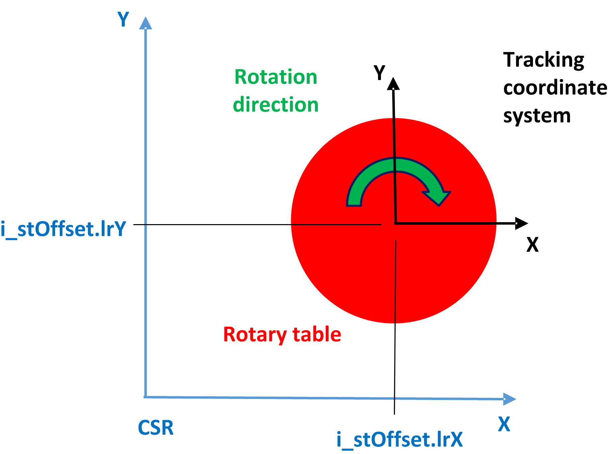
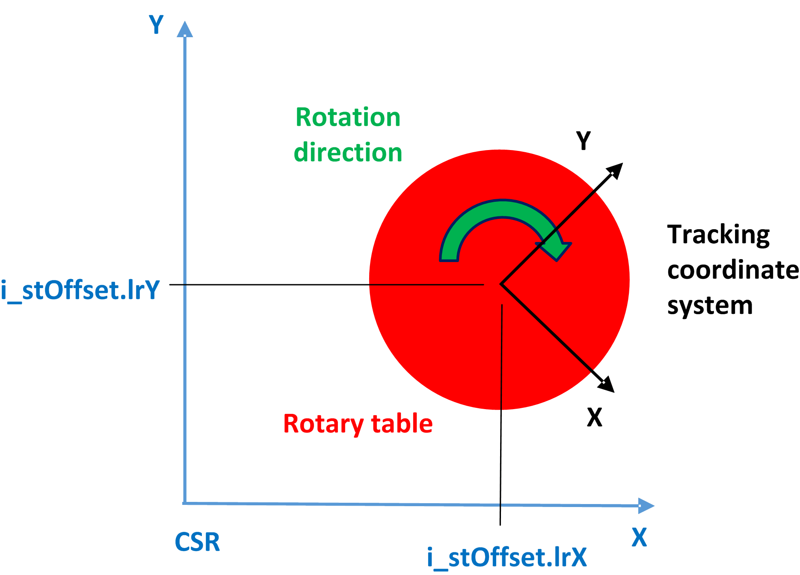

# Configuration of a Rotative Tracking System

## Position, Orientation, Tracking Direction

The configuration of a rotative tracking system is similar to a linear tracking system. The parameters i\_stOffset, i\_etOrientationConvention, and i\_stOrientation of the method AddRotativeTrackingSystem describe the origin of the rotative coordinate system based on the CSR (Robot Coordinate System). The origin of the rotative tracking system must be the center of rotation.

Example of a shifted rotational tracking system:

The parameters i\_etTrackingDirection and i\_xClockwiseRotation define the rotation:

* i\_etTrackingRotationAxis defines the axis of the tracking coordinate system, the robot is supposed to rotate about.
* i\_xClockwiseRotation = TRUE defines a clockwise rotation while i\_xClockwiseRotation = FALSE defines a counter-clockwise rotation about the specified axis.

Example with clockwise rotation about Z:

The orientation can be rotated to define a different orientation of the tracking coordinate system.

Example of a rotated orientation of the tracking coordinate system:

## Logical Encoder and Velocity Source

The logical encoder used for the tracking must be configured to report the rotation of the tracking system in degrees.

In case of a curved belt, where the velocity source might not report its movement in degrees, the encoder must be adopted to convert the movement into an angular movement. This can be done with the help of the FeedConstant of the encoder.

As the FeedConstant of the encoder is different to the FeedConstant of the source, it is necessary to disable the verification of the tracking encoder with the help of the bit xDisableTrackingEncoderCheck in IF\_RobotConfigurationAdvanced.

## Parameters for Stop

A simple maximum overall deceleration for the tracking is no longer sufficient in case of a rotative tracking, especially when the tracking is supposed to slow down with the same stop parameters as the rotary table.

Therefore, stop parameters must be defined for all tracking systems, including the linear tracking systems. This is because the tracking behavior is switched as soon as a rotative tracking system is configured.

To define the stop parameters, the method IF\_RobotConfiguration.SetTrackingStopParameters must be used.

Note that the stop parameters only apply when the tracking is aborted. A change from a moving coordinate system to a fixed system still uses the same desynchronization mechanism as before.

It is also mandatory to define emergency stop parameters for the rotative and linear tracking systems. These parameters apply in case of an exception. Emergency parameters can be also set with the help of the configuration method IF\_RobotConfiguration.SetTrackingStopParameters.

## Usage of Rotative Tracking Systems

The programming itself for a rotative tracking system is the same as with a linear tracking system.

To calculate the target positions based on the rotation angle, refer to auxiliary libraries with mathematical functions such as the [PD\_PacDriveLib](../../../../../api/crossBook?lang=en-US&virtualBookName=PD.Lib.PacDriveLib&topicID=D_SE_0087815).

There is no difference in the feedback from the tracking.

EIO0000002232.23