# Implement a User Specific Tracking Source

## General

To create a tracking source, you have to add a function block to your project. This function block must extend the FB\_TrackingSourceBase and implement ROB.IF\_TrackingSource from the robotic library.

The section [Creation of a Tracking Source](#ImplementAUserSpecificTrackingSourc-CEB3C47B__CreationOfATrackingSource-CEB39B11) explains how to add this function block so that it extends the base function block and implements the interface.

The section [User Specific Extension of the Tracking Source](#ImplementAUserSpecificTrackingSourc-CEB3C47B__section-133-CEB39E04) explains the steps to create your interface and include user specific methods and properties.

The section [Implement UpdateTrackingDataCartesian](#ImplementAUserSpecificTrackingSourc-CEB3C47B__ImplementUpdateTrackingDataCartesia-CEB3B8AF) explains the base details on how to implement this method, followed by several examples.

## Creation of a Tracking Source

| Step | Action |
| --- | --- |
| 1 | In the Devices tree or the POUs tree, select Add Object > POU... from the contextual menu.  **Result**: The Add POU dialog box is displayed. |
| 2 | Enter a Name for your function block. |
| 3 | Select Function Block. |
| 4 | Activate the Extends check box. |
| 5 | Click the browse button (...) next to the input field to open the Input Assistant. |
| 6 | Select Categories > Function blocks > ROB > Robotic > Configuration > FB\_TrackingSourceBase. |
| 7 | Confirm with OK.  **Result**: The Add POU dialog box is displayed. |
| 8 | Activate the Implements check box. |
| 9 | Click the browse button (...) next to the input field to open the Input Assistant. |
| 10 | Select Categories > Interfaces > ROB > Robotic > Configuration > IF\_TrackingSource. |
| 11 | Confirm with OK.  **Result**: The Add POU dialog box is displayed.  NOTE: In case the tracking source should support auxiliary axes, also add the interface IF\_TrackingSourceAuxAx to the Implements field. |
| 12 | Click Add. |
| 13a | In case of IF\_TrackingSource, remove all methods and properties except UpdateTrackingDataCartesian. The other elements are already implemented by the function block FB\_TrackingSourceBase in the robotic library and cannot be overwritten as the access modifier FINAL is set. |
| 13b | In case of IF\_TrackingSource and IF\_TrackingSourceAuxAx, remove all methods and properties except UpdateTrackingDataAuxAx and UpdateTrackingDataCartesian. The other elements are already implemented by the function block FB\_TrackingSourceBase in the robotic library and cannot be overwritten as the access modifier FINAL is set. |
| 14a | In the header of the remaining methods, correct the name spaces of the outputs.  Initial header for cartesian:  Correct header for cartesian: |
| 14b | In the header of the remaining methods, correct the name spaces of the outputs.  Initial header for auxiliary axes:  Correct header for auxiliary axes: |
| 15 | Implement the necessary code for your tracking source and delete the line {warning 'Add method implementation '} from the method afterwards to remove the compiler advisory. This advisory is automatically generated by Machine Expert and is generated to remind you that an implementation is necessary. |

## User Specific Extension of the Tracking Source

It is possible to extend the user specific tracking source and its interface with user-defined methods and properties. User-defined methods and properties can be necessary to initialize the tracking source or to parametrize the tracking motion.

Extending the interface may be necessary if you want to access a method or property from another part of your project where the function block is not instantiated.

Example code for different methods can be found in the descriptions of the example sources.

For an extension of the interface, you must create your own interface that extends the existing IF\_TrackingSource.

To use this extended interface, you must replace the interface implemented by the tracking source function block.

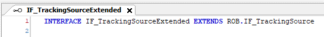

Example for an extended interface:

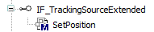

Example of a tracking source which uses the extended interface:

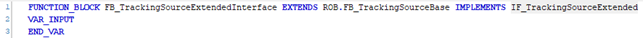

NOTE: It is not necessary to add all new methods and properties to an interface. You can add methods and properties directly to the tracking source. These elements can only be accessed in the POU that the tracking source is instantiated in.

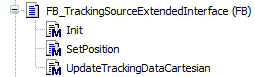

The example above has an additional method Init which is not part of the extended interface. This method can only be called in the POU where the tracking source is instantiated.

## Implement UpdateTrackingDataCartesian

To implement a trackable motion, the movement of the tracking target must be mapped to the respective outputs of the method UpdateTrackingDataCartesian.

For this purpose the cartesian position must be mapped to the output q\_stCartesianPosition while its velocity must be written to the output q\_stCartesianVelocity.

The movement of the tracking target must be described in the tracking coordinate system, it is not necessary to consider synchronization or desynchronization.

For the components that are not used and not configured, the position and velocity must be kept at zero.

|  |  |
| --- | --- |
|  | In this example the tracking coordinate system is rotated by 90° in the CSR.  The red box is to be tracked, so its position is X = 200, Y = 10 for this cycle and the velocity is equal to the conveyor velocity in position X direction.  The position and the velocity must be updated to the present value of each call. |

Modifying the position to assign a new target must not be performed in this method. For this you must implement a separate method, for further information refer to the examples.

## Example Code for Linear Tracking Source with Logical Encoder (PacDrive)

The tracking source is a linear tracking source that tracks a belt driven by a servo drive, and the tracking direction is cartesian X.

The FB\_TrackingSourceLinear uses an extended interface with the method SetPosition. This interface can be forwarded to other POUs to get access to the methods of the tracking source.

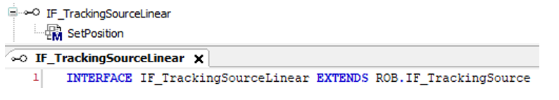

The interface of the SetPosition method in the interface must also be defined:

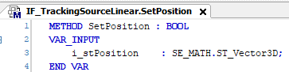

The tracking source has a method Init for configuration.

The body contains no source code and only two variables: One to store the logical encoder and one to store the cartesian position of the tracking target.

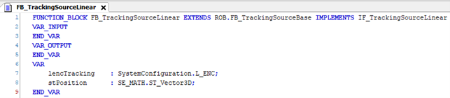

The configuration method links the logical encoder to the drive it is tracking, and it stores the logical encoder.

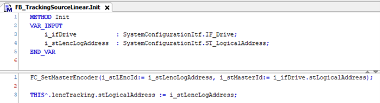

The SetPosition method has a position as input. This position represents the cartesian position of the target to track, for example, the product position on the belt.

To avoid a SetPosition on the encoder while the tracking is active, the property xInUse is verified. If xInUse is TRUE, the robot is synchronizing to, synchronous to or desynchronizing from this tracking source, and the position of the tracking system must not be modified.

The cartesian coordinate is stored in a local variable. A successful or unsuccessful execution is reported via the return value.

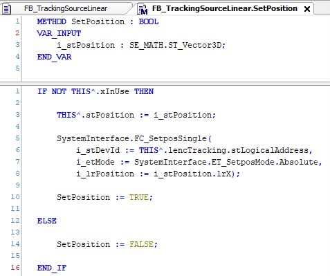

The method UpdateTrackingDataCartesian is as follows: The logical encoder position represents the X coordinate. The Y and Z coordinates are the values that are stored in the SetPosition method.

NOTE: Any position different from zero is considered by the tracking. If you set the Z position to 10, the tracking lifts the robot by 10 mm during synchronization and lowers it back to zero during desynchronization.

For the velocity, you must copy the velocity reported by the logical encoder to the output q\_stCartesianVelocity.lrX and keep the other two components at zero.

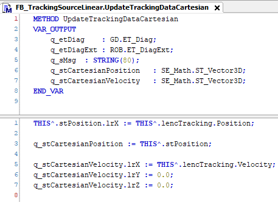

## Example Code for Rotative Tracking Source with a Logical Encoder (PacDrive)

This tracking source is for a rotating table driven by a drive which is turning counterclockwise.

The FB\_TrackingSourceRotative uses an extended interface with the method SetAngleAndRadius. This interface can be forwarded to other POUs to get access to the methods of the tracking source.

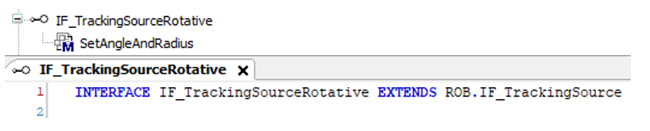

The tracking source has a method Init for configuration.

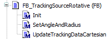

The body contains no source code and only two variables: A logical encoder and the radius that is used for the tracking motion.

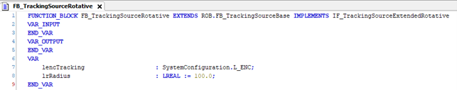

In the configuration method, the logical encoder is linked to the drive and stored in the local variable.

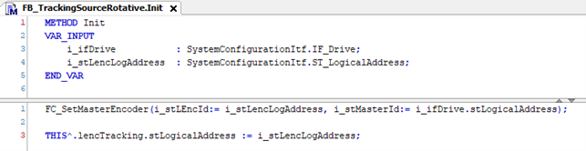

In the SetAngleAndRadius method, the radius is stored for later calculation of the movement and the logical encoder is set to the specified angle. This is only performed, when the property xInUse is not set, which means that the robot is not synchronizing with, synchronous to or desynchronizing from this tracking system. A successful or unsuccessful execution is reported through the return value.

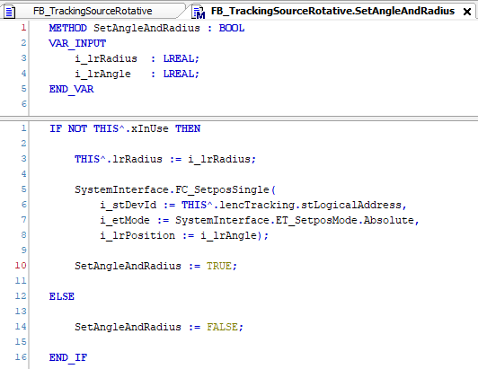

In UpdateTrackingDataCartesian, the cartesian position is calculated from the logical encoder representing the angle and the radius stored in the method SetAngleAndRadius. The cartesian velocity is calculated in a similar way.

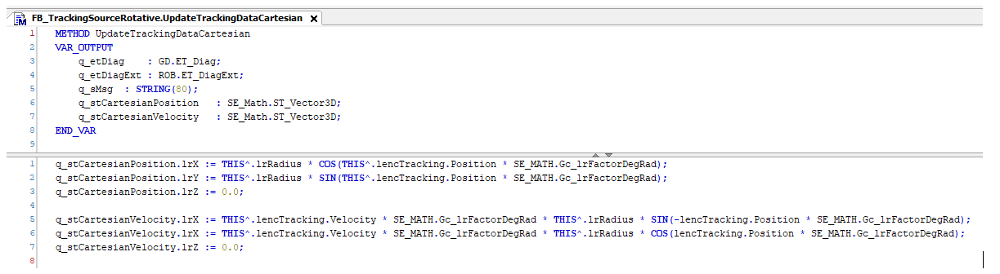

NOTE: The calculations are based on a tracking source which rotates counter-clockwise.

## Example Code for a Tracking Source with a Tracking on an Auxiliary Axis

In this example, the rotative tracking source is extended with the necessary elements to map the rotation to an auxiliary axis.

To be able to map a movement to the auxiliary axes, the tracking source must implement the interface IF\_TrackingSourceAuxAx, which means it has the additional method UpdateTrackingDataAuxAx:

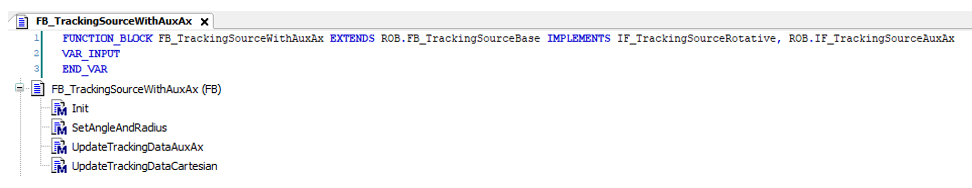

If the position of the logical encoder must be used unchanged, its position and speed can be mapped directly to the corresponding outputs:

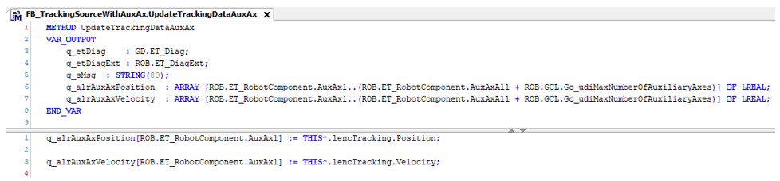

NOTE: The orientation of the coordinate system of the tracking source is not considered by the auxiliary axis. In case the coordinate system of the tracking source is rotated by 90° about Z to the robot coordinate system, this value is not considered by the FB\_Robot.

## Example Code for Linear Tracking Source with FB\_AxisMovementMonitor (M262/M660)

To track on a M262/M660 controller, the FB\_AxisMovementMonitor must be used to represent a trackable motion.

For a linear tracking source you need the configuration method Init in which the FB\_AxisMovementMonitor is linked to the axis that drives the conveyor. The SetPosition method is used to set the tracking position to the tracking target.

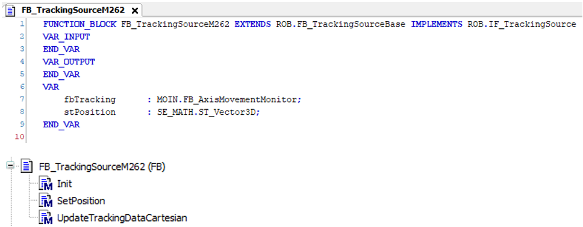

NOTE: You can create an interface which extends IF\_TrackingSource to be able to access the methods of this tracking source from other POUs.

If the extended interface is to be used, it must be implemented by the tracking source.

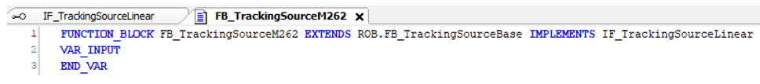

The body contains no source code and only two variables: The FB\_AxisMovementMonitor to track the motion and a position to store the cartesian position of the tracking target.

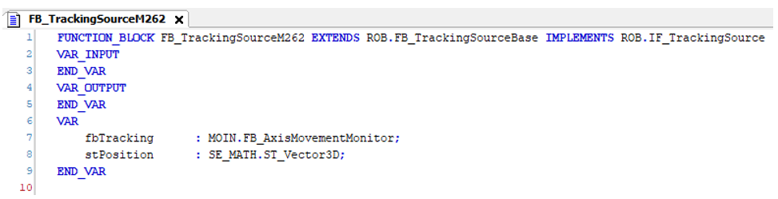

In the configuration method, only the connection of fbTracking to the given drive is necessary.

In this example, the return value of the method is BOOL, it can be enhanced according to your needs.

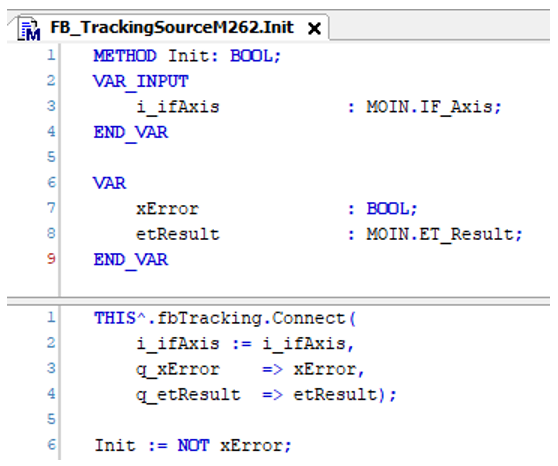

The SetPosition method uses the tracking target as input. Before the SetPosition is executed, the property xInUse is verified to avoid a SetPosition in case the tracking system is used by the robot.

The value of the entered position is stored in the local variable, so that the Y and Z coordinates are available at a later time.

A successful or unsuccessful execution is reported through the return value.

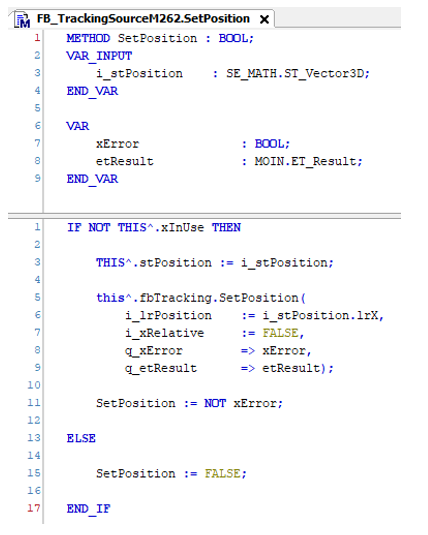

In the method UpdateTrackingDataCartesian, the position from the FB\_AxisMovementMonitor is read and copied to the X value of the tracking position, while its velocity is forwarded to the output of the cartesian velocity.

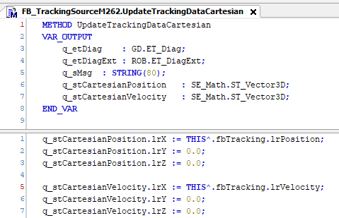

EIO0000002232.23