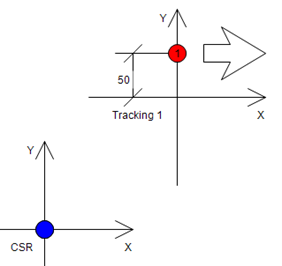

# Usage of Tracking Sources

## Configuration

| Step | Action |
| --- | --- |
| 1 | Create your tracking source as described in the section [Creation of a Tracking Source](ImplementAUserSpecificTrackingSourc-CEB3C47B.html#ImplementAUserSpecificTrackingSourc-CEB3C47B__CreationOfATrackingSource-CEB39B11). |
| 2 | Instantiate the tracking source in your project. |
| 3 | Configure the tracking source with the help of the methods:   * SetCoordinateSystem * EnableComponent (if necessary, for example for auxiliary axes) * SetMotionParameters * SetOptionalParameters (if necessary, for example for auxiliary axes)   NOTE: If necessary, perform further initializations, depending on the tracking source. |
| 4 | Complete and validate the configuration with the method ConfigDone of the tracking source.  NOTE: Repeat steps 1...4 for each tracking source if you need more than one tracking source. |
| 5 | Configure the transformation of the robot and add auxiliary axes, if necessary. |
| 6 | Forward the tracking source(s) to the robot with the method ROB.IF\_RobotConfiguration.AddTrackingSource or RM.IF\_Configuration.AddTrackingSource. |
| 7 | Finalize the robot configuration and validate the configuration with the ConfigDone method from the robot. |

## Motion Program

To track the position, set the tracking source to the cartesian value of the tracking target in the tracking coordinate system.

NOTE: Any value other than zero in the coordinates is considered by the tracking.

To set the position of the tracking source, a separate method might be necessary. Refer to the [examples](ImplementAUserSpecificTrackingSourc-CEB3C47B.html) for further details.

Switch to the tracking system with the help of the methods SetCoordinateSystem and ChangeCoordinateSystem2.

Send one or more movement commands to the tracking target. If you enter a final target of X=0, Y=0 and Z=0, the robot moves to the position you set at the source. Any target value other than zero is a fixed cartesian offset in the tracking coordinate system, relative to the tracking target reported by the source.

If a rotational system is used, the offset is fixed in cartesian space and does not rotate with the source. In case this additional offset must be considered for the rotation, it must be handled by the tracking source instead.

## Offset Handling

There are two ways to deal with an offset of the tracking target within its tracking coordinate system.

As an example, a target in the tracking system Tracking 1 should be tracked. The target has an offset of 50 units in Y-direction and is moving in positive X-direction.

The offset between Tracking 1 and the robot coordinate system (CSR) are 150 units in X and 150 units in Y direction.

| Option | Description |
| --- | --- |
| Option 1 | Option 1 sets the tracking position reported by the tracking source to X = 0, Y = 50 and move X corresponding to the tracking velocity source. To hit the target, the move command or commands must have the final target X = 0, Y = 0.  As a result, the offset of 50 in Y-direction is built up during synchronization and reset with a SetPos before the desynchronization.  NOTE: The Y value of the trajectory storage reaches 150 during the movement towards the target. This is the offset between the coordinate systems which is automatically considered by the robotic functionality.  The disadvantage of this option is the additional acceleration that is added to the tracking motion for synchronizing the additional Y offset. This can lead to a longer time for the synchronization process. As an advantage, the complete offset-handling is done by the tracking source and the motion program must not react on different side offsets. |
| Option 2 | The tracking source reports a position with Y = 0 and only a moving X position. To reach the target in this case, the move command or commands must have a final target X = 0, Y = 50.  When this option is used, the additional offset of 50 is considered by the trajectory storage which moves Y to a value of 150 + 50 = 200.  This option needs less acceleration during the synchronization phase as only the X-component of the movement must be synchronized. On the other hand, the motion program must take care of the Y offset. |
| Option 1 and 2 | The trace shows both options next to each other, option 1 on the left side and option 2 on the right side:  The remaining time in the last trace shows the disadvantage of the higher synchronization time that was mentioned in option 1. |

EIO0000002232.23