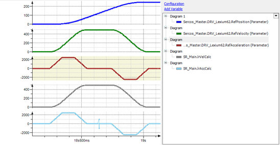
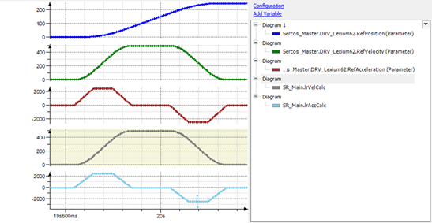

# Usage of Position Monitoring

## General Information

The position monitoring is intended to be used in the commissioning phase to avoid that the robot attempts to follow a tracking source which reports an inconsistent position.

To enable the position monitoring, a maximum acceleration greater than zero must be defined for a component with the method IF\_TrackingSource.EnablePositionMonitoring.

If this maximum acceleration is set, the acceleration of the component is calculated from the positions reported. As soon as the calculated acceleration is greater than the maximum value, a controller stop is performed on the robot axes.

NOTE: If the regular acceleration of the tracking source is greater than the given limit, this also triggers the stop.

## Configuration

The minimum limit that can be configured must be greater than the maximum acceleration of the source. Otherwise, the regular acceleration triggers a stop.

There must be some margin, for example, for a distorted or noisy position of the source or when the drive exceeds its maximum acceleration due to the control loop.

The maximum value of the limit depends on the maximum acceleration the robot can move. The maximum value must be smaller, so the robot is stopped when the position delta from the source requires a higher acceleration.

## Limitations

The minimum inconsistency that can be detected depends on the Sercos cycle time and the given maximum acceleration limit.

Minimum inconsistency = maximum acceleration \* (Sercos cycle time)².

For example, when a maximum acceleration of 3000mm/s² is configured and the Sercos cycle time is 1 ms, the minimum inconsistency that can be detected is 0,003 mm. (3000 mm/s² \* (0,001 s)² = 0,003 mm.

In the following trace, a SetPos of 0,001 mm was performed while the axis was moving at a constant speed. As this results in an acceleration of ±1000 mm/s² and because it is less than the maximum acceleration of the drive, this inconsistency cannot be detected.

If the same SetPos occurs during the deceleration phase, it can be detected because the acceleration is summed up.

When the source is not used by the robot, (property xInUse is FALSE), the position is not monitored. This enables you to modify the position of the source before a tracking is started.

Thus, the algorithm cannot detect an inconsistency in the first two Sercos cycles the source uses for tracking. To be able to calculate an acceleration from the positions, a sequence of at least three positions is necessary.

EIO0000002232.23