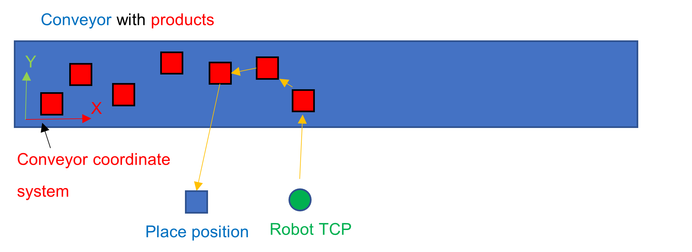

# Multipick

## Overview

The scenario for a multipick is usually a conveyor belt that transports several products that are placed randomly. Instead of picking and placing each product individually, the robot should pick several products before placing them.

The product positions on the conveyor are tracked by a product handler, which reports the position of the products in the conveyor coordinate system.

EIO0000002232.23