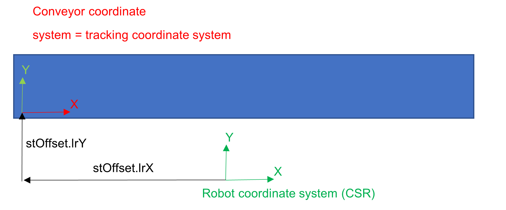
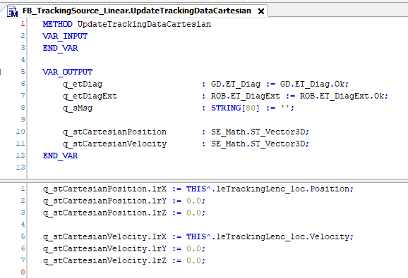

# Configuration of the Tracking Source

## Coordinate System

The tracking source must be configured so that its own coordinate system corresponds to the coordinate system of the conveyor.

The values stOffset.lrX and stOffset.lrY are the values to be used on i\_stOffset in the SetCoordinateSystem configuration method of the tracking source.

## UpdateTrackingDataCartesian

In the update method, the tracking source must follow the conveyor motion:

In this example a logical encoder is used. Refer to the [Example Code for Linear Tracking Source with FB\_ AxisMovementMonitor (M262/M660)](ImplementAUserSpecificTrackingSourc-CEB3C47B.html#ImplementAUserSpecificTrackingSourc-CEB3C47B__ExampleCodeForLinearTrackingSourceW-CEC18007) if another monitoring is used, for example the FB\_AxisMovementMonitor.

For further information, refer to *[FB\_AxisMovementMonitor](../../../../../api/crossBook?lang=en-US&virtualBookName=MOIN&topicID=198B1FBF)*.

EIO0000002232.23