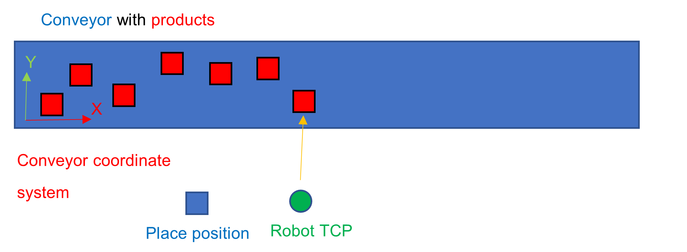
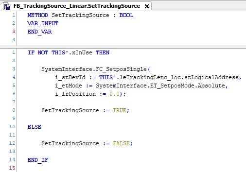
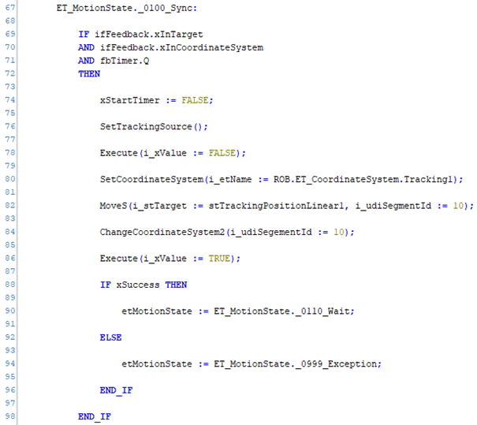
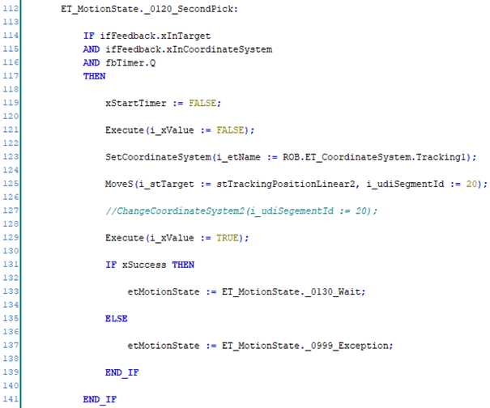
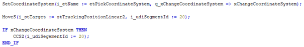
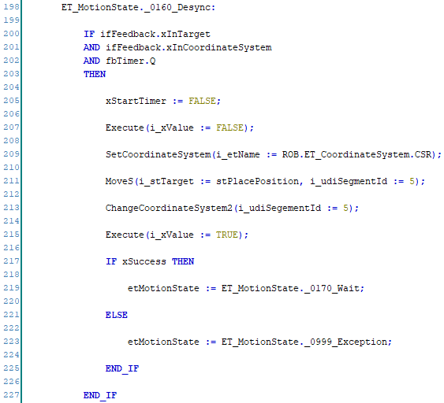

# Move Command Sequence

## Synchronization

Before sending the first commands to the robot, initially set the tracking source to a position of X = 0, Y = 0 and Z = 0 which is then reported on the output q\_stCartesianPosition of UpdateTrackingDataCartesian.

When a logical encoder is used, this is done with a method that does a SetPos to zero:

Example to move to the first product:

| Step | Action |
| --- | --- |
| 1 | Call SetCoordinateSystem and select the correct tracking system. |
| 2 | Use the product position in the conveyor coordinate system as final target for your move command. |
| 3 | Call ChangeCoordinateSystem2 to configure the part of the trajectory where the change between the coordinate systems is allowed. |

NOTE: The description here is only the minimum code required, for each individual case it might be necessary to call other methods or use additional functionalities.

The following code is an example for a pseudocode sequence. For a better overview, the commands are shortened.

* SetTrackingSource is the call where the tracking source is set to zero.
* stTrackingPositionLinear1 is the product position in the conveyor coordinate system.

## Move from Product to Product

The movement from product to product in tracking is similar. At first a call of SetCoordinateSystem is required, then the move commands are called with their final target which is the product position in the conveyor coordinate system.

NOTE: ChangeCoordinateSystem2 is not required in this case, as it is the same coordinate system. The same sequence can be repeated several times, as long as the robot can and has to pick further products.

The Multipick can be either in the same or a different coordinate system. For example, if the products arrive on two different conveyors, it might be necessary to change the coordinate system. The method SetCoordinateSystem has an output called q\_xChangeCoordinateSystem, which is set to TRUE if the call of ChangeCoordinateSystem2 is required.

With this solution, it is not necessary to differentiate in the user code if the robot remains in the selected system or if it is forced to change it. This is automatically indicated by the SetCoordinateSystem method.

## Desynchronization

The SetCoordinateSystem must be called with [ET\_CoordinateSystem.CSR](D-SE-0075477.html) and the move command targets the place position. Followed by the mandatory call of ChangeCoordinateSystem2, as the coordinate system must change from Tracking1 to CSR.

EIO0000002232.23