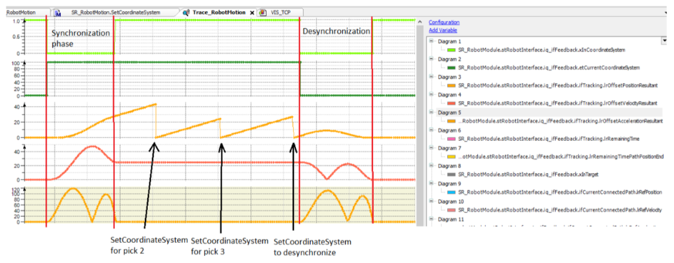
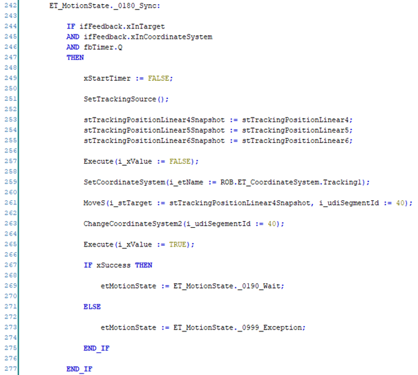
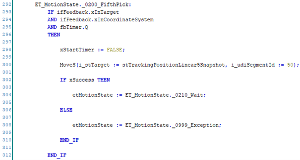

# Next Multipick

## Overview

To perform the next Multipick, reset the tracking source to X = 0, Y = 0 and Z = 0 and then perform the steps from the section [Move Command Sequence](MoveCommandSequence-DE2D0D10.html).

## Usage of SetCoordinateSystem with Every Pick

Call SetCoordinateSystem with every pick, for a more flexible handling of the pick logic.

When the robot is ready for the next pick, the positions of the products are evaluated and the most suitable product for a pick is selected.

To be able to use the product position in the conveyor coordinate system, the tracking offset must be reset to zero.

This reset is initiated with every call of SetCoordinateSystem. The tracking movement for a triple pick with Synchronization, two intermediate SetCoordinateSystem (pick 2 and pick 3) and a Desynchronization to a fix position is displayed in the trace:

## Alternative Approach without SetCoordinateSystem for Every Pick

A less flexible approach for performing a Multipick is if you do not use the intermediate SetCoordinateSystem.

In this case, the products for the Multipick must be selected and stored after the reset of the tracking source when the first pick is about to start.

In this example, the snapshot positions are stored for the products 4, 5 and 6 that were selected as valid pick targets for this triple pick.

Then, the commands to synchronize and to move to the first snapshot position are sent.

To move to the next pick position, only the move commands are necessary:

The desynchronization after the last pick is the same as before.

As all products must be selected when the first pick is about to start, this alternative approach is less flexible. It is not possible to skip a product that was selected at the start of the selection for a more suitable product on the fly.

EIO0000002232.23