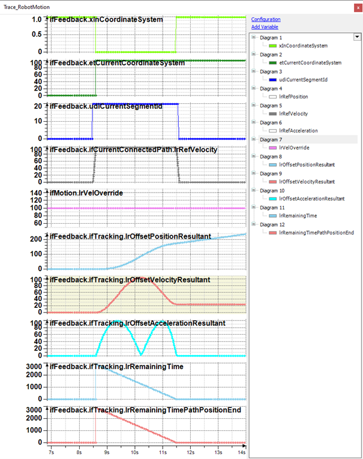
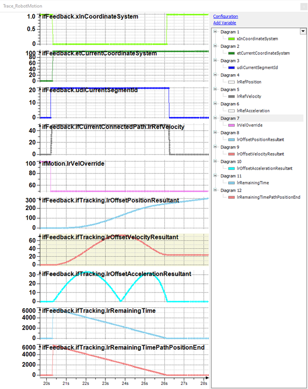
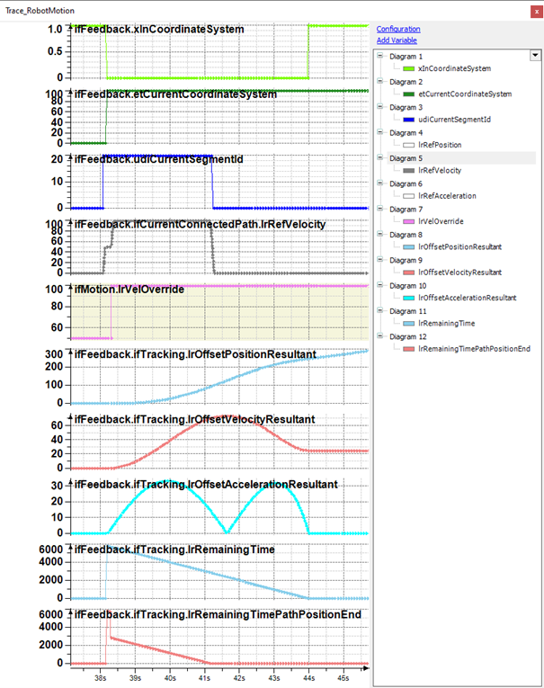
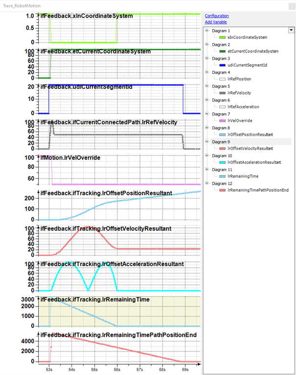

# Influence of VelOverride and LinearTrackingVelOverrideScaling on Synchronization with ChangeCoordinateSystem2

## ChangeCoordinateSystem2 Time Calculation

When the combination SetCoordinateSystem/ChangeCoordinateSystem2 is used, the time for synchronization is calculated once at the start of the tracking. This time is based on the distance specified with ChangeCoordinateSystem2 and the motion parameters including VelOverride. This time is used when it is longer than the second time calculated on the basis of the maximum tracking acceleration.

As the feature LinearTrackingVelOverrideScaling uses the VelOverride to slow down the robot when the next product to pick is still in front of the work envelope, the state of the VelOverride influences the tracking synchronization behavior.

NOTE: Set the VelOverride at 100 before the motion and tracking commands are sent. The suggested VelOverride value from LinearTrackingVelOverrideScaling should only be used after the tracking was started.

## Example with VelOverride 100

The trace shows the movement to a tracking target with VelOverride = 100. The calculated time for synchronization is 3 s. In the last two traces, the time for synchronization (ifFeedback.ifTracking.lrRemainingTime) and the time that the TCP needs to reach the specified end position of the synchronization (ifFeedback.ifTracking.lrRemainingTimePathPositionEnd) returns from this value to zero during the change of the coordinate system.

The tracking is synchronized when the trajectory reaches the end position specified in the ChangeCoordinateSystem2 command.

## Example with VelOverride 50

In this example the VelOverride is set to 50% before tracking is started. The time for synchronization is 6 s. In the last two traces, the time for synchronization (ifFeedback.ifTracking.lrRemainingTime) and the time that the TCP needs to reach the specified end position of the synchronization (ifFeedback.ifTracking.lrRemainingTimePathPositionEnd) returns from this value to zero during the change of the coordinate system.

NOTE: This linear behavior of the time (half VelOverride = double synchronization time) does not occur in all cases. The parametrization of the example was chosen in a way that the resulting times double when the VelOverride is halved.

## Example with Increased VelOverride

In this example, the VelOverride is increased after the tracking was started. The VelOverride is 50 at the start of the tracking and is set to 100 afterwards.

Initially both times report 6 s, the same value as in the example with 50% VelOverride.

After the change of the VelOverride, the lrRemainingTimePathPositionEnd drops to ~3 s. This is the reaction of the trajectory to the change of VelOverride. In the grey trace the RefVelocity increases from 50 to 100. Due to the faster movement, the trajectory reaches the end position earlier.

The remaining time of the tracking does not react to the change of lrVelOverride. The time is only calculated once at the start of the tracking. The tracking ends the synchronization after the trajectory reaches the specified end position, but still within the time based on the VelOverride of 50%.

## Example with Decreased VelOverride

In this example, the VelOverride is decreased after the tracking was started. The VelOverride is 100 at the start of the tracking and is set to 50 afterwards.

Initially both times report 3 s.

The residual time for tracking remains at this value, while the residual time for the trajectory increases due to the slower movement.

In this case, the tracking ends the synchronization before the trajectory reaches the specified end position.

EIO0000002232.23