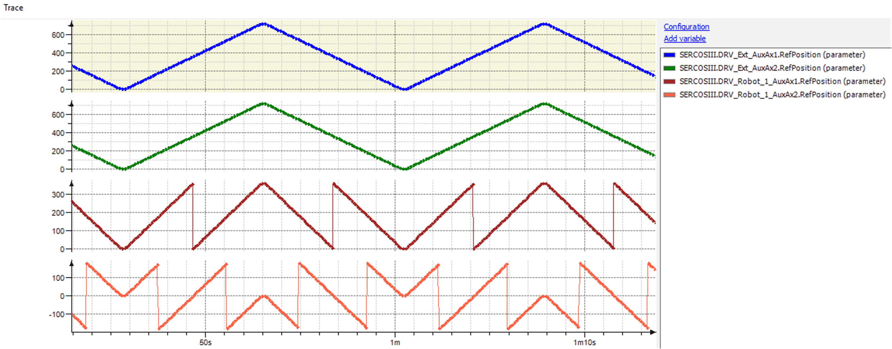
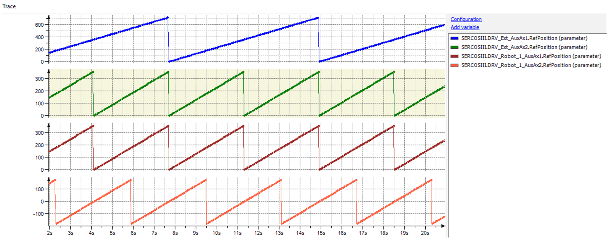

# General Behavior of ExternalPositionSource

## How to Create an ExternalPositionSource

Creating an external position source

| Step | Action |
| --- | --- |
| 1 | In the Devices tree or the POUs tree, select Add Object > POU... from the contextual menu.  **Result**: The Add POU dialog box is displayed. |
| 2 | Enter a name for your function block. |
| 3 | Select Function Block. |
| 4 | Activate the check box Implement. |
| 5 | Click the browse button next to the input field to open the Input Assistant. |
| 6 | Select Categories > Interfaces > ROB > Robotic > Configuration > IF\_ExternalPositionSource. |
| 7 | Confirm with OK.  **Result**: The Add POU dialog is displayed. |
| 8 | Click Add.    **Result**: The function block implementing the interface is added. |
| 9 | Add further code to the function block.  Example code for a robot which should follow four external drives: |

## Using ExternalPositionSource

| Step | Action |
| --- | --- |
| 1 | Add an instance of the function block that you have created (How to Create an ExternalPositionSource).   ``` VAR fbExternalPositionSource : FB_ExternalPositionSource; END_VAR ``` |
| 2 | Forward this instance to the robot by calling the method ExternalPositionSource(…) in ifRobotConfiguration.ifAdvanced:   ``` fbRobot.ifConfiguration.ifAdvanced.ExternalpositionSource(                  i_ifSource := fbExternalPositionSource,                  q_etDiag    => etDiag,                  q_etDiagExt => etDiagExt,                  q_sMsg      => sMsg; ``` |

Now, when the robot is in automatic mode (FB\_Robot.xEnable = TRUE), the method is called automatically every Sercos cycle to read the positions.

## Verification of RefPositions

There are several verifications of the RefPositions forwarded to the robot

| Verification | Description |
| --- | --- |
| The component must be configured. | * It is not possible to write a RefPosition for Y when a 2D Robot (For example Delta2Ax) is configured with working plane X/Z. * It is not possible to write a RefPosition for an auxiliary axis, which is not configured.   **Exception**: When the coordinate system of the robot (ET\_CoordinateSystem.CSR) is rotated, the correct orientation must be forwarded to the FB\_Robot. You can use ifFeedback.rstLastTargetOrientation. |
| In case you use the library SchneiderElectricRobotics, the RefPositions are verified against the work envelope of the robot. | * It is not possible to start the robot when the TCP is outside the work envelope, neither with warm- or cold start. * In case the movement would pull the robot outside its work envelope, a stop with regular motion parameters is initiated. |
| The standard transformations are verifying, if the position can be reached mechanically. | In case the position is invalid, the robot axes are stopped. An exception is reported by the FB\_Robot / FB\_RoboticModule. |

## Behavior of Cold Start with ExternalPositionSource

When a cold start is requested, the current TCP position is checked against the position provided by the external position source. If these positions match with a tolerance of 1.0E-2, the robot is considered to be on path and a cold start can be performed.

If at least one of the positions is shifted by more than 0.01, an exception NotOnPath is reported by the FB\_Robot.

The sequence for a cold start is:

| Step | Action |
| --- | --- |
| 1 | Set your external positions to ifFeedback.rstRefPositionTCP / rstRefOrientationTCP / raifAuxAx[Index].lrRefPosition while robot is disabled. |
| 2 | Enable the robot:   * FB\_RoboticModule: Send the module command ET\_Cmd.Auto * FB\_Robot: Set the property xEnable to TRUE |
| 3 | Verify the feedback, if ifFeedback.xOnPath = TRUE. |
| 4 | Start the robot   * FB\_RoboticModule: Send the module command ET\_Cmd.Start. * FB\_Robot: Set the property xStart to TRUE   Result: You can move the external positions and the robot is following. |

## Behavior of Warm Start with ExternalPositionSource

When an external position source is configured, the warm start mode is set to ET\_WarmStartMode.Sequenced. Thus, you must use the method ifWarmstart.Start() to launch a warm start movement. For further details about the sequenced warm start, refer to [*Behavior of Warm Start Mode Sequenced*](D-SE-0096790.html#D-SE-0096790).

When the warm start is started, the method WriteRefValues is called and the current position of the components are read. The components are moved to this position. In case the external position is changed during warm start, this modification is not considered. The components are not returning the feedback OnPath. An application logger entry is created.

When the external position changes after a component has finished its movement, but the warm start is not completed yet, the feedback OnPath for this component is reset to FALSE.

It is possible to restart the warm start for any component which is not on its path, yet.

When the components are moved to their correct position, ifFeedback.xOnPath becomes TRUE and ifRobot.xStart can be set to TRUE and the robot is following the movement of the external position source.

## Behavior of Warm Start Feedback

Possible bits for warm start are, for example ifWarmstart.raxCartesianPossible[ROB.ET\_RobotComponent.CartesianX].

These bits become TRUE when the following conditions are met:

* The FB\_Robot is in warm start mode (xEnable, xWsSelect, and xWsStart are TRUE)
* The motion parameters for a warm start for this component are configured (ifWarmstart.SetMotionParamerer(…))
* The component is not on path
* The component is not performing a warm start movement

OnPath bits, for example ifWarmstart.raxCartesianOnPath [ROB.ET\_RobotComponent.CartesianX]

These bits are TRUE when:

* The function block FB\_Robot is enabled
* The component is on path

Distance, for example ifWarmstart.ralrCartesianDistance[ROB.ET\_RobotComponent.CartesianX].In case the component is not on path, the distance to the warm start target can be read here, as soon as the FB\_Robot is in warm start mode (xEnable, xWsSelect, and xWsStart are TRUE).

Furthermore, there are application logger entries, which reports certain warm start events.

## Usage of Additional- / User-Transformation

The usages of the following transformations are possible even if ExternalPositionSource is configured.

* IF\_RobotConfiguration.User3Ax(…)
* IF\_RobotConfigurationAdvanced.AdditionalTransformationTCP(…)
* IF\_RobotConfigurationAdvanced.AdditionalTransformationAxes(…)

## Mixture with Regular Move Commands

If ExternalPositionSource is configured, it is not possible to move the robot with regular move commands.The methods will return a diagnosic message ExecutionAborted / ExternalPositionSourceConfigured.

## Behavior of Stop

In case of FB\_Robot.xStart switches fromTRUE to FALSE, an active movement of each robot component, forwarded by the external position source, is stopped with the configured motion parameters.

The motion parameters can be configured with the available configuration methods in IF\_RobotMotion.

* SetMotionParameters(…)
* SetMaxVelocity(…)
* SetMaxAcceleration(…)
* SetMaxDeceleration(…)
* SetRamp(…)

## Behavior of EmergencyStop

In case of FB\_Robot.xEnable switches from TRUE to FALSE an active movement of each robot component, forwarded by the external position source, is stopped with the configured emergency parameters.

The emergency parameters can be configured with the available configuration methods in IF\_RobotConfiguration:

* SetEmergencyParameters(…)
* SetEmergencyParameters2(…)

## Stop Behavior When the RoboticModule is Used

When the RoboticModule is configured to run with an external position source, the stop behavior is as follows:

* Reaction ASyncStop stops the individual axes with their stop behavior
* Reaction SyncStopEL/EH stops the robots external motion with configured emergency parameters
* Reaction StopEndOfCycle stops the robots external motion with configured motion parameters

## Behavior of Feedback EstimatedStopPosition

Used parameters for calculating the feedback estimated stop position changed.

| Parameter | Description |
| --- | --- |
| ifSpace.rstEstimatedStopPosition | Is calculated with motion parameters set by IF\_RobotMotion.SetMotionParameters(…) for robot components **X**, **Y** and **Z**. |
| raifAuxAx.lrEstimatedStopPosition | Is calculated with motion parameters set by IF\_RobotMotion.SetMotionParameters(…) for robot components **AuxAx**. |
| raifOrientation.lrEstimatedStopPosition | Is calculated with motion parameters set by IF\_RobotMotion.SetMotionParameters(…) for robot components **Orientation**. |

## Behavior of Schneider Electric Robot Work Envelope

The calculated estimated stop position is forwarded to a Schneider Electric robot to check the robots work envelope.

The motion parameters for calculating the estimated stop position must be configured corresponding to the application needs, otherwise an unexpected stop of the robot can occur.

## Behavior of Periodically Auxiliary Axis

In case you use a period for an auxiliary axis, the period of the external position source must be equal to or a multiple of the auxiliary axis period length.

Examples:

| AuxAx PeriodLength | External Position Period |
| --- | --- |
| 360 | 0...360  -180...180  -360...360  0...3600  ... |
| 90 | 0...90  0...180  -45...45  -10...80  0...720  0...900  ... |

The external position is calculated into the auxiliary axis period. The period start of the auxiliary axis does not matter, you can use a period of -180…180 on the auxiliary axis while the external position source uses 0...720 or no period at all.

NOTE: It is not possible to use a shorter period on the external position source.

Example trace, where the external axes move without a period, but AuxAx1 uses a period of 0...360 and AuxAx2 uses a period of -180...180.



Example trace, where the external axis for AuxAx1 moves without a period of 0...720 while AuxAx1 uses a period of 0...360. The external axis for AuxAx2 moves with a period of 0…360, while AuxAx2 has a period of -180…180.



EIO0000002232.23