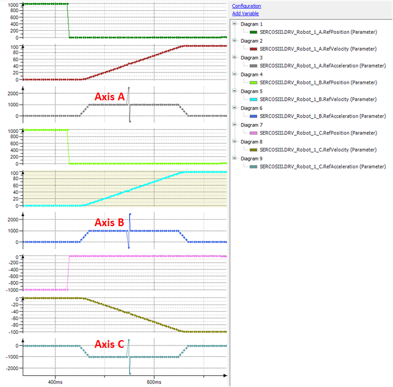
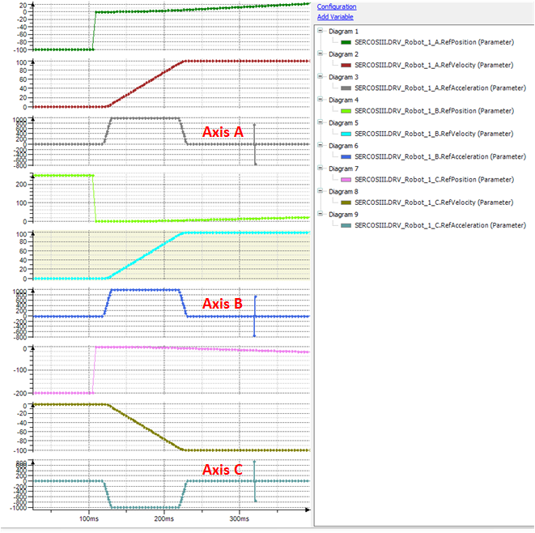

# Using ExternalPositionSourceLimit

## General Information

The ExternalPositionSourceLimit method is used during commissioning to avoid, that the robot follows an inconsistent CAM of the external position source. Monitor all available components.

## Configuration

The minimum value that must be configured should be greater than the acceleration used for the external position source. Provide a small margin so that the algorithm is not triggered if the external position source slightly exceeds its maximum acceleration due to the control loop.

There must also be a tolerance not to trigger the algorithm when the position signal from the source is distorted.

The further the limit value is from the maximum value, the lower the probability that a false-positive result is triggered.

The maximum value that must be configured depends on the maximum acceleration at which the robot can move. The value for the limit must be smaller than this value so that the robot is stopped when a position causes a greater acceleration.

NOTE: When the SERCOS is set to 1 ms, small acceleration values will catch small inconsistencies. A limit of 10000 mm/sec² will trigger an error when the position delta is 0.1 mm or greater.

Most inconsistencies cause two spikes in the acceleration: one in the cycle in which the inconsistency is present and one in the cycle afterwards.

## Examples

The following diagram displays three examples, where the SetPos of 0.0015 is applied to three different movements with an acceleration of 1000 mm/sec². The limitation is set to 1250 mm/sec².

The Axis A moves forward and as the SetPos has a positive value, the acceleration immediately goes up to 2500 mm/sec². So, the limit would trigger a stop.

The Axis B also moves forward, the SetPos has a negative value. Because of this, the acceleration drops to -500 mm/sec². This would not trigger a stop, as the value is less than the limit. In the following cycle, the acceleration jumps to 2500 mm/sec², so this would also trigger a stop.

The Axis C is moving backwards and has a positive SetPos, so the second cycle would exceed the limit and trigger a stop.

In the following example, the drives move at constant speed and no acceleration is present, any SetPos smaller than 0.00125 mm will not trigger the limit, as the resulting acceleration is below the threshold.

The example trace shows a Setpos of 0.00075 during a phase of constant velocity on all three axes, that would not trigger the stop.

EIO0000002232.23