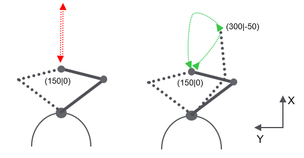

# Change of SCARA Arm Configuration

## Overview

Changing the arm configuration of a SCARA with identical start and end positions may result in extensive accelerations on axis B. This effect is amplified if the length of link A is equal to the length of link B. Define a via point to avoid a straight in and out movement of the TCP. Connect the move commands to the via point and to the desired end position with a blending zone to get a smooth transition without stop of the robot.

## Example Description



Start position: X = 150, Y = 0 , ArmConfiguration at start = Right

```
stViaPoint.lrX := 300.0;
stViaPoint.lrY := -50.0;

stTarget.lrX := 150.0;
stTarget.lrY := 0.0;

MoveJ(i_stTarget            := stViaPoint,
      i_etArmConfiguration  := ET_ArmConfiguration.Right,
      i_lrMaxZone           := 50.0,
      i_udiSegmentId        := 10);

MoveJ(i_stTarget            := stTarget,
      i_etArmConfiguration  := ET_ArmConfiguration.Left,
      i_lrMaxZone           := 0.0,
      i_udiSegmentId        := 20);
```

EIO0000002232.23