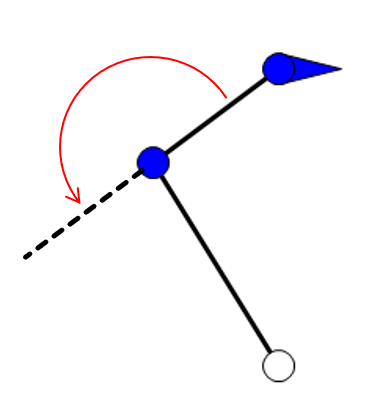
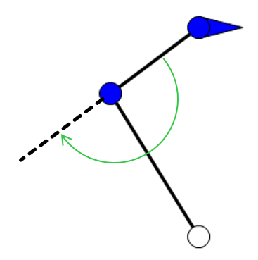
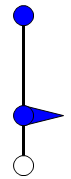
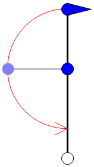
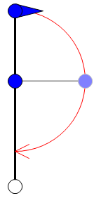
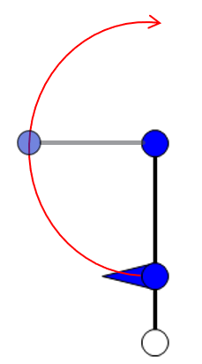
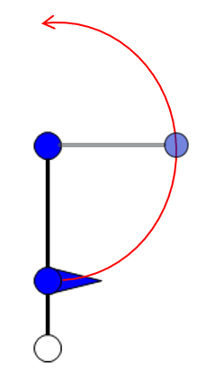

# Behavior with Arm Configuration InnerRight / InnerLeft

## Overview

With ET\_ArmConfiguration.Right and ET\_ArmConfiguration.Left, the working range of AxisB of a SCARA (Selective Compliance Assembly Robot Arm), configured with the method IF\_RobotConfiguration - Scara4Ax, is limited to the range of ±180°, where 0° marks the out-stretched position. Therefore, a modification of the arm configuration from right (angle of AxisB ≥ 0°) to left (angle of AxisB < 0°) and the opposite way is only possible by applying a movement through the out-stretched position.

With ET\_ArmConfiguration.InnerRight and ET\_ArmConfiguration.InnerLeft, the working range of AxisB of a SCARA, configured with the method IF\_RobotConfiguration - Scara4Ax, is not limited to the movement through the out-stretched position. This means a modification of the arm configuration from right (angle of AxisB ≥ 0°) to left (angle of AxisB < 0°) and the opposite way is also possible by applying a movement through the folded position.

The folded position represents an angle + or – 180° of AxisB.

## Examples (Out-stretched Position)

If a robot is exactly in the out-stretched position, it can immediately take the target arm configuration of its next movement. Therefore, the shortest movement of AxisB is always considered to reach the new target position.

**Example 1:**

* Start position: Out-stretched (AxisB = 0°)
* Start arm configuration: Right or Left
* Target arm configuration: Right or InnerRight

Both, target arm configurations Right and InnerRight result in a counterclockwise rotation of AxisB.

**Example 2:**

* Start position: Out-stretched (AxisB = 0°)
* Start arm configuration: Right or Left
* Target arm configuration: Left or InnerLeft

Both, target arm configurations Left and InnerLeft result in a clockwise rotation of AxisB.

## Examples (Folded Position)

The same behavior applies to the folded position. If a robot is exactly in the folded position, it can immediately take the target arm configuration of its next movement. Therefore, the shortest movement of AxisB is always considered to reach the new target position.

**Example 1:**

* Start position: Folded (AxisB = 180° or -180°)
* Start arm configuration: Right or Left
* Target arm configuration: Right or InnerRight

Both, target arm configurations Right and InnerRight result in a clockwise rotation of AxisB.

**Example 2:**

* Start position: Folded (AxisB = 180° or -180°)
* Start arm configuration: Right or Left
* Target arm configuration: Left or InnerLeft

Both, target arm configurations Left and InnerLeft result in a counterclockwise rotation of AxisB.

EIO0000002232.23