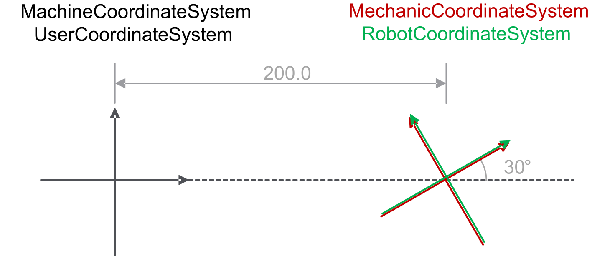
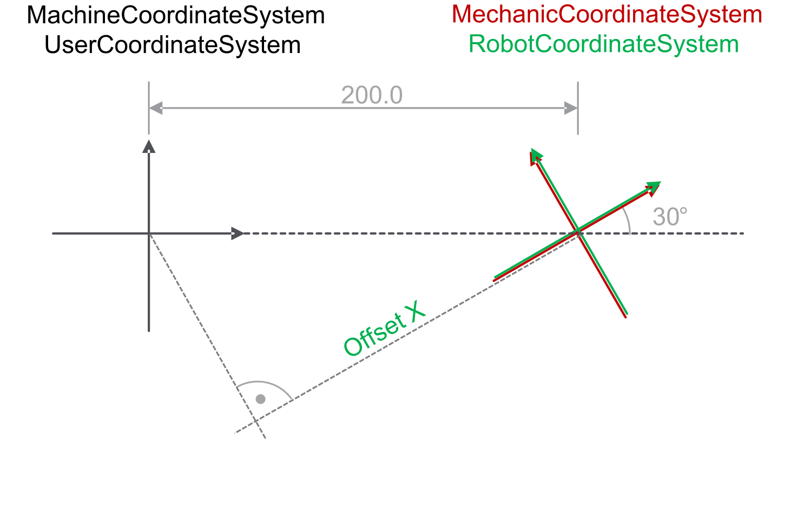
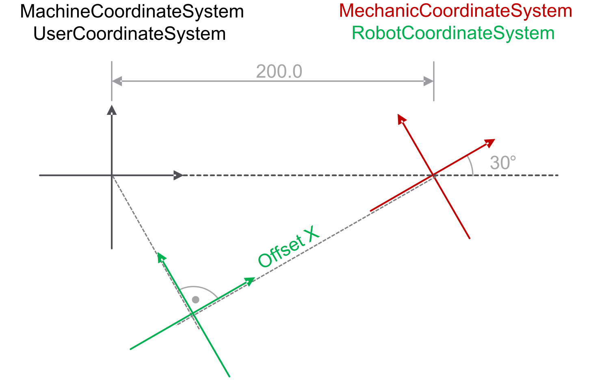
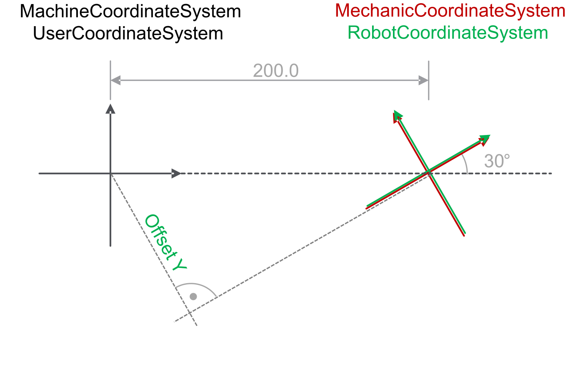
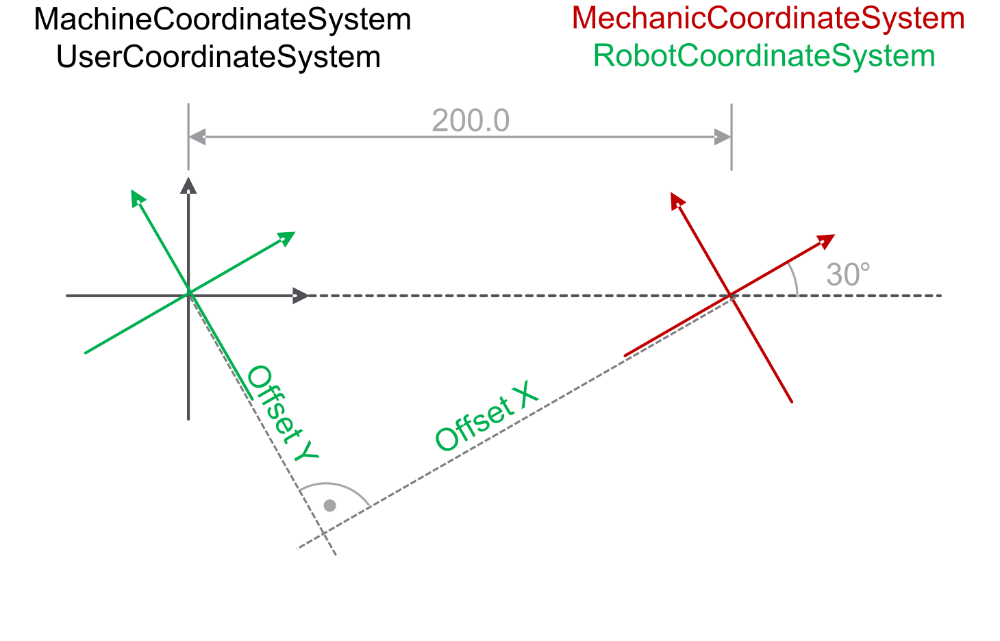
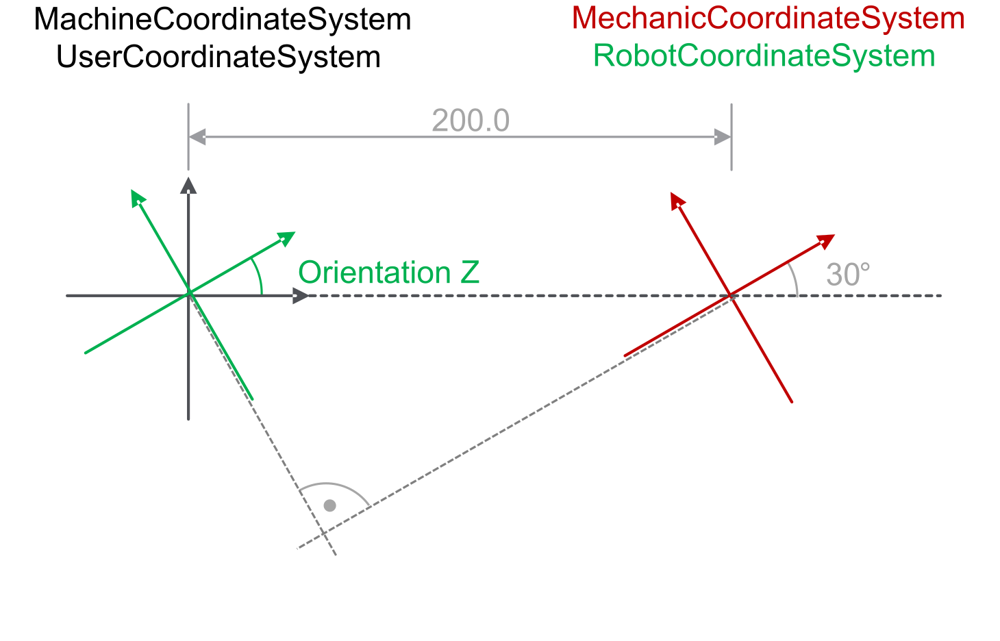
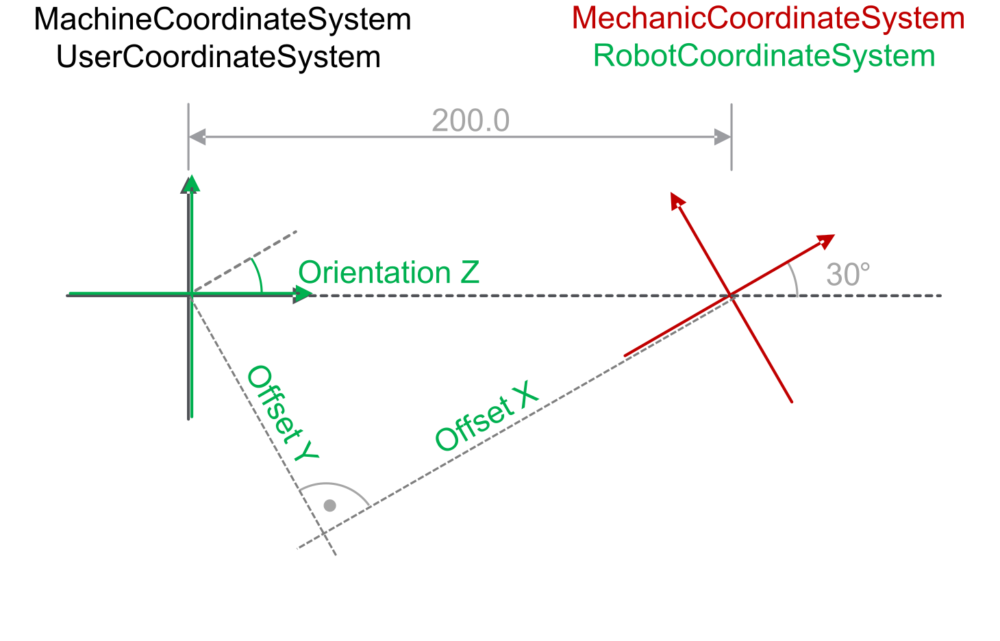
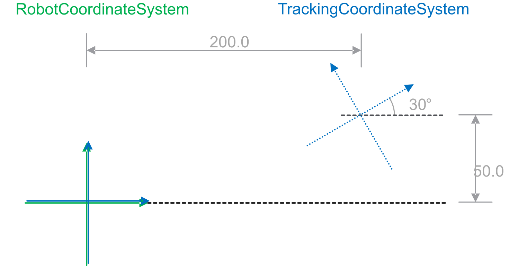
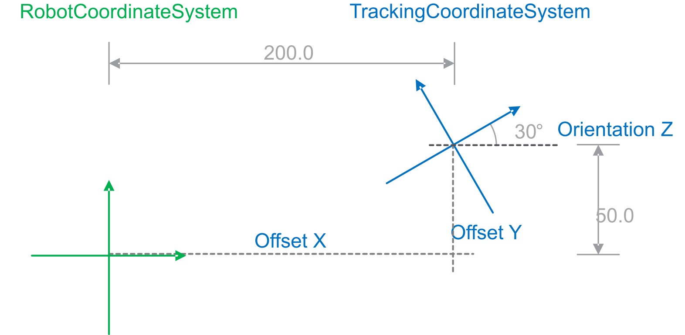

# Using ModifyCoordinateSystem / ModifyCoordinateSystem2

## Robot Coordinate System

The robot coordinate system (ET\_CoordinateSystem.CSR) is based on the mechanical coordinate system (ET\_CoordinateSystem.Mechanic) of a robot.

By default, the robot coordinate system is congruent to the mechanical coordinate system.

Offsets and orientations are related to the mechanical coordinate system when the ModifyCoordinateSystem method or the ModifyCoordinateSystem2 method are called for the robot coordinate system.

Also refer to [IF\_RobotConfigurationAdvanced - ModifyCoordinateSystem (Method)](D-SE-0075536.html) and [IF\_RobotConfigurationAdvanced - ModifyCoordinateSystem2 (Method)](D-SE-0075533.html).

```
ModifyCoordinateSystem2(
     i_etName := ROB.ET_CoordinateSystem.CSR,
     i_stOffset := stOffset,
     i_etOrientationConvention := ET_OrientationConvention.ZYX,
     i_stOrientation := stOrientation,
     … );
```

In case a Schneider Electric Lexium robot is configured, the robot coordinate system is modified by default in Z direction. The value of the modified robot coordinate system can be read by calling the method GetCoordinateSystem.

## Tracking Coordinate System

Tracking coordinate systems (ET\_CoordinatSystem.Tracking1...30) are based on the robot coordinate system (ET\_CoordinateSystem.CSR).

Offsets and orientations are related to the robot coordinate system when:

* A tracking system or tracking source is added to the robot.

  ```
  Add<Type>TrackingSystem<Version>(
       i_etSystemId := ROB.ET_CoordinateSystem.Tracking1,
       i_stOffset := stOffset,
       i_etOrientationConvention := ET_OrientationConvention.ZYX,
       i_stOrientation := stOrientation,
       … );
  ```
* The method ModifyCoordinateSystem or the method ModifyCoordinateSystem2 is called for a tracking coordinate system.

  ```
  ModifyCoordinateSystem2(
       i_etName := ROB.ET_CoordinateSystem.Tracking1,
       i_stOffset := stOffset,
       i_etOrientationConvention := ET_OrientationConvention.ZYX,
       i_stOrientation := stOrientation,
       … );
  ```

## Example - Robot Coordinate System

The robot coordinate system:

* Is by default congruent to the mechanical coordinate system.
* Is located 200.0 mm in positive X direction of the machine / user coordinate system.
* Is rotated by 30° in relation to the machine / user coordinate system.



The aim is to parameterize the robot coordinate system congruent to the machine / user coordinate system.

NOTE: Offsets and orientations are related to the mechanical coordinate system when the ModifyCoordinateSystem method or the ModifyCoordinateSystem2 method are called for the robot coordinate system.

**Calculating the offset for the robot coordinate system in X direction of the mechanical coordinate system:**



Offset X = - COS (30) \* 200.0 = -173.21

Result:

Offset X = -173.21



**Calculating the offset for the robot coordinate system in Y direction of the mechanical coordinate system:**



Offset Y = SIN (30) \* 200.0 = 100.0

Result:

* Offset X = -173.21
* Offset Y = 100.0



**Get the orientation about Z for the robot coordinate system related to the mechanical coordinate system:**



Orientation Z = - 30

Result:

* Offset X = -173.21
* Offset Y = 100.0
* Orientation Z = - 30



## Example - Tracking Coordinate System

The tracking coordinate system:

* Is located 200.0 mm in positive X direction of the robot coordinate system.
* Is located 50.0 mm in positive Y direction of the robot coordinate system.
* Is rotated by 30° in relation to the robot coordinate system.



The aim is to parameterize the tracking coordinate system related to the robot coordinate system.

NOTE: Offsets and orientations are related to the robot coordinate system when:

* A tracking system or tracking source is added to the robot.
* The ModifyCoordinateSystem method or the ModifyCoordinateSystem2 method are called for a tracking coordinate system

Result:

* Offset X = 200.0
* Offset Y = 50.0
* Orientation Z = 30.0



EIO0000002232.23