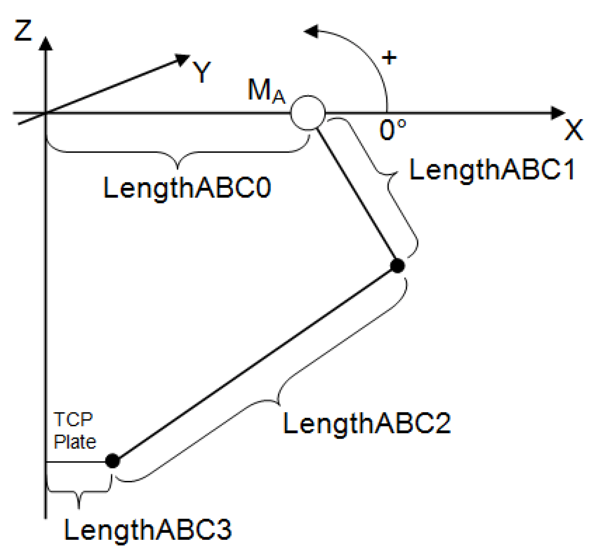
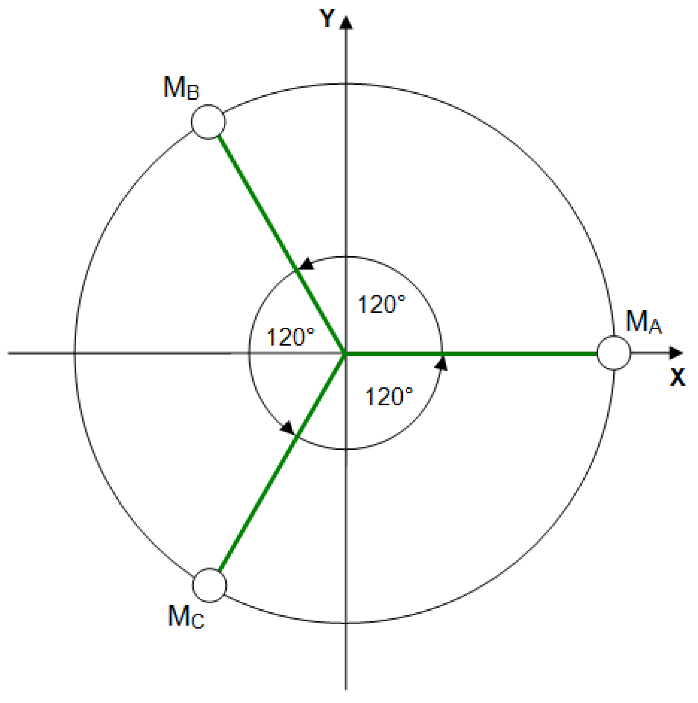

# IF\_Configuration - Delta3Ax (Method)

## Overview

|  |  |
| --- | --- |
| Type: | Method |
| Available as of: | V1.0.0.0 |

NOTE: Using the transformation Delta3Ax requires license points.

License points are only required for library versions earlier than V2.4.0.0. For more information on license points, refer to *License Model for PacDrive Software Packages*.

For further information, refer to Robotic library *[ROB.IF\_RobotConfiguration.Delta3Ax](../../../../../api/crossBook?lang=en-US&virtualBookName=PD.Lib.Robotic&topicID=D_SE_0075525)*.

Robots of all types inherently present various hazards to machine operators, maintenance personnel, and commissioners. Some of these hazards may be the result of improper/invalid programming control or system parameterization/configuration. To help avoid as much as possible these hazards/situations, the library SchneiderElectricRobotics has been developed dedicated to Schneider Electric robots.

| WARNING | |
| --- | --- |
|  | UNINTENDED ROBOT OPERATION  Ensure that the library SchneiderElectricRobotics is used for operating a Schneider Electric robot.  Failure to follow these instructions can result in death, serious injury, or equipment damage. |

The library SchneiderElectricRobotics facilitates:

* The parameterization of the robot.
* The monitoring of the robot axes parameters.

  + GearIn and GearOut
  + FeedConstant
  + Maximum current
  + Direction
  + Maximum speed
* The monitoring of the work envelope of the robot.

This chapter provides information on:

* [Task](#D-SE-0076923)
* [Description](#D-SE-0076923__D-SE-0076923.4)
* [Interface](#D-SE-0076923__D-SE-0076923.5)
* [Diagnostic Messages](#D-SE-0076923__D-SE-0076923.6)

## Task

Configuring a triaxial Delta robot.

## Description

With the method Delta3Ax(...), the robot can be configured as a Delta robot with three degrees of freedom.

NOTE: If a method to configure a transformation was already called up successfully (q\_etDiag = GD.ET\_Diag.Ok AND q\_etDiagExt = ET\_DiagExt.Ok), then it is not possible to overwrite the parameterization by calling up another method for configuring a transformation.

## Interface

| Input | Data type | Description |
| --- | --- | --- |
| i\_ifDriveA | [SystemConfigurationItf.IF\_Drive](../../../../../api/crossBook?lang=en-US&virtualBookName=PD.Lib.SystemConfigurationItf&topicID=D_SE_0089154) | Drive of axis A. |
| i\_ifDriveB | [SystemConfigurationItf.IF\_Drive](../../../../../api/crossBook?lang=en-US&virtualBookName=PD.Lib.SystemConfigurationItf&topicID=D_SE_0089154) | Drive of axis B. |
| i\_ifDriveC | [SystemConfigurationItf.IF\_Drive](../../../../../api/crossBook?lang=en-US&virtualBookName=PD.Lib.SystemConfigurationItf&topicID=D_SE_0089154) | Drive of axis C. |
| i\_lrLengthABC0 | LREAL | Length of the distance between the axes A, B, and C and the center of the base plate.  Value range: i\_lrLengthABC0 > 0 |
| i\_lrLengthABC1 | LREAL | Length of the upper arm mounted on Axis A, B, or C.  Value range: i\_lrLengthABC1 > 0 |
| i\_lrLengthABC2 | LREAL | Length of the lower arm mounted on Axis A, B, or C.  Value range: i\_lrLengthABC2 > 0 |
| i\_lrLengthABC3 | LREAL | Length of the distance between the suspension points of the lower arms and the center of the flange plate.  Value range: i\_lrLengthABC3 > 0 |

| Output | Data type | Description |
| --- | --- | --- |
| q\_etDiag | [GD.ET\_Diag](../../../../../api/crossBook?lang=en-US&virtualBookName=PD.Lib.GlobalDiagnostic&topicID=D_SE_0076228) | General library-independent statement on the diagnostic.  A value not equal to ET\_Diag.Ok corresponds to a diagnostic message. |
| q\_etDiagExt | [ET\_DiagExt](ET_DiagExt-GeneralInformation-CBB54036.html#ET_DiagExt-GeneralInformation-CBB54036) | POU-specific output on the diagnostic.  q\_etDiag = ET\_Diag.Ok -> Status message  q\_etDiag <> ET\_Diag.Ok -> Diagnostic message |
| q\_sMsg | STRING[80] | Event-triggered message that gives additional information on the diagnostic state. |

## Diagnostic Messages

| q\_etDiag | q\_etDiagExt | Enumeration value | Description |
| --- | --- | --- | --- |
| OK | Ok | 0 | Ok |
| ExecutionAborted | ConfigurationAlreadyCompleted | 154 | The configuration is already completed. |
| ExecutionAborted | TransformationAlreadyConfigured | 171 | The transformation is already configured. |
| InputParameterInvalid | DriveAAlreadyInUse | 164 | The drive A is already in use. |
| InputParameterInvalid | DriveAInvalid | 167 | The drive A is invalid. |
| InputParameterInvalid | DriveBAlreadyInUse | 165 | The drive B is already in use. |
| InputParameterInvalid | DriveBInvalid | 168 | The drive B is invalid. |
| InputParameterInvalid | DriveCAlreadyInUse | 166 | The drive C is already in use. |
| InputParameterInvalid | DriveCInvalid | 169 | The drive C is invalid. |
| InputParameterInvalid | LengthABC0Range | 176 | The LengthABC0 is out of range. |
| InputParameterInvalid | LengthABC1Range | 177 | The LengthABC1 is out of range. |
| InputParameterInvalid | LengthABC2Range | 178 | The LengthABC2 is out of range. |
| InputParameterInvalid | LengthABC3Range | 179 | The LengthABC3 is out of range. |

## ConfigurationAlreadyCompleted

|  |  |
| --- | --- |
| Enumeration name: | ConfigurationAlreadyCompleted |
| Enumeration value: | 154 |
| Description: | The configuration is already completed. |

| Issue | Cause | Solution |
| --- | --- | --- |
| The configuration of the robot transformation was not successful. | The configuration of the robot has already been completed. The method ConfigDone(...) has already been called up successfully. | Ensure that no transformation configuration method, for example Delta3Ax(...) or AddAuxAx(...), is called after the configuration has been completed. |

## DriveAAlreadyInUse

|  |  |
| --- | --- |
| Enumeration name: | DriveAAlreadyInUse |
| Enumeration value: | 164 |
| Description: | The drive A is already in use. |

| Issue | Cause | Solution |
| --- | --- | --- |
| The configuration of the robot transformation was not successful. | The drive transferred at the input i\_ifDriveA is already configured in the robot and cannot be used again. | Ensure that no drive is assigned to the robot more than once. |

## DriveAInvalid

|  |  |
| --- | --- |
| Enumeration name: | DriveAInvalid |
| Enumeration value: | 167 |
| Description: | The drive A is invalid. |

| Issue | Cause | Solution |
| --- | --- | --- |
| The configuration of the robot transformation was not successful. | The drive transferred at the input i\_ifDriveA is invalid. | At the input i\_ifDriveA, a valid drive must be transferred. |

## DriveBAlreadyInUse

|  |  |
| --- | --- |
| Enumeration name: | DriveBAlreadyInUse |
| Enumeration value: | 165 |
| Description: | The drive B is already in use. |

| Issue | Cause | Solution |
| --- | --- | --- |
| The configuration of the robot transformation was not successful. | The drive transferred at the input i\_ifDriveB is already configured in the robot and cannot be used again. | Ensure that no drive is assigned to the robot more than once. |

## DriveBInvalid

|  |  |
| --- | --- |
| Enumeration name: | DriveBInvalid |
| Enumeration value: | 168 |
| Description: | The drive B is invalid. |

| Issue | Cause | Solution |
| --- | --- | --- |
| The configuration of the robot transformation was not successful. | The drive transferred at the input i\_ifDriveB is invalid. | At the input i\_ifDriveB, a valid drive must be transferred. |

## DriveCAlreadyInUse

|  |  |
| --- | --- |
| Enumeration name: | DriveCAlreadyInUse |
| Enumeration value: | 166 |
| Description: | The drive C is already in use. |

| Issue | Cause | Solution |
| --- | --- | --- |
| The configuration of the robot transformation was not successful. | The drive transferred at the input i\_ifDriveC is already configured in the robot and cannot be used again. | Ensure that no drive is assigned to the robot more than once. |

## DriveCInvalid

|  |  |
| --- | --- |
| Enumeration name: | DriveCInvalid |
| Enumeration value: | 169 |
| Description: | The drive C is invalid. |

| Issue | Cause | Solution |
| --- | --- | --- |
| The configuration of the robot transformation was not successful. | The drive transferred at the input i\_ifDriveC is invalid. | At the input i\_ifDriveC, a valid drive must be transferred. |

## LengthABC0Range

|  |  |
| --- | --- |
| Enumeration name: | LengthABC0Range |
| Enumeration value: | 176 |
| Description: | The LengthABC0 is out of range. |

| Issue | Cause | Solution |
| --- | --- | --- |
| The configuration of the robot transformation was not successful. | The value transferred at the input i\_IrLengthABC0 is outside the valid range. | At the input i\_lrLengthABC0, a value greater than 0 must be transferred. |

## LengthABC1Range

|  |  |
| --- | --- |
| Enumeration name: | LengthABC1Range |
| Enumeration value: | 177 |
| Description: | The LengthABC1 is out of range. |

| Issue | Cause | Solution |
| --- | --- | --- |
| The configuration of the robot transformation was not successful. | The value transferred at the input i\_IrLengthABC1 is outside the valid range. | At the input i\_lrLengthABC1, a value greater than 0 must be transferred. |

## LengthABC2Range

|  |  |
| --- | --- |
| Enumeration name: | LengthABC2Range |
| Enumeration value: | 178 |
| Description: | The LengthABC2 is out of range. |

| Issue | Cause | Solution |
| --- | --- | --- |
| The configuration of the robot transformation was not successful. | The value transferred at the input i\_IrLengthABC2 is outside the valid range. | At the input i\_lrLengthABC2, a value greater than 0 must be transferred. |

## LengthABC3Range

|  |  |
| --- | --- |
| Enumeration name: | LengthABC3Range |
| Enumeration value: | 179 |
| Description: | The LengthABC3 is out of range. |

| Issue | Cause | Solution |
| --- | --- | --- |
| The configuration of the robot transformation was not successful. | The value transferred at the input i\_IrLengthABC3 is outside the valid range. | At the input i\_lrLengthABC3, a value greater than 0 must be transferred. |

## Ok

|  |  |
| --- | --- |
| Enumeration name: | Ok |
| Enumeration value: | 0 |
| Description: | Ok |

The configuration of the robot transformation was successful.

## TransformationAlreadyConfigured

|  |  |
| --- | --- |
| Enumeration name: | TransformationAlreadyConfigured |
| Enumeration value: | 171 |
| Description: | The transformation is already configured. |

| Issue | Cause | Solution |
| --- | --- | --- |
| The configuration of the robot transformation was not successful. | The configuration of the robot transformation has already been completed successfully. | Ensure that a configuration for a transformation is only called once. |

EIO0000002234.21