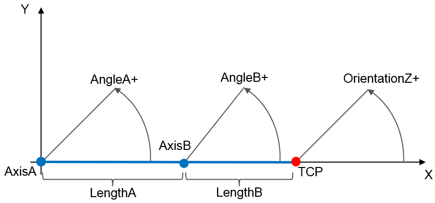

# IF\_Configuration - Scara4Ax (Method)

## Overview

|  |  |
| --- | --- |
| Type: | Method |
| Available as of: | V2.5.0.0 |

Robots of all types inherently present various hazards to machine operators, maintenance personnel, and commissioners. Some of these hazards may be the result of improper/invalid programming control or system parameterization/configuration. To help avoid as much as possible these hazards/situations, the library SchneiderElectricRobotics has been developed dedicated to Schneider Electric robots.

| WARNING | |
| --- | --- |
|  | UNINTENDED ROBOT OPERATION  Ensure that the library SchneiderElectricRobotics is used for operating a Schneider Electric robot.  Failure to follow these instructions can result in death, serious injury, or equipment damage. |

The library SchneiderElectricRobotics facilitates:

* The parameterization of the robot.
* The monitoring of the robot axes parameters.

  + GearIn and GearOut
  + FeedConstant
  + Maximum current
  + Direction
  + Maximum speed
* The monitoring of the work envelope of the robot.

This chapter provides information on:

* [Task](#D-SE-0088404__D-SE-0088404.3)
* [Description](#D-SE-0088404__D-SE-0088404.4)
* [Interface](#D-SE-0088404__D-SE-0088404.5)

## Task

Configuring a four axial SCARA.

## Description

With the method Scara4Ax(...), the robot can be configured as a four axial SCARA (Selective Compliance Assembly Robot Arm) with four degrees of freedom.

In case of a coupling of translation along the Z axis and the TCPs (Tool Center Point) orientation, a user-specific transformation can be introduced via method AdditionalTransformationAxes() of IF\_RobotConfigurationAdvanced.

NOTE: If a method to configure a transformation was already called up successfully (q\_etDiag = GD.ET\_Diag.Ok AND q\_etDiagExt = ET\_DiagExt.Ok), then it is not possible to overwrite the parameterization by calling up another method to configure a transformation.

## Interface

| Input | Data type | Description |
| --- | --- | --- |
| i\_ifDriveA | [SystemConfigurationItf.IF\_Drive](../../../../../api/crossBook?lang=en-US&virtualBookName=PD.Lib.SystemConfigurationItf&topicID=D_SE_0089154) | Drive of axis A. |
| i\_ifDriveB | [SystemConfigurationItf.IF\_Drive](../../../../../api/crossBook?lang=en-US&virtualBookName=PD.Lib.SystemConfigurationItf&topicID=D_SE_0089154) | Drive of axis B. |
| i\_ifDriveC | [SystemConfigurationItf.IF\_Drive](../../../../../api/crossBook?lang=en-US&virtualBookName=PD.Lib.SystemConfigurationItf&topicID=D_SE_0089154) | Drive of axis C. |
| i\_ifDriveD | [SystemConfigurationItf.IF\_Drive](../../../../../api/crossBook?lang=en-US&virtualBookName=PD.Lib.SystemConfigurationItf&topicID=D_SE_0089154) | Drive of axis D. |
| i\_lrLengthA | LREAL | Length of the arm mounted on axis A.  Value range: i\_lrLengthA > 0  Unit: [mm] |
| i\_lrLengthB | LREAL | Length of the arm mounted on axis B.  Value range: i\_lrLengthB > 0  Unit: [mm] |

| Output | Data type | Description |
| --- | --- | --- |
| q\_etDiag | [GD.ET\_Diag](../../../../../api/crossBook?lang=en-US&virtualBookName=PD.Lib.GlobalDiagnostic&topicID=D_SE_0076228) | General library-independent statement on the diagnostic.  A value not equal to ET\_Diag.Ok corresponds to a diagnostic message. |
| q\_etDiagExt | [ET\_DiagExt](../../../../../api/crossBook?lang=en-US&virtualBookName=PD.Lib.Robotic&topicID=D_SE_0075479) | POU-specific output on the diagnostic.  q\_etDiag = ET\_Diag.Ok -> Status message  q\_etDiag <> ET\_Diag.Ok -> Diagnostic message |
| q\_sMsg | STRING[80] | Event-triggered message that gives additional information on the diagnostic state. |

## Diagnostic Messages

| q\_etDiag | q\_etDiagExt | Enumeration value | Description |
| --- | --- | --- | --- |
| OK | Ok | 0 | Ok |
| ExecutionAborted | ConfigurationAlreadyCompleted | 154 | The configuration is already completed. |
| ExecutionAborted | TransformationAlreadyConfigured | 171 | The transformation is already configured. |
| InputParameterInvalid | DriveAAlreadyInUse | 164 | The drive A is already in use. |
| InputParameterInvalid | DriveAInvalid | 167 | The drive A is invalid. |
| InputParameterInvalid | DriveBAlreadyInUse | 165 | The drive B is already in use. |
| InputParameterInvalid | DriveBInvalid | 168 | The drive B is invalid. |
| InputParameterInvalid | DriveCAlreadyInUse | 166 | The drive C is already in use. |
| InputParameterInvalid | DriveCInvalid | 169 | The drive C is invalid. |
| InputParameterInvalid | DriveDAlreadyInUse | 351 | The drive D is already in use. |
| InputParameterInvalid | DriveDInvalid | 333 | The drive D is invalid. |
| InputParameterInvalid | LengthARange | 262 | The LengthA is out of range. |
| InputParameterInvalid | LengthBRange | 263 | The LengthB is out of range. |

## Ok

|  |  |
| --- | --- |
| Enumeration name: | Ok |
| Enumeration value: | 0 |
| Description: | Ok |

The configuration of the robot transformation was successful.

## ConfigurationAlreadyCompleted

|  |  |
| --- | --- |
| Enumeration name: | ConfigurationAlreadyCompleted |
| Enumeration value: | 154 |
| Description: | The configuration is already completed. |

| Issue | Cause | Solution |
| --- | --- | --- |
| The configuration of the robot transformation was not successful. | The configuration of the robot has already been completed. The method ConfigDone(...) has already been called successfully. | Ensure that no transformation configuration method, for example Delta3Ax(...) or AddAuxAx(...), is called after the configuration has been completed. |

## TransformationAlreadyConfigured

|  |  |
| --- | --- |
| Enumeration name: | TransformationAlreadyConfigured |
| Enumeration value: | 171 |
| Description: | The transformation is already configured. |

| Issue | Cause | Solution |
| --- | --- | --- |
| The configuration of the robot transformation was not successful. | The configuration of the robot transformation has already been completed successfully. | Ensure that a configuration for a transformation is only called once. |

## DriveAAlreadyInUse

|  |  |
| --- | --- |
| Enumeration name: | DriveAAlreadyInUse |
| Enumeration value: | 164 |
| Description: | The drive A is already in use. |

| Issue | Cause | Solution |
| --- | --- | --- |
| The configuration of the robot transformation was not successful. | The drive transferred at the input i\_ifDriveA is already configured in the robot and cannot be used again. | Ensure that no drive is assigned to the robot more than once. |

## DriveAInvalid

|  |  |
| --- | --- |
| Enumeration name: | DriveAInvalid |
| Enumeration value: | 167 |
| Description: | The drive A is invalid. |

| Issue | Cause | Solution |
| --- | --- | --- |
| The configuration of the robot transformation was not successful. | The drive transferred at the input i\_ifDriveA is invalid. | At the input i\_ifDriveA, a valid drive must be transferred. |

## DriveBAlreadyInUse

|  |  |
| --- | --- |
| Enumeration name: | DriveBAlreadyInUse |
| Enumeration value: | 165 |
| Description: | The drive B is already in use. |

| Issue | Cause | Solution |
| --- | --- | --- |
| The configuration of the robot transformation was not successful. | The drive transferred at the input i\_ifDriveB is already configured in the robot and cannot be used again. | Ensure that no drive is assigned to the robot more than once. |

## DriveBInvalid

|  |  |
| --- | --- |
| Enumeration name: | DriveBInvalid |
| Enumeration value: | 168 |
| Description: | The drive B is invalid. |

| Issue | Cause | Solution |
| --- | --- | --- |
| The configuration of the robot transformation was not successful. | The drive transferred at the input i\_ifDriveB is invalid. | At the input i\_ifDriveB, a valid drive must be transferred. |

## DriveCAlreadyInUse

|  |  |
| --- | --- |
| Enumeration name: | DriveCAlreadyInUse |
| Enumeration value: | 166 |
| Description: | The drive C is already in use. |

| Issue | Cause | Solution |
| --- | --- | --- |
| The configuration of the robot transformation was not successful. | The drive transferred at the input i\_ifDriveC is already configured in the robot and cannot be used again. | Ensure that no drive is assigned to the robot more than once. |

## DriveCInvalid

|  |  |
| --- | --- |
| Enumeration name: | DriveCInvalid |
| Enumeration value: | 169 |
| Description: | The drive C is invalid. |

| Issue | Cause | Solution |
| --- | --- | --- |
| The configuration of the robot transformation was not successful. | The drive transferred at the input i\_ifDriveC is invalid. | At the input i\_ifDriveC, a valid drive must be transferred. |

## DriveDAlreadyInUse

|  |  |
| --- | --- |
| Enumeration name: | DriveDAlreadyInUse |
| Enumeration value: | 351 |
| Description: | The drive D is already in use. |

| Issue | Cause | Solution |
| --- | --- | --- |
| The configuration of the robot transformation was not successful. | The drive transferred at the input i\_ifDriveD is already configured in the robot and cannot be used again. | Ensure that no drive is assigned to the robot more than once. |

## DriveDInvalid

|  |  |
| --- | --- |
| Enumeration name: | DriveDInvalid |
| Enumeration value: | 333 |
| Description: | The drive D is invalid. |

| Issue | Cause | Solution |
| --- | --- | --- |
| The configuration of the robot transformation was not successful. | The drive transferred at the input i\_ifDriveD is invalid. | At the input i\_ifDriveD, a valid drive must be transferred. |

## LengthARange

|  |  |
| --- | --- |
| Enumeration name: | LengthARange |
| Enumeration value: | 262 |
| Description: | The LengthA is out of range. |

| Issue | Cause | Solution |
| --- | --- | --- |
| The configuration of the robot transformation was not successful. | The value transferred at the input i\_lrLengthA is outside the valid range. | At the input i\_lrLengthA, a value greater than 0 must be transferred. |

## LengthBRange

|  |  |
| --- | --- |
| Enumeration name: | LengthBRange |
| Enumeration value: | 263 |
| Description: | The LengthB is out of range. |

| Issue | Cause | Solution |
| --- | --- | --- |
| The configuration of the robot transformation was not successful. | The value transferred at the input i\_lrLengthB is outside the valid range. | At the input i\_lrLengthB, a value greater than 0 must be transferred. |

EIO0000002234.21