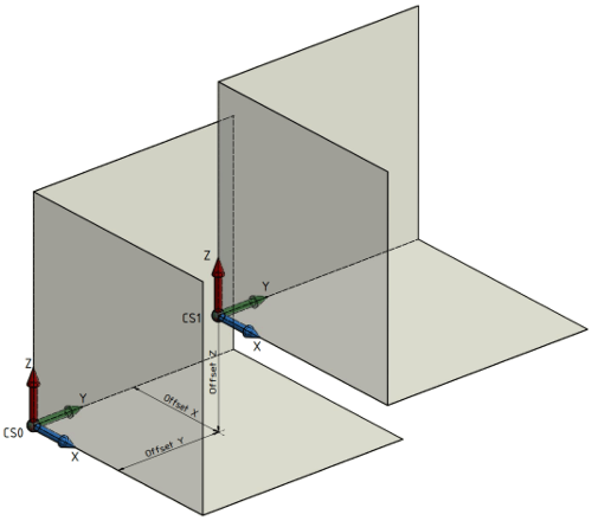
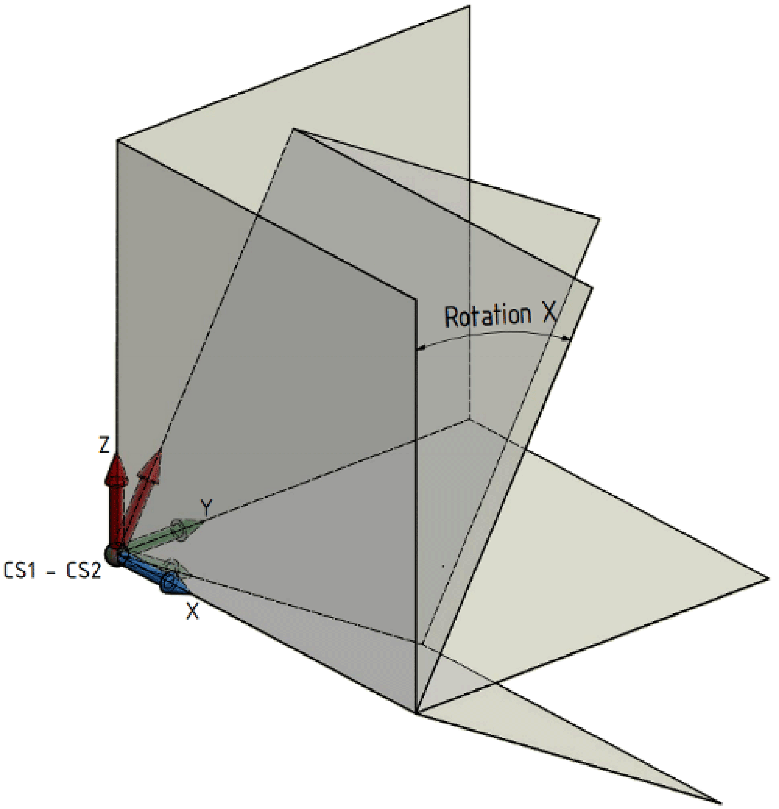
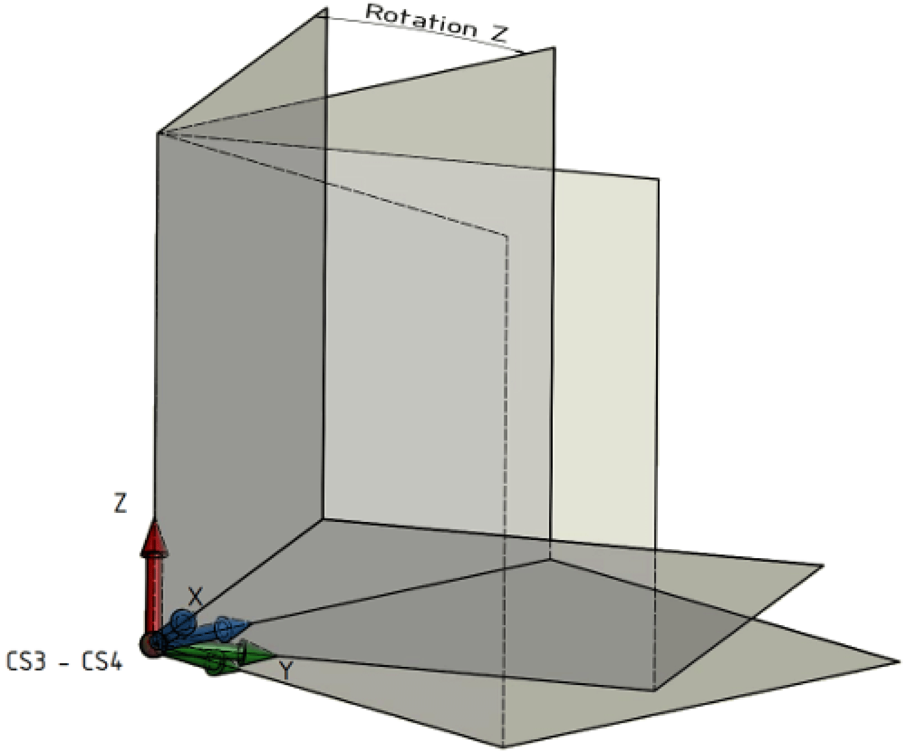

# IF\_ConfigurationAdvanced - ModifyCoordinateSystem (Method)

## Overview

|  |  |
| --- | --- |
| Type: | Method |
| Available as of: | V1.0.0.0 |

This chapter provides information on:

* [Task](#D-SE-0076937__D-SE-0076937.3)
* [Description](#D-SE-0076937__D-SE-0076937.4)
* [Interface](#D-SE-0076937__D-SE-0076937.5)
* [Diagnostic Messages](#D-SE-0076937__D-SE-0076937.6)

## Task

Modifying the robot coordinate system.

## Description

With the method ModifyCoordinateSystem(…), the robot coordinate system can be modified.

Execution sequence of the shift or rotation of the output coordinate system (robot coordinate system) CS0:

| 1. | Shifting the coordinate system CS0 by the offsets X, Y, Z. This creates the coordinate system CS1. |

| 2. | Rotation of the coordinate system CS1 around its X axis. This creates the coordinate system CS2. |

| 3. | Rotation of the coordinate system CS2 around its Y axis. This creates the coordinate system CS3. |

| 4. | Rotation of the coordinate system CS3 around its Z axis. This creates the coordinate system CS4. |

The coordinate system CS4 corresponds to the shifted and rotated coordinate system.

## Interface

| Input | Data type | Description |
| --- | --- | --- |
| i\_etName | [ROB.ET\_CoordinateSystem](../../../../../api/crossBook?lang=en-US&virtualBookName=PD.Lib.Robotic&topicID=D_SE_0075477) | Name of the coordinate system that has to be modified. |
| i\_stOffset | [PDL.ST\_Vector3D](../../../../../api/crossBook?lang=en-US&virtualBookName=PD.Lib.PacDriveLib&topicID=D_SE_0087802) | Describes the shifting of the coordinate system in relation to the world coordinate system.  Unit: [Units] |
| i\_stOrientation | [PDL.ST\_Vector3D](../../../../../api/crossBook?lang=en-US&virtualBookName=PD.Lib.PacDriveLib&topicID=D_SE_0087802) | Describes the rotation of the coordinate system in relation to the world coordinate system.  Unit: [°] |
| i\_xInvertDirectionX | BOOL | Invert the positive X direction of the coordinate system. |
| i\_xInvertDirectionY | BOOL | Invert the positive Y direction of the coordinate system. |
| i\_xInvertDirectionZ | BOOL | Invert the positive Z direction of the coordinate system. |

| Output | Data type | Description |
| --- | --- | --- |
| q\_etDiag | [GD.ET\_Diag](../../../../../api/crossBook?lang=en-US&virtualBookName=PD.Lib.GlobalDiagnostic&topicID=D_SE_0076228) | General library-independent statement on the diagnostic.  A value not equal to ET\_Diag.Ok corresponds to a diagnostic message. |
| q\_etDiagExt | [ET\_DiagExt](ET_DiagExt-GeneralInformation-CBB54036.html#ET_DiagExt-GeneralInformation-CBB54036) | POU-specific output on the diagnostic.  q\_etDiag = ET\_Diag.Ok -> Status message  q\_etDiag <> ET\_Diag.Ok -> Diagnostic message |
| q\_sMsg | STRING[80] | Event-triggered message that gives additional information on the diagnostic state. |

## Diagnostic Messages

| q\_etDiag | q\_etDiagExt | Enumeration value | Description |
| --- | --- | --- | --- |
| OK | Ok | 0 | Ok |
| ExecutionAborted | ExternalPositionSourceConfigured | 357 | The external position source is configured. |
| InMotion | 84 | The robot is in motion. |
| TrackingActive | 270 | Tracking is active. |
| TransformationMissing | 172 | The transformation is unavailable. |
| InputParameterInvalid | CoordinateSystemInvalid | 93 | The coordinate system is invalid. |
| InvertDirectionXInvalid | 255 | InvertDirectionX is invalid. |
| InvertDirectionYInvalid | 256 | InvertDirectionY is invalid. |
| InvertDirectionZInvalid | 257 | InvertDirectionZ is invalid. |
| OffsetInvalid | 253 | The Offset is invalid. |
| OrientationInvalid | 254 | The orientation is invalid. |

## CoordinateSystemInvalid

|  |  |
| --- | --- |
| Enumeration name: | CoordinateSystemInvalid |
| Enumeration value: | 93 |
| Description: | The coordinate system is invalid. |

| Issue | Cause | Solution |
| --- | --- | --- |
| The modification of a coordinate system of the robot was not successful. | The value transferred at the input i\_etName is invalid. | At the input i\_etName, a value of *[ROB.ET\_CoordinateSystem](../../../../../api/crossBook?lang=en-US&virtualBookName=PD.Lib.Robotic&topicID=D_SE_0075477)* must be transferred. |

## ExternalPositionSourceConfigured

|  |  |
| --- | --- |
| Enumeration name: | ExternalPositionSourceConfigured |
| Enumeration value: | 357 |
| Description: | The external position source is configured. |

| Issue | Cause | Solution |
| --- | --- | --- |
| The modification of a coordinate system of the robot was not successful. | An external position source for the robot components cartesian, orientation and auxiliary axes is configured. | The modification of a tracking coordinate system of the robot is not possible when an external position source for the robot components is configured.  NOTE: Do not modify a tracking coordinate system of the robot. |

## InMotion

|  |  |
| --- | --- |
| Enumeration name: | InMotion |
| Enumeration value: | 84 |
| Description: | The robot is in motion. |

| Issue | Cause | Solution |
| --- | --- | --- |
| The modification of a coordinate system of the robot was not successful. | A motion is active in the coordinate system that has to be modified. | Do not call ModifyCoordinateSystem(...) while the robot is in motion. |

## InvertDirectionXInvalid

|  |  |
| --- | --- |
| Enumeration name: | InvertDirectionXInvalid |
| Enumeration value: | 255 |
| Description: | InvertDirectionX is invalid. |

| Issue | Cause | Solution |
| --- | --- | --- |
| The modification of a coordinate system of the robot was not successful. | A two-dimensional transformation, in the YZ plane, is configured. | Ensure that the input i\_xInvertDirectionX is set to FALSE. |

## InvertDirectionYInvalid

|  |  |
| --- | --- |
| Enumeration name: | InvertDirectionYInvalid |
| Enumeration value: | 256 |
| Description: | InvertDirectionY is invalid. |

| Issue | Cause | Solution |
| --- | --- | --- |
| The modification of a coordinate system of the robot was not successful. | A two-dimensional transformation, in the XZ plane, is configured. | Ensure that the input i\_xInvertDirectionY is set to FALSE. |

## InvertDirectionZInvalid

|  |  |
| --- | --- |
| Enumeration name: | InvertDirectionZInvalid |
| Enumeration value: | 257 |
| Description: | InvertDirectionZ is invalid. |

| Issue | Cause | Solution |
| --- | --- | --- |
| The modification of a coordinate system of the robot was not successful. | A two-dimensional transformation, in the XY plane, is configured. | Ensure that the input i\_xInvertDirectionZ is set to FALSE. |

## OffsetInvalid

|  |  |
| --- | --- |
| Enumeration name: | OffsetInvalid |
| Enumeration value: | 253 |
| Description: | The Offset is invalid. |

| Issue | Cause | Solution |
| --- | --- | --- |
| The modification of a coordinate system of the robot was not successful. | A two-dimensional transformation, in the XY plane, is configured. | Ensure that the input i\_stOffset.lrZ is set to 0. |
| A two-dimensional transformation, in the XZ plane, is configured. | Ensure that the input i\_stOffset.lrY is set to 0. |
| A two-dimensional transformation, in the YZ plane, is configured. | Ensure that the input i\_stOffset.lrX is set to 0. |

## Ok

|  |  |
| --- | --- |
| Enumeration name: | Ok |
| Enumeration value: | 0 |
| Description: | Ok |

The modification of a coordinate system of the robot was successful.

## OrientationInvalid

|  |  |
| --- | --- |
| Enumeration name: | OrientationInvalid |
| Enumeration value: | 254 |
| Description: | The orientation is invalid. |

| Issue | Cause | Solution |
| --- | --- | --- |
| The modification of a coordinate system of the robot was not successful. | A two-dimensional transformation, in the XY plane, is configured. | Ensure that the inputs i\_stOrientation.lrX and i\_stOrientation.lrY are set to 0. |
| A two-dimensional transformation, in the XZ plane, is configured. | Ensure that the inputs i\_stOrientation.lrX and i\_stOrientation.lrZ are set to 0. |
| A two-dimensional transformation, in the YZ plane, is configured. | Ensure that the inputs i\_stOrientation.lrY and i\_stOrientation.lrZ are set to 0. |

## TrackingActive

|  |  |
| --- | --- |
| Enumeration name: | TrackingActive |
| Enumeration value: | 270 |
| Description: | Tracking is active. |

| Issue | Cause | Solution |
| --- | --- | --- |
| The modification of a coordinate system of the robot was not successful. | The robot is still in tracking and not in coordinate system *[ROB.ET\_CoordinateSystem.CSR](../../../../../api/crossBook?lang=en-US&virtualBookName=PD.Lib.Robotic&topicID=D_SE_0075477)*. | Do not call ModifyCoordinateSystem(...) while the robot is in tracking. |

## TransformationMissing

|  |  |
| --- | --- |
| Enumeration name: | TransformationMissing |
| Enumeration value: | 172 |
| Description: | The transformation is unavailable. |

| Issue | Cause | Solution |
| --- | --- | --- |
| The modification of a coordinate system of the robot was not successful. | There is no transformation of the robot configured. | Ensure that the transformation of the robot is configured before modifying the coordinate system. |

EIO0000002234.21