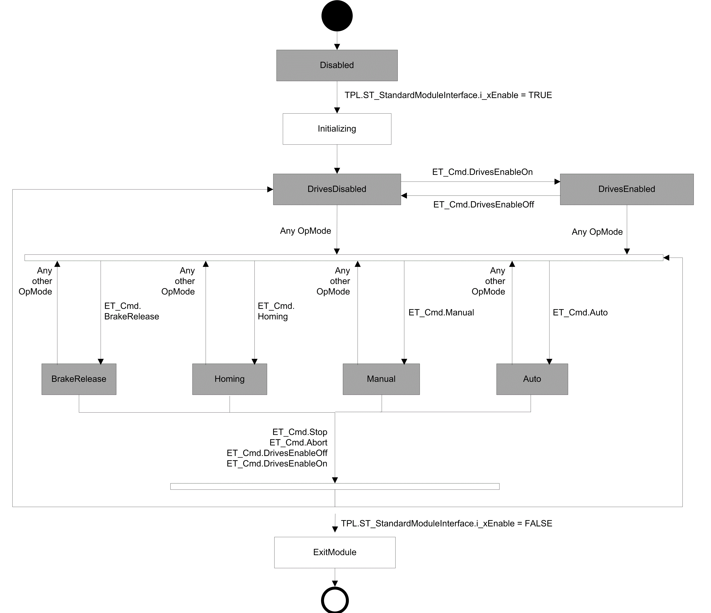
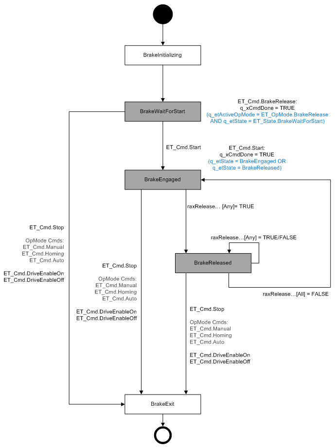
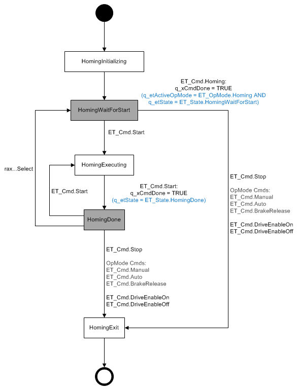
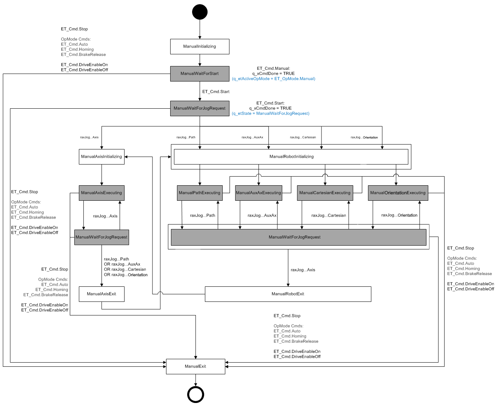
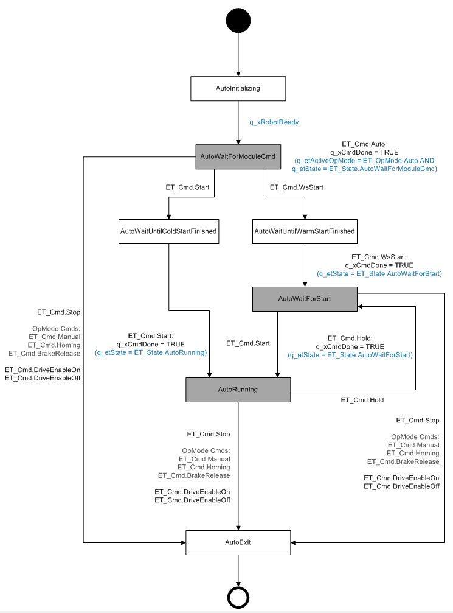

# OpMode Diagrams

## General

**White States** are transition states.

For example, during the execution of a command already sent.

Dependent on the execution time, it can be possible that these states do not appear in the monitoring.

**Gray States** are final states.

For example, a sent command is executed successfully.

The module is waiting for a next command to be sent.

**General OpMode diagram**

**Specific OpMode diagrams**

* [OpMode diagram - BrakeRelease](#D-SE-0076979__D-SE-0076979.3)
* [OpMode diagram - Homing](#D-SE-0076979__D-SE-0076979.4)
* [OpMode diagram - Manual](#D-SE-0076979__D-SE-0076979.5)
* [OpMode diagram - Auto](#D-SE-0076979__D-SE-0076979.6)

## OpMode BrakeRelease

**White States** are transition states.

For example, a sent command is being executed.

Dependent on the execution time, it can be possible that these states do not appear in the monitoring.

**Gray States** are final states.

For example, a sent command is executed successfully.

The module is waiting for a next command to be sent.

**NOTE:** The command ET\_Cmd.Abort can be sent at any time and in every state.

ET\_Cmd.Abort leads to the state ET\_State.BrakeExit.

**Stop behavior**

The commands with the target state ET\_State.BrakeExit engages the released brakes.

## OpMode Homing

**White States** are transition states.

For example, a sent command is being executed.

Dependent on the execution time, it can be possible that these states do not appear in the monitoring.

**Gray States** are final states.

For example, a sent command is executed successfully.

The module is waiting for a next command to be sent.

**NOTE:** The command ET\_Cmd.Abort can be sent at any time and in every state.

ET\_Cmd.Abort leads to the state ET\_State.HomingExit.

**Stop behavior**

ET\_Cmd.Abort - An active homing motion is stopped with a **ControllerStop**.

All other commands with the target state ET\_State.HomingExit can be send only if no homing is active.

## OpMode Manual

**White States** are transition states.

For example, a sent command is being executed.

Dependent on the execution time, it can be possible that these states do not appear in the monitoring.

**Gray States** are final states.

For example, a sent command is executed successfully.

The module is waiting for a next command to be sent.

**NOTE:** The command ET\_Cmd.Abort can be sent at any time and in every state.

ET\_Cmd.Abort leads to the state ET\_State.ManualExit.

**Stop behavior**

ET\_State.ManualAxisExecuting

Stop behavior in case of state ET\_State.ManualAxisExecuting is active:

* ET\_Cmd.Stop - The active motion is stopped with the configured manual parameters for axes jogging.
* Other commands with the target state ET\_State.ManualExit lead to a **ControllerStop** of the active motion.

ET\_State.ManualPathExecuting

Stop behavior in case of state ET\_State.ManualPathExecuting is active:

* ET\_Cmd.Stop - The active motion is stopped with the configured manual parameters for path jogging set by IF\_Manual.SetParameter for *[ROB.ET\_RobotComponent.Path](../../../../../api/crossBook?lang=en-US&virtualBookName=PD.Lib.Robotic&topicID=D_SE_0075489)*.
* Other commands with the target state ET\_State.ManualExit lead to a stop-on-path with the configured emergency stop parameters set by IF\_Configuration.SetEmergencyParameter of the active motion.

ET\_State.ManualAuxAxExecuting or ET\_State.ManualCartesianExecuting or ET\_State.ManualOrientationExecuting

Stop behavior in case of state ET\_State.ManualAuxAxExecuting or ET\_State.ManualCartesianExecuting or ET\_State.ManualOrientationExecuting is active:

* ET\_Cmd.Stop - The active motion is stopped with the configured manual parameters for

  + AuxAx jogging set by IF\_Manual.SetParameter for *[ROB.ET\_RobotComponent.AuxAx1](../../../../../api/crossBook?lang=en-US&virtualBookName=PD.Lib.Robotic&topicID=D_SE_0075489)*.
  + Cartesian jogging set by IF\_Manual.SetParameter for *[ROB.ET\_RobotComponent.CartesianX, -Y, -Z](../../../../../api/crossBook?lang=en-US&virtualBookName=PD.Lib.Robotic&topicID=D_SE_0075489)*.
  + Orientation jogging set by IF\_Manual.SetParameter for *[ROB.ET\_RobotComponent.OrientationX, -Y, -Z](../../../../../api/crossBook?lang=en-US&virtualBookName=PD.Lib.Robotic&topicID=D_SE_0075489)*.
* Other commands with the target state ET\_State.ManualExit lead to a stop with the configured emergency parameters set by IF\_Configuration.SetEmergencyParameter of the active motion.

TPL.ET\_Reaction.AsyncStop

Drives are disabled by the module. The configured ControllerEnableStopMode (drive parameter) is used for stopping.

TPL.ET\_Reaction.SyncStopEL

The robot movement is stopped by using the emergency parameters set by:

* IF\_Configuration.SetEmergencyParameters(…)
* IF\_Configuration.SetEmergencyParameters2(…)

An active tracking is stopped with the parameter set by:

* *[ROB.IF\_RobotMotion.SetMaxAccelerationResultant(…)](../../../../../api/crossBook?lang=en-US&virtualBookName=PD.Lib.Robotic&topicID=D_SE_0075589)*

When the robot movement is stopped, the drives are disabled.

TPL.ET\_Reaction.SyncStopEH

The robot movement is stopped by using the emergency parameters set by:

* IF\_Configuration.SetEmergencyParameters(…)
* IF\_Configuration.SetEmergencyParameters2(…)

An active tracking is stopped with the parameter set by:

* *[ROB.IF\_RobotMotion.SetMaxAccelerationResultant(…)](../../../../../api/crossBook?lang=en-US&virtualBookName=PD.Lib.Robotic&topicID=D_SE_0075589)*

When the robot movement is stopped, the drives are NOT disabled.

TPL.ET\_Reaction.StopEndOfCycle

The robot movement is stopped by using the motion parameters set by:

* IF\_Manual.SetParameter(…)
* IF\_Manual.SetMaxDeceleration(…)
* IF\_Manual.SetRamp(…)

After the robot jogging movement has stopped, an active tracking is stopped with the parameter set by:

* *[ROB.IF\_RobotMotion.SetMaxAccelerationResultant(…)](../../../../../api/crossBook?lang=en-US&virtualBookName=PD.Lib.Robotic&topicID=D_SE_0075589)*

## OpMode Auto

**White States** are transition states.

For example, a sent command is being executed.

Dependent on the execution time, it can be possible that these states do not appear in the monitoring.

**Gray States** are final states.

For example, a sent command is executed successfully.

The module is waiting for a next command to be sent.

**NOTE:** The command ET\_Cmd.Abort can be sent at any time and in every state.

ET\_Cmd.Abort leads to the state ET\_State.AutoExit.

**Stop behavior**

ET\_State.AutoRunning

Stop behavior in case of state ET\_State.AutoRunning is active and the robot is in motion:

* ET\_Cmd.Hold - The active path motion is stopped on path with the configured motion parameters set by *[ROB.IF\_RobotMotion.SetMotionParameter](../../../../../api/crossBook?lang=en-US&virtualBookName=PD.Lib.Robotic&topicID=D_SE_0075600)* for *[ROB.ET\_RobotComponent.Path](../../../../../api/crossBook?lang=en-US&virtualBookName=PD.Lib.Robotic&topicID=D_SE_0075489)*.

  NOTE: A ET\_Cmd.Hold does not stop the tracking, the robot keeps following the belt.
* ET\_Cmd.Stop - The active path motion is stopped on path with the configured motion parameters set by *[ROB.IF\_RobotMotion.SetMotionParameter](../../../../../api/crossBook?lang=en-US&virtualBookName=PD.Lib.Robotic&topicID=D_SE_0075600)* for *[ROB.ET\_RobotComponent.Path](../../../../../api/crossBook?lang=en-US&virtualBookName=PD.Lib.Robotic&topicID=D_SE_0075489)*).
* All other commands with the target state ET\_State.AutoExit lead to a stop-on-path with the configured emergency parameters set by IF\_Configuration.SetEmergencyParameter.

  NOTE: While in tracking synchronization, the tracking is stopped (SetMaxAccelerationResultant) after the robots additional motion.

TPL.ET\_Reaction.AsyncStop

Drives are disabled by the module. The configured ControllerEnableStopMode (drive parameter) is used for stopping.

An active tracking is stopped with the parameter set by:

* *[ROB.IF\_RobotMotion.SetMaxAccelerationResultant(…)](../../../../../api/crossBook?lang=en-US&virtualBookName=PD.Lib.Robotic&topicID=D_SE_0075589)*

  NOTE: While in tracking synchronization, the tracking is stopped in parallel to the robots additional motion.

TPL.ET\_Reaction.SyncStopEL

The robot movement is stopped by using the emergency parameters set by:

* IF\_Configuration.SetEmergencyParameters(…)
* IF\_Configuration.SetEmergencyParameters2(…)

An active tracking is stopped with the parameter set by:

* *[ROB.IF\_RobotMotion.SetMaxAccelerationResultant(…)](../../../../../api/crossBook?lang=en-US&virtualBookName=PD.Lib.Robotic&topicID=D_SE_0075589)*

  NOTE: While in tracking synchronization, the tracking is stopped in parallel to the robots additional motion.

When the robot movement is stopped, the drives are disabled.

TPL.ET\_Reaction.SyncStopEH

The robot movement is stopped by using the emergency parameters set by:

* IF\_Configuration.SetEmergencyParameters(…)
* IF\_Configuration.SetEmergencyParameters2(…)

An active tracking is stopped with the parameter set by:

* *[ROB.IF\_RobotMotion.SetMaxAccelerationResultant(…)](../../../../../api/crossBook?lang=en-US&virtualBookName=PD.Lib.Robotic&topicID=D_SE_0075589)*

  NOTE: While in tracking synchronization, the tracking is stopped in parallel to the robots additional motion.

When the robot movement is stopped, the drives are NOT disabled.

TPL.ET\_Reaction.StopEndOfCycle

The robot path movement is stopped by using the motion parameters set by:

* *[ROB.IF\_RobotMotion.SetMotionParameter(…)](../../../../../api/crossBook?lang=en-US&virtualBookName=PD.Lib.Robotic&topicID=D_SE_0075600)*
* *[ROB.IF\_RobotMotion.SetMaxDeceleration(…)](../../../../../api/crossBook?lang=en-US&virtualBookName=PD.Lib.Robotic&topicID=D_SE_0075598)*
* *[ROB.IF\_RobotMotion.SetRamp(…)](../../../../../api/crossBook?lang=en-US&virtualBookName=PD.Lib.Robotic&topicID=D_SE_0075601)*

An active tracking is stopped with the parameter set by:

* *[ROB.IF\_RobotMotion.SetMaxAccelerationResultant(…)](../../../../../api/crossBook?lang=en-US&virtualBookName=PD.Lib.Robotic&topicID=D_SE_0075589)*

  NOTE: While in tracking synchronization, the tracking is stopped in parallel to the robots additional motion.

EIO0000002234.21