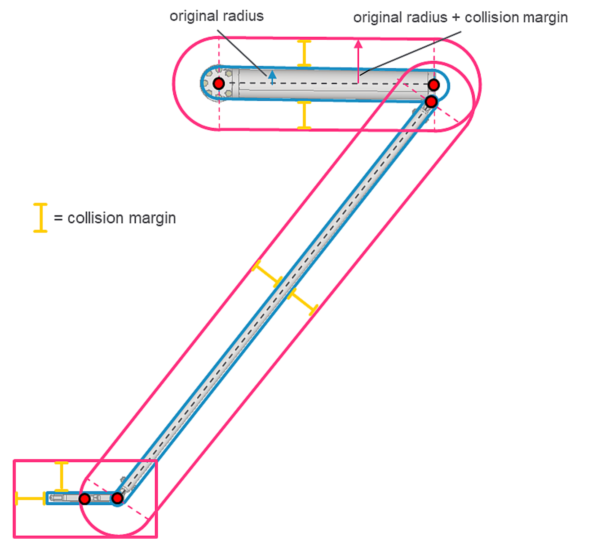

# ST\_CollisionHandlerPSeriesOptionalParameters – General Information

## Overview

|  |  |
| --- | --- |
| Type: | Data structure |
| Available as of: | V2.12.1.0 |
| Inherits from: | - |

## Description

Contains a list of optional parameters that can be set before configuring a P-Series collision handler.

The optional parameters are only applied on a call of the method IF\_CollisionHandlerPSeries.SetParametersFromRobotPSeries. A call of the method IF\_CollisionHandlerDelta3Ax.SetParameters ignores these parameters.

## Structure Elements

| Name | Data type | Description |
| --- | --- | --- |
| lrCollisionMargin | LREAL | The collision margin is a strictly positive value that is added to each configured radius (for spheres and capsules) and half extent (for AABB and OBB). |

## lrCollisionMargin

The collision margin is a strictly positive value that is added to each configured radius (for spheres and capsules) and half extent (for AABB and OBB) of the collision objects modelling the robot.

As shown in the figure below, the center points of spheres or boxes and the points of the capsules are not influenced by such parameters.

NOTE: As a result of this parameter, the collision objects are enlarged but not translated or rotated. For example, in the case of a capsule, the distance between the two capsule points is not affected by the collision margin value, but only the radius.

Example of collision margin on the objects modelling a chain of a P-Series robot:

EIO0000002236.19