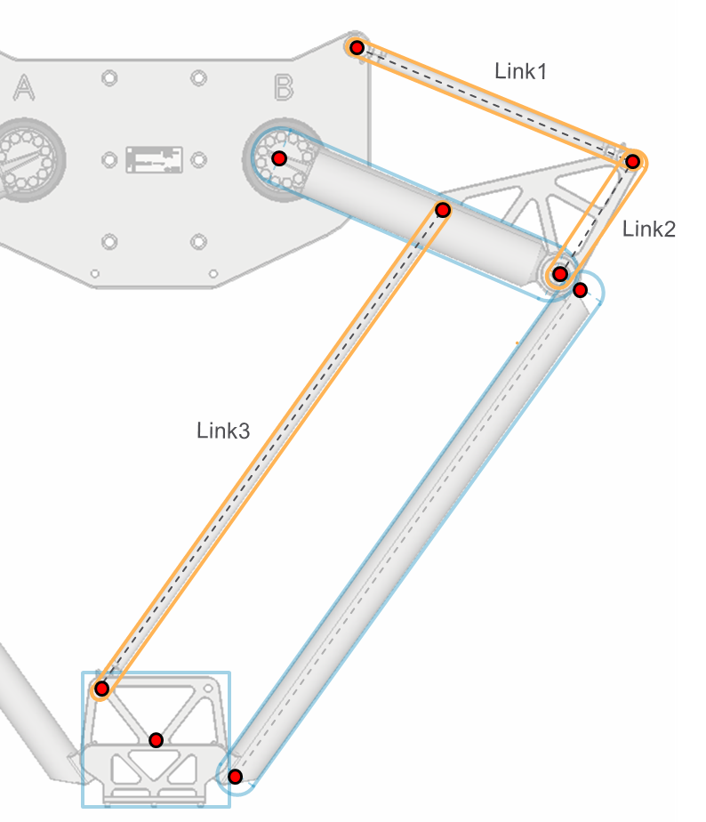
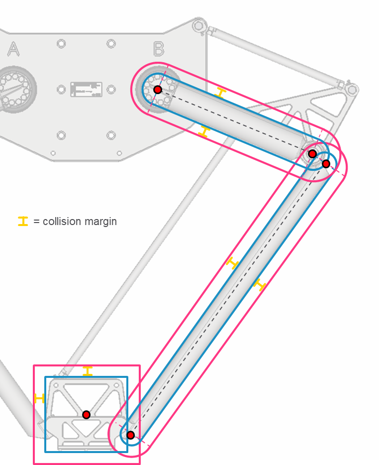

# ST\_CollisionHandlerTSeriesParallelLinkageParameters – General Information

## Overview

|  |  |
| --- | --- |
| Type: | Data structure |
| Available as of: | V2.12.1.0 |
| Inherits from: | - |

## Description

A set of parameters used to describe the parallel linkage of a T-Series robot.

In the following graphic the capsules represent the parallel linkage. The links are marked as Link1, Link2 and Link3, the capsules are marked in yellow:

## Structure Elements

| Name | Data type | Description |
| --- | --- | --- |
| lrLink1Radius | LREAL | Radius of link 1 of the parallel linkage. This is used by the collision handler to set the radius of the capsule modelling the link. |
| lrLink2Radius | LREAL | Radius of link 2 of the parallel linkage. This is used by the collision handler to set the radius of the capsule modelling the link. |
| lrLink3Radius | LREAL | Radius of link 3 of the parallel linkage. This is used by the collision handler to set the radius of the capsule modelling the link. |

## lrCollisionMargin

The collision margin is a strictly positive value that is added to each configured radius (for spheres and capsules) and half extent (for AABB and OBB).

As shown in the figure below, the center points of spheres or boxes and the points of the capsules are not influenced by such parameters.

NOTE: As a result of this parameter, the collision objects are enlarged but not translated or rotated. For example, in the case of a capsule, the distance between the two capsule points is not affected by the collision margin value.

Example of collision margin on the objects modelling a chain of a T-Series robot:

## xModelParallelLinkage

If set to TRUE, the parallel linkage is modelled using three capsules as shown in the graphic below. The three additional capsules are added to the chain of the robot on which the parallel linkage is mounted. This is described while configuring an instance of the function block FB\_RobotTSeries by the inputs i\_etConfigurationA and i\_etConfigurationB of the method InitializeRobot.

If xModelParallelLinkage = TRUE then:

* If i\_etConfigurationA = SERP.ET\_RobotTSeriesConfiguration.SingleLowerArmParallelLinkage then the parallel linkage collision objects are added to the chain A collision group of the collision handler.
* If i\_etConfigurationB = SERP.ET\_RobotTSeriesConfiguration.SingleLowerArmParallelLinkage then the parallel linkage collision objects are added to the chain B collision group of the collision handler.
* On a successful call of the configuration method SetParametersFromRobotTSeries, the selected collision group contains three additional capsules representing Link1, Link2 and Link3 of the parallel linkage.
* The optional parameter lrCollisionMargin also applies to the capsules modelling the parallel linkage.

Capsules representing the parallel linkage; the links are marked as Link1, Link2 and Link3, the capsules are marked in yellow:

EIO0000002236.19